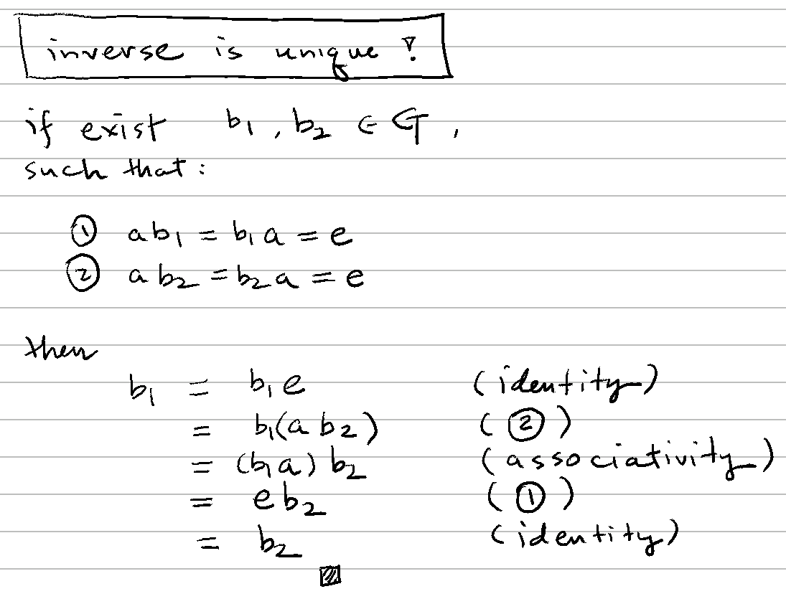

# 🔸 反元素

[運算](../op.md) ⟩ [二元運算](./) ⟩ 反元素 (inverse)


假設[代數系統](../system.md) $$(\mathbf{S}, \ast)$$ 擁有「[單位元素](identity.md) $$e$$」， $$a \in \mathbf{S}$$。

若有另一個元素 $${\color{orange}b}$$ 擁有以下性質：

* $${\color{orange}b} \ast a = a \ast {\color{orange}b} = e$$

我們就說 $${\color{orange}b}$$ 是 $$a$$ 的「<mark style="color:orange;">**反元素**</mark>」(<mark style="color:yellow;">**inverse**</mark>)，並用 $$a^{-1}$$ 代表。





1. 若[代數系統](../system.md) $$(\mathbf{S}, \ast)$$ 擁有「[單位元素](identity.md)」與「[結合律](associativity.md)」，則 $$a$$ 的<mark style="color:purple;">**反元素**</mark> $$a^{-1}$$(<mark style="color:red;">**如果存在的話**</mark>)是<mark style="color:yellow;">**唯一的**</mark>。 (證明：👉 )




* 「[group](../group/ "mention")」中的<mark style="color:yellow;">**每個元素**</mark>有擁有「<mark style="color:orange;">**反元素**</mark>」。



* Abstract and Linear Algebra (Burton) ⟩ 2.1 Definition and Elementary Properties of Groups (p. 47)&#x20;
* Understanding Analysis ⟩ 8.6 A Construction of R From Q, Def. 8.6.4 (p.299)


