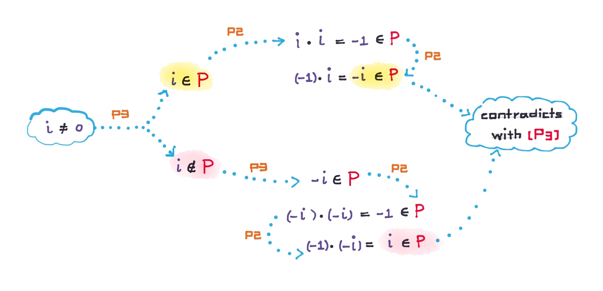

# 🔰 有序體 (ordered field)

[代數](../) ⟩ [體](./) ⟩ 有序體 (ordered field)


A [**field**](./) $$\mathbb{F}$$ is called <mark style="color:purple;">**ordered**</mark> if there is a <mark style="color:yellow;">**subset**</mark> $$\mathbb{P}$$ of $$\mathbb{F}$$, called the <mark style="color:yellow;">**set of positive elements**</mark> of $$\mathbb{F}$$, satisfying the following:

1. $$\forall x, y \in P, x + y \in P$$
2. $$\forall x, y \in P, x \cdot y \in P$$
3.  $$\forall x \in \mathbb{F}$$, <mark style="color:orange;">**one and only one**</mark> of the following three is true:

    (1) $$x=0$$ (2) $$x \in P$$ (3) $$-x \in P$$



A [field](./) F is called an <mark style="color:purple;">**ordered field**</mark> if F is endowed with a [quan-xu-total-ordering.md](../../set/binary/quan-xu-total-ordering.md "mention") <mark style="color:yellow;">**≤**</mark> that satisfies：

* (<mark style="color:yellow;">**Ｏ4**</mark>)：x <mark style="color:yellow;">**≤**</mark> y => x + z <mark style="color:yellow;">**≤**</mark> y + z
* (<mark style="color:yellow;">**Ｏ5**</mark>)：x ≥ 0, y ≥ 0 => xy ≥ 0

:point\_right: Understanding Analysis





[複數](../../num/complex/)系<mark style="color:red;">**不是**</mark>有序體， 🎖 證明： :point\_right: 




* 「[real](../../num/real/ "mention")」是一個<mark style="color:purple;">**有序體**</mark>。
* what is an [quan-xu-total-ordering.md](../../set/binary/quan-xu-total-ordering.md "mention")?



* Understanding Analysis ⟩ 8.6 A Construction of R From Q, Def. 8.6.5 (p.299)


