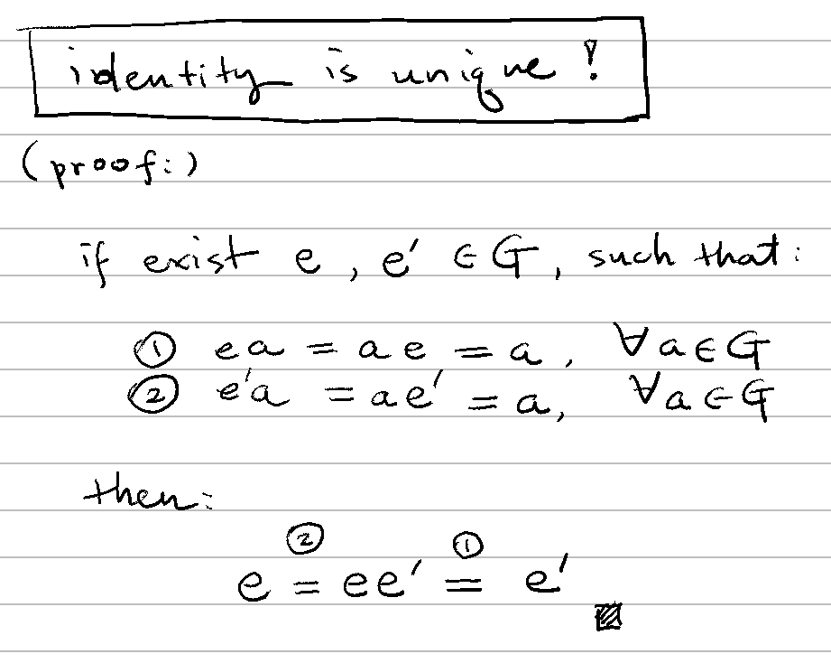

# 🔰 群的性質

[代數](../) ⟩ [系統](../system.md) ⟩ [群](./) ⟩ 群的性質


1. [單位元素](../binary/identity.md) $$e$$ 是<mark style="color:yellow;">**唯一的**</mark>。 (證明：👉 )
2. <mark style="color:yellow;">每個元素</mark> $$a$$ 都擁有[反元素](../binary/inverse.md) $$a^{-1}$$，而且是<mark style="color:yellow;">**唯一的**</mark>。 (證明：👉 )
3. $$(a^{-1})^{-1} = a, \ \forall a \in \mathbf{G}$$
4. $$(ab)^{-1} = b^{-1} a^{-1}, \ \forall a,b \in \mathbf{G}$$&#x20;
5. $$e^{-1} = e$$



* 加法群：[反元素](./)通常以 $${\color{orange}-a}$$ 表示，[單位元素](./)通常以 $${\color{orange}\mathbf{0}}$$ 表示。


## 證明 



<figure><figcaption></figcaption></figure>



<figure><figcaption></figcaption></figure>



因為 $$a \ast a^{-1} = a^{-1} \ast a = e$$，因此 $$a^{-1}$$ 與 $$a$$ 互為彼此的反元素。



因為[群](./)有「[結合律](../binary/associativity.md)」的關係，所以 $$(b^{-1} a^{-1})(ab) = e = (ab)(b^{-1} a^{-1})$$，因此 $$(ab)^{-1} = b^{-1} a^{-1}$$



因為 $$ee = e$$，因此 $$e^{-1} = e$$。



* [ ] Contemporary Abstract Algebra (2017), Ch. 2 Groups, p.43


