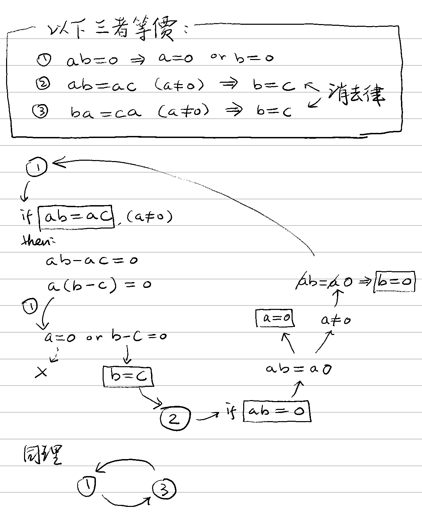
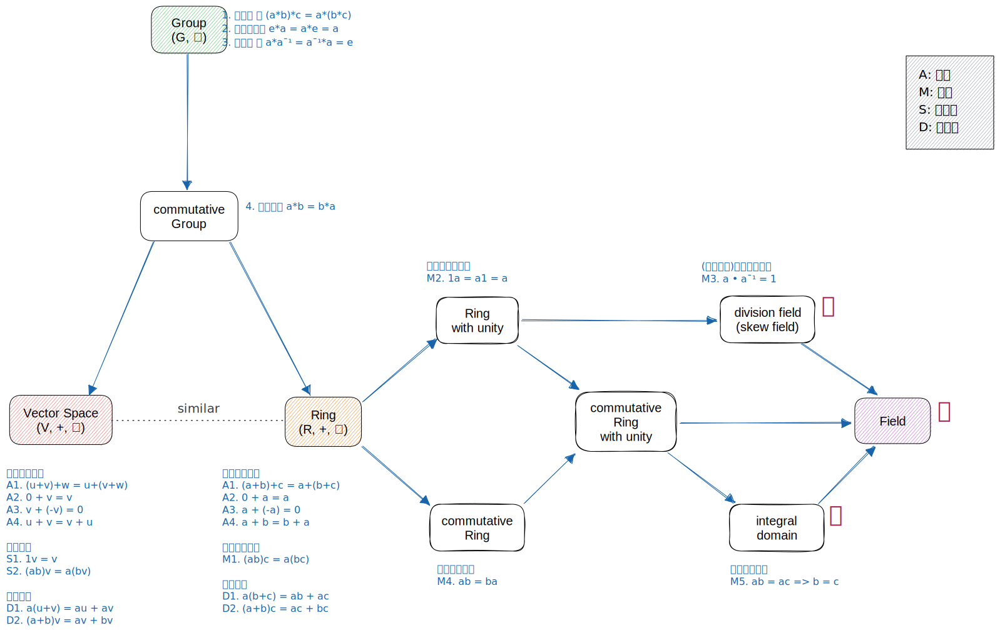

# 🔰 integral domain

[代數](../) ⟩ [環](./) ⟩ integral domain


具有：

* <mark style="color:yellow;">**乘法**</mark><mark style="color:orange;">**交換律**</mark>： $$ab=ba$$
* <mark style="color:yellow;">**乘法**</mark><mark style="color:orange;">**單位元素**</mark>： $$\mathbf{1} a=a\mathbf{1}=a$$
* <mark style="color:yellow;">**乘法**</mark><mark style="color:orange;">**消去律**</mark>： $$ab=ac \ (a \neq 0) \implies b=c$$

的環 ([ring](./))，稱為「<mark style="color:purple;">**integral domain**</mark>」，整數 $$\mathbb{Z}$$ 為其代表。





以下三條件等價：

1. $$ab=0 \implies a=0 \text{ or } b=0$$
2. <mark style="color:yellow;">**左**</mark><mark style="color:orange;">**消去律**</mark>：$$ab=ac \ (a \neq 0) \implies b=c$$
3. [<mark style="color:yellow;">右</mark>](#user-content-fn-1)[^1]<mark style="color:orange;">**消去律**</mark>：$$ba=ca \ (a \neq 0) \implies b=c$$


* 🎖 證明： :point\_right: 







* Contemporary Abstract Algebra (2017), Ch. 12 Rings, p.228.



[^1]: 
