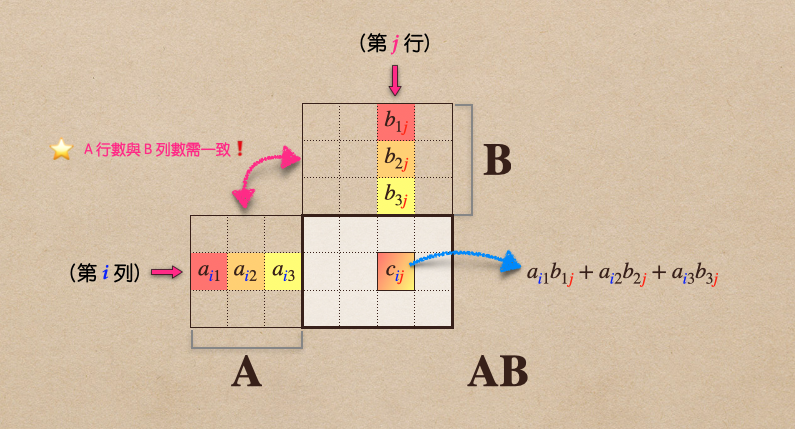
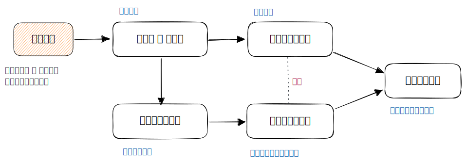
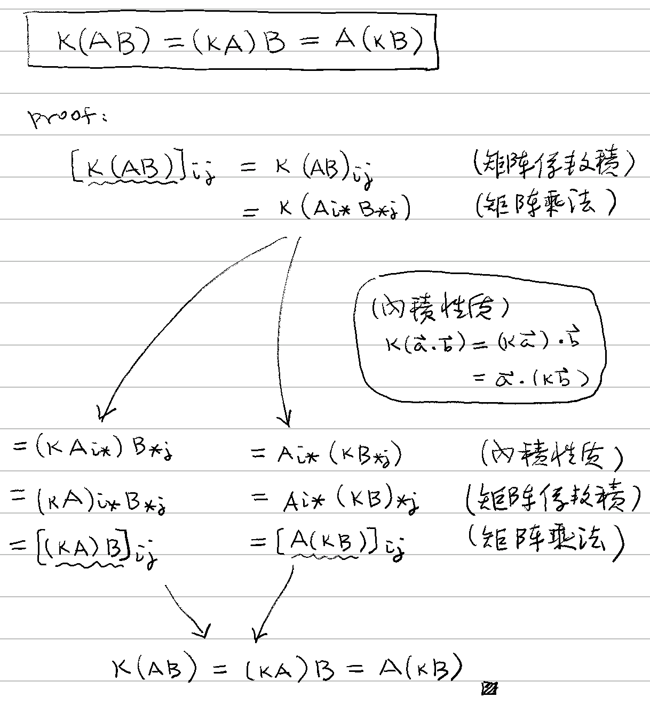

# ⭐ 矩陣乘法

[線代](../../../) ⟩ [矩陣](../../) ⟩ [運算](../) ⟩ 矩陣乘法

## 🔰 定義 


當Ａ為 $$m\times p$$ 矩陣、Ｂ為 $$p\times n$$ 矩陣時，我們定義<mark style="color:yellow;">**兩個矩陣相乘**</mark>的結果為一個 $$m\times n$$ 矩陣：

* $$AB= \begin{bmatrix} a_{11} & a_{12} & \cdots & a_{1p} \\ a_{21} & a_{22} & \cdots & a_{2p} \\ \vdots & \vdots &        & \vdots \\ a_{m1} & a_{m2} & \cdots & a_{mp} \end{bmatrix} \; \begin{bmatrix} b_{11} & b_{12} & \cdots & b_{1n} \\ b_{21} & b_{22} & \cdots & b_{2n} \\ \vdots & \vdots &        & \vdots \\ b_{p1} & b_{p2} & \cdots & b_{pn} \end{bmatrix} = \begin{bmatrix} c_{11} & c_{12} & \cdots & c_{1n} \\ c_{21} & c_{22} & \cdots & c_{2n} \\ \vdots & \vdots &        & \vdots \\ c_{m1} & c_{m2} & \cdots & c_{mn} \end{bmatrix}$$&#x20;

其中：

* &#x20;$$c_{ij}=(\mathbf{AB})_{{\color{blue}{i}}{\color{red}{j}}}   = a_{i1}b_{1j} + a_{i2}b_{2j} + \cdots + a_{ip}b_{pj}$$
* $$c_{ij}= \mathbf{A}_{{\color{blue}{i}}*}\mathbf{B}_{*\color{red}{j}}$$ （ :star: 相當於「$$\mathbf{A}$$ 第 $$i$$ <mark style="color:yellow;">列</mark>」與「$$\mathbf{B}$$ 第 $$j$$ <mark style="color:yellow;">行</mark>」做[內積](../../../vec/op/dot/):exclamation:）


<figure><figcaption>
矩陣乘法定義
</figcaption></figure>



* [「分割式」乘法](split-table.md)
* [「表格疊加」法](outer-product/sum-of-outer-products.md)
* [「分組式」乘法](by-groups.md)
* [「塊狀」乘法](by-blocks.md)
* [反矩陣](inverse.md)








$$\mathbf{A}$$ 的<mark style="color:yellow;">**行數**</mark>與 $$\mathbf{B}$$ 的<mark style="color:yellow;">**列數**</mark><mark style="color:red;">**必須一樣**</mark>，才能做<mark style="color:purple;">**矩陣乘法**</mark>:exclamation:




* 向量 ⟩ [內積](../../../vec/op/dot/)&#x20;
* Desmos ⟩ [matrix](../../../../tool/desmos/expr/matrix/ "mention")
* GGB ⟩ [matrix](../../../../tool/ggb/matrix/ "mention") &#x20;



* [Desmos Calculator](https://www.desmos.com/matrix?lang=zh-TW)



* [ ] Mathematics for 3D Game Programming & Computer Graphics (2nd Edition, 2004) &#x20;



## 🔸 矩陣乘法性質引理 

1. [outer-product](outer-product/ "mention")
2. [outer-product.md](outer-product/outer-product.md "mention")
3. [sum-of-outer-products.md](outer-product/sum-of-outer-products.md "mention")

## 🔸 性質 

<table><thead><tr><th width="100" data-type="number">#</th><th width="437">🔸 性質</th><th width="100">🎖 證明</th></tr></thead><tbody><tr><td>1</td><td><mark style="color:red;"><strong>類結合律</strong></mark>：{\color{orange}k} (\mathbf{AB}) =  ({\color{orange}k}\mathbf{A)B} =  \mathbf{A} ({\color{orange}k}\mathbf{B})</td><td></td></tr><tr><td>2</td><td><mark style="color:yellow;"><strong>結合律</strong></mark>： \mathbf{(AB)C} = \mathbf{A(BC)}</td><td></td></tr></tbody></table>
