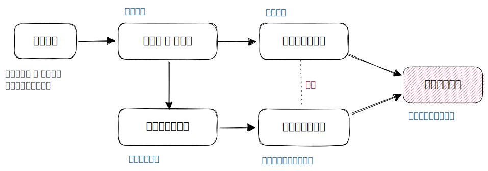
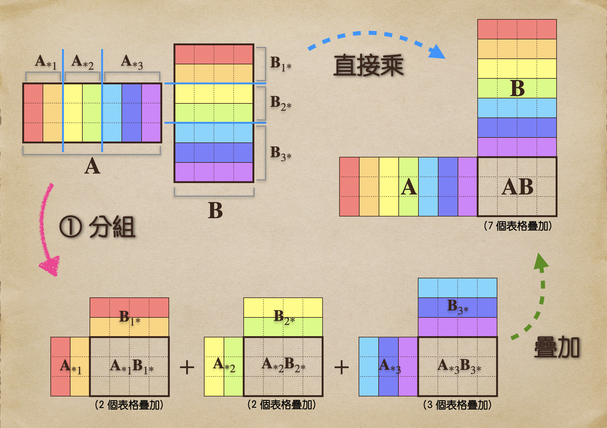
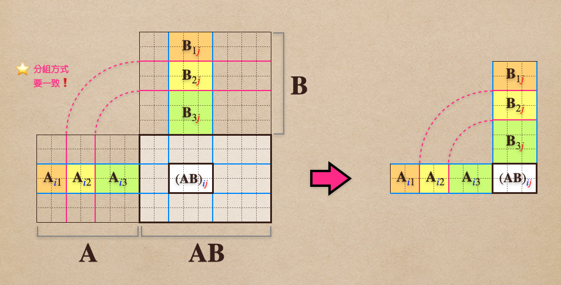

# 🔰 「塊狀」乘法

[線代](../../../) ⟩ [矩陣](../../) ⟩ [運算](../) ⟩ [乘法](./) ⟩ 「塊狀」乘法


矩陣相乘時，我們既可以用[「分組式」乘法](by-groups.md)，<mark style="color:yellow;">**同時**</mark>又可以用[「分割式」乘法](split-table.md)，絲毫<mark style="color:yellow;">**不影響相乘的結果**</mark>。這時會產生一種有趣的矩陣乘法，稱為「<mark style="color:purple;">**塊狀乘法**</mark>」。




* [「分割式」乘法](split-table.md)
* [「分組式」乘法](by-groups.md)







* [ ] Linear Algebra - A Modern Introduction, 3.1 Matrix Operations ⟩ Partitioned Matrices



在[「分組式」乘法](by-groups.md)中，我們有提到如果將「[矩陣乘法](./)」進行「<mark style="color:yellow;">**分組**</mark>」，並<mark style="color:yellow;">**不影響**</mark>最後疊加的<mark style="color:yellow;">**結果**</mark>：

<figure><figcaption>
{\color{red}\mathbf{A}}   {\color{blue}\mathbf{B}}     =     {\color{red}\mathbf{A}}_{*1} {\color{blue}\mathbf{B}}_{1*} +  \cdots +  {\color{red}\mathbf{A}}_{*p} {\color{blue}\mathbf{B}}_{p*} 
</figcaption></figure>

這時，如果我們又<mark style="color:orange;">**同時**</mark>對<mark style="color:yellow;">**每個表格**</mark>進行「[分割](split-table.md)」，依然<mark style="color:yellow;">**不影響**</mark>最後<mark style="color:yellow;">**疊加的結果**</mark>：

<figure><figcaption></figcaption></figure>

因此可以得到以下的結論，我們稱之為<mark style="color:purple;">**「塊狀」乘法**</mark>：


$$(\mathbf{AB})_{{\color{blue}{i}}{\color{red}{j}}}   =  \mathbf{A}_{{\color{blue}i}1} \mathbf{B}_{1{\color{red}j}} +  \mathbf{A}_{{\color{blue}i}2} \mathbf{B}_{2{\color{red}j}} + \cdots +  \mathbf{A}_{{\color{blue}i}p} \mathbf{B}_{p{\color{red}j}}$$




* 若：\
  Ａ切成 $$m\times p$$ <mark style="color:yellow;">**塊**</mark>的<mark style="color:yellow;">**子矩陣**</mark>： $$\begin{bmatrix}     A_{11} & \cdots & A_{1p} \\     \vdots & & \vdots  \\     A_{m1} & \cdots & A_{mp}   \end{bmatrix}$$\
  \
  Ｂ切成 $$p\times n$$ <mark style="color:yellow;">**塊**</mark>的<mark style="color:yellow;">**子矩陣**</mark>： $$\begin{bmatrix}     B_{11} & \cdots & B_{1n} \\     \vdots & & \vdots  \\     B_{p1} & \cdots & B_{pn}   \end{bmatrix}$$\
  \
  其中<mark style="color:yellow;">**Ａ各**</mark><mark style="color:orange;">**行**</mark><mark style="color:yellow;">**的切法**</mark>與<mark style="color:yellow;">**Ｂ各**</mark><mark style="color:orange;">**列**</mark><mark style="color:yellow;">**的切法**</mark>是<mark style="color:yellow;">**一致**</mark>的。 
* 則 $$\mathbf{A}\mathbf{B}$$ 有 $$m\times n$$ <mark style="color:yellow;">**塊**</mark>的<mark style="color:yellow;">**子矩陣**</mark>，其中：


$$(\mathbf{AB})_{{\color{blue}{i}}{\color{red}{j}}}   =  \mathbf{A}_{{\color{blue}i}1} \mathbf{B}_{1{\color{red}j}} +  \mathbf{A}_{{\color{blue}i}2} \mathbf{B}_{2{\color{red}j}} + \cdots +  \mathbf{A}_{{\color{blue}i}p} \mathbf{B}_{p{\color{red}j}}$$




* 這個公式看起來跟一般的「[矩陣乘法](./)」根本沒有區別，唯一的區別是：<mark style="color:yellow;">**一般乘法**</mark>乘的是「<mark style="color:yellow;">**元素**</mark>」，但「<mark style="color:purple;">**塊狀乘法**</mark>」乘的是一塊一塊的「<mark style="color:yellow;">**子矩陣**</mark>」:exclamation:
* 如果我們切到極致，把Ａ、Ｂ的<mark style="color:yellow;">**每行每列**</mark>都切開，這時「<mark style="color:purple;">**塊狀乘法**</mark>」就等於一般的「[矩陣乘法](./)」了。



## 🔰 從子矩陣的觀點看塊狀乘法 

事實上，如果我們從「子矩陣」的角度出發，會得到一個更自然的觀點：

<figure><figcaption>
矩陣塊狀乘法
</figcaption></figure>

從上圖中，我們可以看出來 $$(\mathbf{AB})_{{\color{blue}{i}}{\color{red}{j}}}$$ 子矩陣的每個元素都是由「著色部分」的兩個子矩陣相乘得來的，由[「分組式」乘法](by-groups.md)我們知道：不管著色部分再分成幾組（圖中分為三組），並不影響 $$(\mathbf{AB})_{{\color{blue}{i}}{\color{red}{j}}}$$ 最後疊加的結果，因此以這個觀點來說，以上的定理就變成是「很自然」的事了。
