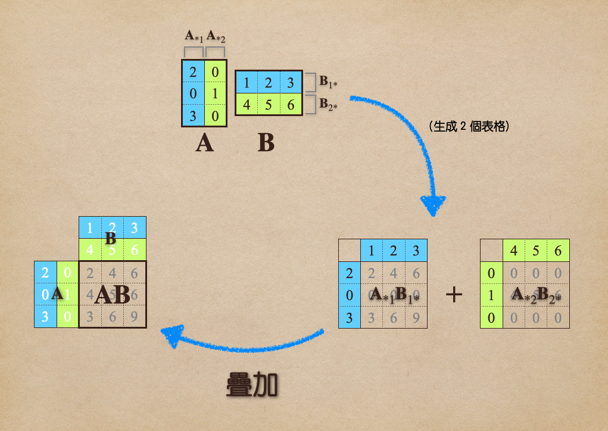
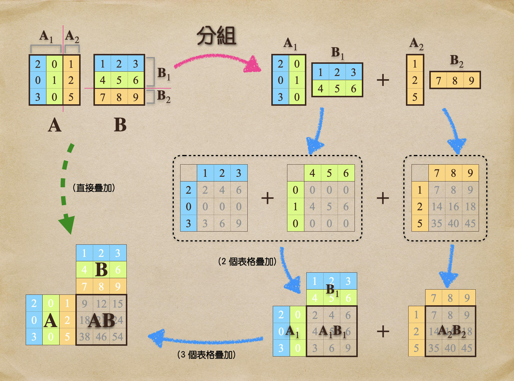
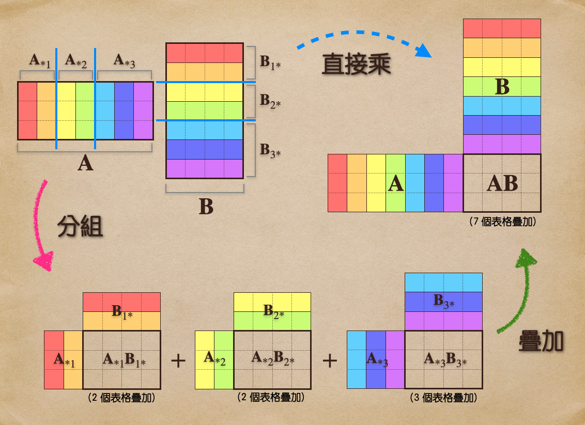

# 🔰 「分組式」乘法

ㄝA[線代](../../../) ⟩ [矩陣](../../) ⟩ [運算](../) ⟩ [乘法](./) ⟩ 「分組式」乘法


在「[表格疊加法](outer-product/sum-of-outer-products.md)」中，我們提到如何將「[矩陣乘法](./)」看成是「<mark style="color:yellow;">**一連串表格的疊加**</mark>」。事實上，我們還可以將這些表格「<mark style="color:yellow;">**分組**</mark>」，之後再疊加，<mark style="color:yellow;">**結果相同**</mark>。




* [表格疊加法](outer-product/sum-of-outer-products.md)



* [「塊狀」乘法](by-blocks.md)







* 類似：[「分割式」乘法](split-table.md)



* [ ] Linear Algebra - A Modern Introduction, 3.1 Matrix Operations ⟩&#x20;
  * Partitioned Matrices



下圖顯示在「[表格疊加法](outer-product/sum-of-outer-products.md)」中，我們如何將 A, B 相對應的[行列相乘](outer-product/)，然後看成「<mark style="color:yellow;">**一連串表格**</mark>」的<mark style="color:yellow;">**疊加**</mark>：

<figure><figcaption>
「表格疊加」法
</figcaption></figure>

如果我們進一步將 A, B 矩陣的各行、各列依<mark style="color:yellow;">**相同模式「分組」**</mark>，則由「[表格疊加法](outer-product/sum-of-outer-products.md)」所產生的<mark style="color:yellow;">**表格**</mark>也會跟著<mark style="color:yellow;">**分組**</mark>，但不管有沒有分組，我們最後都是對<mark style="color:red;">**全部表格**</mark>進行<mark style="color:yellow;">**疊加**</mark>，所以「<mark style="color:yellow;">**分組對結果絲毫沒有影響**</mark>」。

* 例如，在下圖中：
  * A 有 3 行、B 有 3 列，我們將 A 的前兩行分為一組、後一行自己一組。用<mark style="color:yellow;">**相同模式**</mark>，將 B 前兩列分為一組、後一列自己一組。
  * 第一組[行列](../../row-col.md)配對相乘，得到兩個表格。
  * 第二組行列相乘，得到一個表格，總共三個表格。
  * 最後進行疊加，<mark style="color:yellow;">**結果**</mark>跟對 AB 直接相乘<mark style="color:yellow;">**沒有區別**</mark>。

<figure><figcaption>
「分組式」乘法
</figcaption></figure>

從上圖中，我們可以看到：


不管是<mark style="color:yellow;">**直接乘**</mark>，還是<mark style="color:yellow;">**分組乘**</mark>，都會得到<mark style="color:yellow;">**相同的三個表格**</mark>，因此<mark style="color:yellow;">**疊加結果**</mark>也會<mark style="color:yellow;">**一樣**</mark>:exclamation:


但這裡要注意以下幾點：


* 這裡所指的「<mark style="color:yellow;">**分組**</mark>」，是將 <mark style="color:yellow;">A</mark> 的「**各**<mark style="color:yellow;">**行**</mark>」分組、<mark style="color:yellow;">B</mark> 的「**各**<mark style="color:yellow;">**列**</mark>」分組。
* <mark style="color:yellow;">**A 的各行**</mark>雖然<mark style="color:green;">**可以任意分組**</mark>，但 <mark style="color:yellow;">**B 的各列**</mark><mark style="color:red;">**並非可以任意分組**</mark>，B 的<mark style="color:yellow;">**分組模式**</mark>必須跟 A <mark style="color:red;">**一模一樣**</mark>才行。
* 例如：假設 A 有 6 行，A 如果分為 (2, 1, 3) 行，那麼 B 也必須分為 (2, 1, 3) 列才行:exclamation:


我們將這種觀點整理成以下引理：

## 💍 引理 

若 A 的<mark style="color:yellow;">**各行**</mark>分組為 $$\begin{bmatrix}  {\color{red}\mathbf{A}}_{*1} \ \cdots \ {\color{red}\mathbf{A}}_{*p}  \end{bmatrix}$$、B 的<mark style="color:yellow;">**各列**</mark>分組為 $$\begin{bmatrix}   {\color{blue}\mathbf{B}}_{1*} \\     \vdots \\   {\color{blue}\mathbf{B}}_{p*} \end{bmatrix}$$，且兩者<mark style="color:yellow;">**分組方式**</mark>是<mark style="color:yellow;">**相容**</mark>的（也就是<mark style="color:yellow;">**分組模式一樣**</mark>），則：&#x20;


$${\color{red}\mathbf{A}}   {\color{blue}\mathbf{B}}     =    \begin{bmatrix}  {\color{red}\mathbf{A}}_{*1} \ \cdots \ {\color{red}\mathbf{A}}_{*p}  \end{bmatrix}   \begin{bmatrix}   {\color{blue}\mathbf{B}}_{1*} \\     \vdots \\   {\color{blue}\mathbf{B}}_{p*} \end{bmatrix}   =     {\color{red}\mathbf{A}}_{*1} {\color{blue}\mathbf{B}}_{1*} +  \cdots +  {\color{red}\mathbf{A}}_{*p} {\color{blue}\mathbf{B}}_{p*}$$


:point\_right: 比較：[「分割式」乘法](split-table.md)

<figure><figcaption>
{\color{red}\mathbf{A}}   {\color{blue}\mathbf{B}}     =     {\color{red}\mathbf{A}}_{*1} {\color{blue}\mathbf{B}}_{1*} +  \cdots +  {\color{red}\mathbf{A}}_{*p} {\color{blue}\mathbf{B}}_{p*} 
</figcaption></figure>

⭐ 註：


* 一般我們用 $${\color{red}\mathbf{A}}_{*j}$$ 來表示 Ａ 的「第 $$j$$ 行」，用 $${\color{blue}\mathbf{B}}_{i*}$$ 表示 Ｂ 的「第 $$i$$ 列」。
* 但這裡，我們刻意用這兩個符號來分別代表 Ａ 的「第 $$j$$ 個<mark style="color:yellow;">**行分組**</mark>」與 Ｂ 的「第 $$i$$ 個<mark style="color:yellow;">**列分組**</mark>」，如此一來，這個公式看起來就跟[「表格疊加」法](outer-product/sum-of-outer-products.md)中的「[定理](outer-product/sum-of-outer-products.md#ding-li)」一模一樣了。
* 公式裡的每個 $${\color{red}\mathbf{A}}_k  {\color{blue}\mathbf{B}}_k$$ 都是<mark style="color:yellow;">**一組表格**</mark> 的疊加，至於每組有多少表格，那就要看該組裡面有<mark style="color:yellow;">**多少對 (pairs) 的行列向量**</mark>了。

