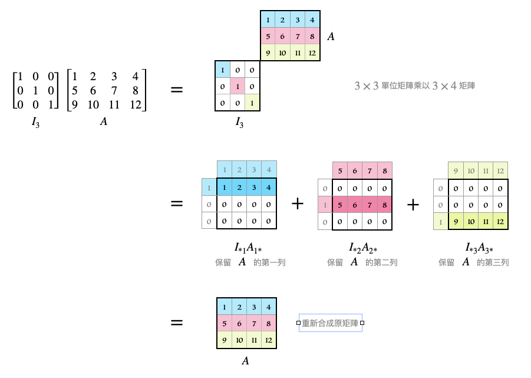
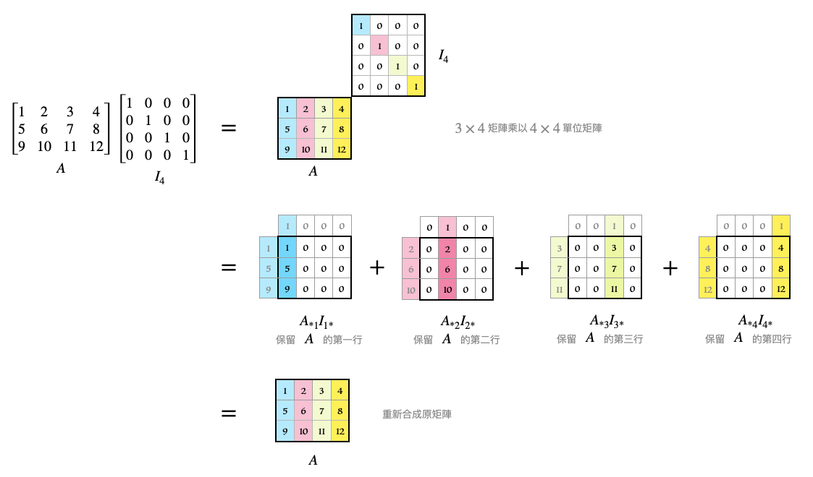

# 🔰 單位方陣

[線代](../../../) ⟩ [矩陣](../../) ⟩ [運算](../) ⟩ [乘法](./) ⟩ 單位方陣 (<mark style="color:purple;">**identity**</mark>)


我們將具有以下性質的 $$n \times n$$ 矩陣稱為「<mark style="color:purple;">n 階單位方陣</mark>」，並用符號 $$Iₙ$$ 代表：

* <mark style="color:yellow;">對角線</mark>上的元素都是 <mark style="color:yellow;">1</mark>。
* <mark style="color:yellow;">其他位置</mark>的元素都是 <mark style="color:yellow;">0</mark>。

例如：

$$I_2=\begin{bmatrix} 1 & 0 \\ 0 & 1 \\ \end{bmatrix}$$為二階方陣、$$I_3=\begin{bmatrix} 1 & 0 & 0\\ 0 & 1  & 0\\ 0 & 0  & 1 \end{bmatrix}$$為三階方陣。

:bulb: 註：在「<mark style="color:yellow;">階數</mark>」不至於造成混淆時，我們會直接以 $$I$$ 代表「<mark style="color:purple;">單位方陣</mark>」。





性質ㄧ：若 $$A$$ 為 $$m × n$$ 矩陣，則： $$I_m A = A$$ 、 $$A I_n = A$$





性質ㄧ：若 $$A$$ 為 $$m × n$$ 矩陣，則： $$I_m A = A$$ 、 $$A I_n = A$$


以下我們用「圖解」的方式來證明： $$IA=A$$

<figure><figcaption></figcaption></figure>

證明： $$AI=A$$

<figure><figcaption></figcaption></figure>


:star: 注意：如果 $$A$$ 矩陣不是「<mark style="color:orange;">方陣</mark>」的話，那麼乘在<mark style="color:yellow;">左邊</mark>與乘在<mark style="color:yellow;">右邊</mark>的[單位方陣](identity.md)的「<mark style="color:yellow;">維度</mark>」是不一樣的❗&#x20;




* [inverse.md](inverse.md "mention")
* [matrix.md](../../../space/basis/ortho/matrix.md "mention")



* [ ] Math for 3D Game ⟩ 2.3 Matrix Inverses



