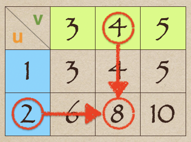

# 🔰 外積

[線代](../../../../) ⟩ [矩陣](../../../) ⟩ [運算](../../) ⟩ [乘法](../) ⟩ 外積 (outer product)


:star: 注意：

* 這裡的「<mark style="color:purple;">外積</mark>」是指 "[outer product](https://en.wikipedia.org/wiki/Outer_product)"，又稱為「<mark style="color:purple;">張量積</mark>」。
* "[cross product](https://en.wikipedia.org/wiki/Cross_product)" 中文也翻譯成「<mark style="color:yellow;">外積</mark>、<mark style="color:yellow;">叉積</mark>或<mark style="color:yellow;">向量積</mark>」，為了避免混淆，本文一律將 "cross product" 稱為「<mark style="color:yellow;">叉積</mark>」。



當[行向量](../../../row-col.md)乘以[列向量](../../../row-col.md)時，<mark style="color:yellow;">一定可以相乘</mark>，不會有維度不合的問題，此時這個乘積稱為 "<mark style="color:purple;">**outer product**</mark>"： 

* $$\begin{bmatrix} a_{1}  \\ a_{2} \\ \vdots \\ a_{m} \end{bmatrix}  \begin{bmatrix} b_{1} & b_{2} & \cdots & b_{n}  \end{bmatrix} = \begin{bmatrix} a_{1}b_{1} & a_{1}b_{2} & \cdots & a_{1}b_{n} \\ a_{2}b_{1} & a_{2}b_{2} & \cdots & a_{2}b_{n} \\ \vdots & \vdots &   & \vdots \\ a_{m}b_{1} & a_{m}b_{2} & \cdots & a_{m}b_{n} \\ \end{bmatrix}$$

\
:star: 注意：

* 這種乘法<mark style="color:yellow;">**類似九九乘法表**</mark>。
* $$m\times 1$$ 矩陣乘以 $$1\times n$$ 矩陣會得到 $$m\times n$$ 矩陣。
* 當 $$𝐮$$ 與 $$𝐯$$ 都是「[行向量](../../../row-col.md)」時，數學符號用 $$\mathbf{u} \otimes  \mathbf{v} = \mathbf{u} \mathbf{v}^T$$ 來表示它們的 <mark style="color:purple;">outer product</mark>。




* [「分割式」乘法](../split-table.md)



例如： $$\mathbf{u} =  \begin{bmatrix} 1 \\ 2 \end{bmatrix}$$為[<mark style="color:orange;">**行**</mark><mark style="color:yellow;">**向量**</mark>](../../../row-col.md)、 $$\mathbf{v} =\begin{bmatrix} 3 & 4 & 5 \end{bmatrix}$$為[<mark style="color:green;">**列**</mark><mark style="color:yellow;">**向量**</mark>](../../../row-col.md)，則 $$\mathbf{uv} =\begin{bmatrix} 3 & 4 & 5\\ 6 & 8 & 10 \end{bmatrix}$$

這種乘法<mark style="color:yellow;">**類似**</mark>「九九乘法表」：


這種觀點在<mark style="color:yellow;">**證明**</mark>[矩陣乘法](sum-of-outer-products.md)公式時，常常能有比較<mark style="color:yellow;">**直觀簡潔**</mark>的證法。




* [Desmos Calculator](https://www.desmos.com/matrix?lang=zh-TW)



* 比較： [內積](../../../../vec/op/dot/)、[外積](../../../../vec/op/cross/)
* [轉置矩陣](../../transpose.md)與這裡的性質證明相關。



* 轉置矩陣[定理](../../transpose.md#prop)



* Wikipedia ⟩ [Outer product](https://en.wikipedia.org/wiki/Outer_product)
* Linear Algebra - A Modern Introduction ⟩ 3.1 Matrix Operations ⟩ Partitioned Matrices



## 💍 引理


若： $$\mathbf{u}$$,  $$\mathbf{v}$$ 是[行向量](../../../row-col.md)或[列向量](../../../row-col.md)，<mark style="color:yellow;">**且**</mark><mark style="color:red;">**可作**</mark>[矩陣乘法](../)，

則： $$(\mathbf{uv})^T = \mathbf{v}^T \mathbf{u}^T$$


:star: 註： $$\mathbf{u}$$,  $$\mathbf{v}$$ 是[行向量](../../../row-col.md)或[列向量](../../../row-col.md)，<mark style="color:yellow;">**且**</mark><mark style="color:red;">**可作**</mark>[矩陣乘法](../)，只有兩種狀況：

* $$\mathbf{u}$$ 為[<mark style="color:green;">**列**</mark><mark style="color:yellow;">**向量**</mark>](../../../row-col.md)、$$\mathbf{v}$$ 為[<mark style="color:orange;">**行**</mark><mark style="color:yellow;">**向量**</mark>](../../../row-col.md) (兩者維度<mark style="color:red;">**必須相同**</mark>)，它們的乘積又稱為「[內積](../../../../vec/op/dot/)」("<mark style="color:purple;">**inner product**</mark>")。
* $$\mathbf{u}$$ 為[<mark style="color:orange;">**行**</mark><mark style="color:yellow;">**向量**</mark>](../../../row-col.md)、$$\mathbf{v}$$ 為[<mark style="color:green;">**列**</mark><mark style="color:yellow;">**向量**</mark>](../../../row-col.md) (兩者維度<mark style="color:yellow;">**可以不同**</mark>)，它們的乘積又稱為 "<mark style="color:purple;">**outer product**</mark>"。

🎖 證明： :point\_right: 

