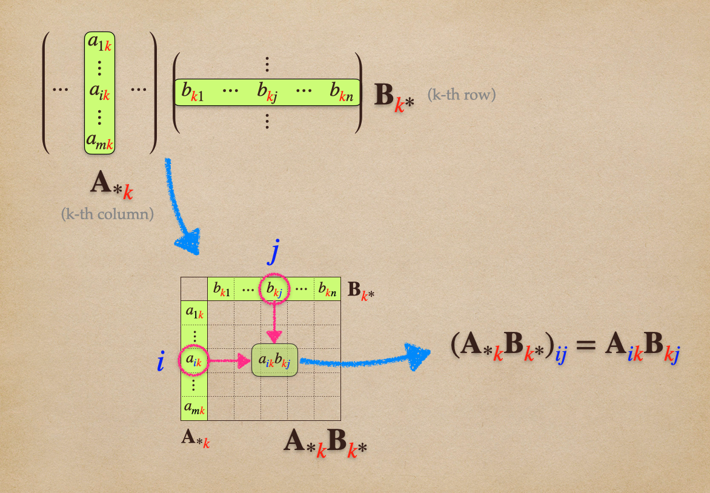
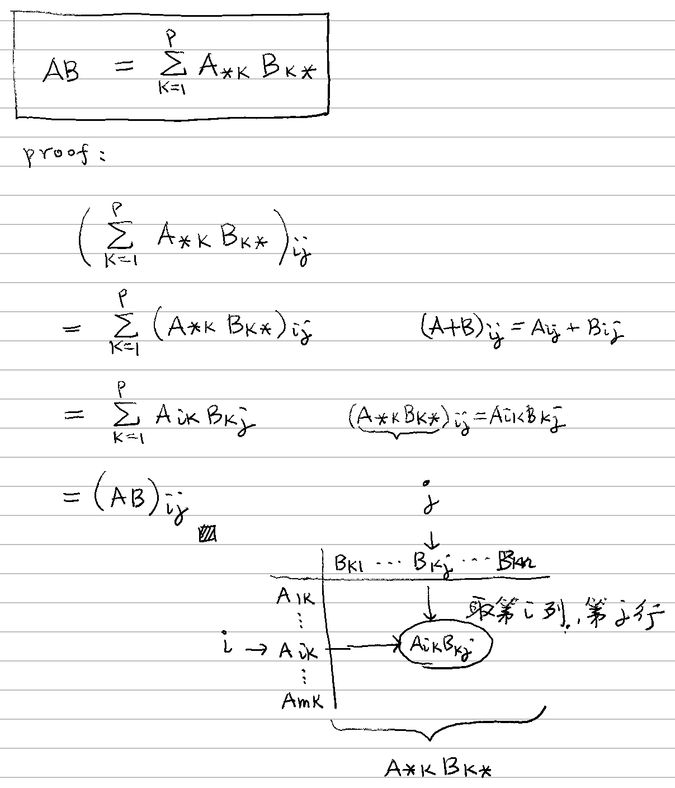

# ⭐ 矩陣乘積為外積之和

[線代](../../../../) ⟩ [矩陣](../../../) ⟩ [運算](../../) ⟩ [乘法](../) ⟩ 矩陣乘積為 outer products 之和


若： $$\mathbf{A}$$ 為 $$m\times p$$ 矩陣、 $$\mathbf{B}$$ 為 $$p\times n$$ 矩陣，則： 

* &#x20;$$\mathbf{AB} = \mathbf{A}_{*\color{red}{1}} \mathbf{B}_{{\color{red}{1}}*} + \mathbf{A}_{*\color{red}{2}} \mathbf{B}_{{\color{red}{2}}*} + \cdots + \mathbf{A}_{*\color{red}{p}} \mathbf{B}_{{\color{red}{p}}*} = \sum_{k=1}^{p} \mathbf{A}_{*k} \mathbf{B}_{k*}$$ 


:star: 註解：

* 每個 $$\mathbf{A}_{*k} \mathbf{B}_{k*}$$ （$$A$$ 的第 $$k$$ <mark style="color:yellow;">行</mark>乘以與 $$B$$ 的第 $$k$$ <mark style="color:yellow;">列</mark>）都是一個 [.](./ "mention")。
* 如果 [.](./ "mention") 是<mark style="color:yellow;">一個表格</mark>，那麼[矩陣乘法](../)就是「<mark style="color:yellow;">一連串的表格</mark>進行<mark style="color:yellow;">疊加</mark>」。
* 由於<mark style="color:yellow;">矩陣加法沒有順序性</mark>，因此由此定理可得知：如果我們「分別將 $$A$$ 的[行](../../../row-col.md)與 $$B$$ 的[列](../../../row-col.md)做<mark style="color:yellow;">一致性的調動</mark>」，則得到的<mark style="color:yellow;">乘積依然一樣</mark>:exclamation:



例如： $$\mathbf{A} =\begin{bmatrix}  2 & 0\\  0 & 1 \\ 3 & 0  \end{bmatrix}$$、 $$\mathbf{B} =  \begin{bmatrix}  1 & 2 & 3\\  4 & 5 & 6  \end{bmatrix}$$， $$\mathbf{AB} =\begin{bmatrix}  2 & 4 & 6\\  4 & 5 & 6 \\ 3 & 6 & 9  \end{bmatrix}$$。

在下圖中，我們將 A, B 兩組相對應的[行列相乘](./)，可以得到<mark style="color:yellow;">**兩個表格**</mark>，再將這兩個表格<mark style="color:yellow;">**疊加**</mark>，就可以得到 AB 相乘的結果。

<figure><figcaption>
「表格疊加」法
</figcaption></figure>

會得到這樣的結果，並非巧合，我們用後面的「[#ding-li](sum-of-outer-products.md#ding-li "mention") 」證明。

## 💍 引理


$$( \mathbf{A}_{*\color{red}{k}} \mathbf{B}_{{\color{red}{k}}*} ) _{{\color{blue}{ij}}} =   \mathbf{A}_{{\color{blue}{i}} \color{red}{k}}   \mathbf{B}_{{\color{red}{k}} {\color{blue}{j}}}$$   &#x20;


:point\_right: [矩陣符號](../../../notation.md)

這個引理的意思是：「第 k 個表格」的第 $$(i,j)$$ 個元素就是 $$\mathbf{A}_{{\color{blue}{i}} \color{red}{k}}   \mathbf{B}_{{\color{red}{k}} {\color{blue}{j}}}$$：

<figure><figcaption>
「第 k 個表格」的第 (i,j) 個元素
</figcaption></figure>

A 的每一行與 B 相對應的每一列相乘，都可以得到「一個表格」，所以 A, B 各有多少行、列，就會得到多少表格，最後再疊加起來就可以了。



&#x20;

<figure><figcaption></figcaption></figure>



* 轉置矩陣[定理](../../transpose.md#prop)
* [「分組式」乘法](../by-groups.md)



* 比較： [內積](../../../../vec/op/dot/)
* 本文使用大量的[矩陣符號](../../../notation.md)。
* [轉置矩陣](../../transpose.md)的證明與本文「[#ding-li](sum-of-outer-products.md#ding-li "mention") 」相關。



* [Desmos Calculator](https://www.desmos.com/matrix?lang=zh-TW)


