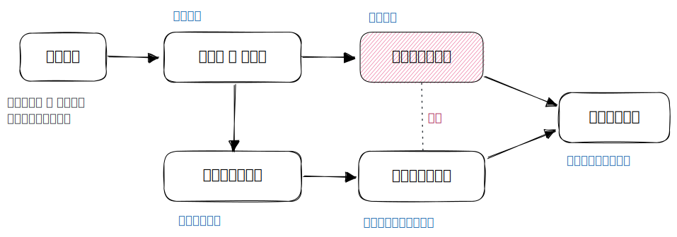
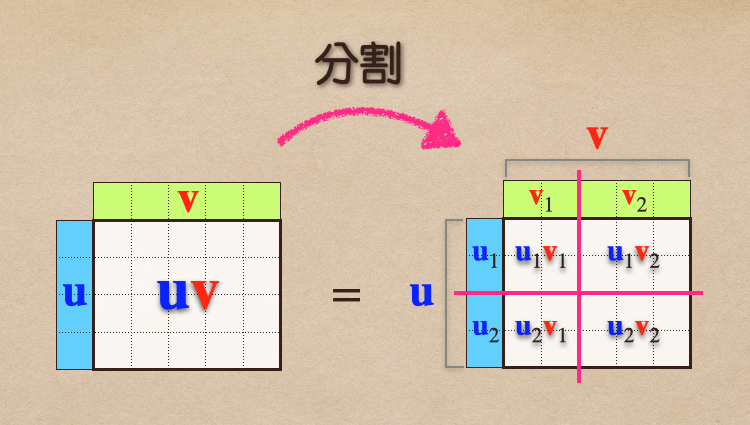

# 🔰 「分割式」乘法

[線代](../../../) ⟩ [矩陣](../../) ⟩ [運算](../) ⟩ [乘法](./) ⟩ 「分割式」乘法


在「[行向量 ⨉ 列向量](outer-product/)」的乘法中，我們提到：「[行向量](../../row-col.md)乘以[列向量](../../row-col.md)，會得到<mark style="color:yellow;">**一個表格**</mark>」，類似九九乘法表。事實上，我們可以進一步將這個表格進行「<mark style="color:yellow;">**分割**</mark>」，然後再填入相對應的數值，<mark style="color:yellow;">**結果一樣**</mark>。




* [行向量 ⨉ 列向量](outer-product/)



* [「塊狀」乘法](by-blocks.md)







* [「分組式」乘法](by-groups.md)



* [ ] Linear Algebra - A Modern Introduction, 3.1 Matrix Operations ⟩&#x20;
  * Partitioned Matrices



在下圖中，我們將[行向量](../../row-col.md)  $${\color{blue}\mathbf{u}}$$ 分割成 $${\color{blue}\mathbf{u}}_{1}, {\color{blue}\mathbf{u}}_{2}$$，將[列向量](../../row-col.md) $${\color{red}\mathbf{v}}$$ 分割成 $${\color{red}\mathbf{v}}_1 , {\color{red}\mathbf{v}}_2$$：

<figure><figcaption>
「分割式」乘法
</figcaption></figure>

在上圖中，<mark style="color:yellow;">**分割表格**</mark>對填入數值的方式<mark style="color:yellow;">**沒有任何影響**</mark>，我們還是利用<mark style="color:yellow;">**類似填九九乘法表**</mark>的方式，在每個儲存格中填入該有的數值，結果當然會一樣。

有意思的是：


$${\color{blue}\mathbf{u}}$$, $${\color{red}\mathbf{v}}$$ 兩向量的<mark style="color:yellow;">**分割方式各自獨立**</mark>，要<mark style="color:green;">**怎麼分割都可以**</mark>，這點跟[「分組式」乘法](by-groups.md)不同。


這裡要注意幾點：


* 圖中的 $${\color{blue}\mathbf{u}}_{1}, {\color{blue}\mathbf{u}}_{2}, {\color{red}\mathbf{v}}_{1}, {\color{red}\mathbf{v}}_{2}$$ 都是用<mark style="color:yellow;">**大寫**</mark>，它們都是 [(行或列) 向量](../../row-col.md)，<mark style="color:red;">**不是純數**</mark>:exclamation:
* 這些向量也是[矩陣](../../)，這種切割過的矩陣稱為「<mark style="color:yellow;">**子矩陣**</mark>」(submatrix)。
* $${\color{blue}\mathbf{u}}_{1} {\color{red}\mathbf{v}}_{1} \ \cdots \ {\color{blue}\mathbf{u}}_{2} {\color{red}\mathbf{v}}_{2}$$ 這些矩陣也都是<mark style="color:yellow;">**子矩陣**</mark>，<mark style="color:yellow;">**大小不盡相同**</mark>，不能當作純數對待:exclamation:


我們將這種觀點整理成以下引理：

## 💍 引理 

假設我們將行向量  $${\color{blue}\mathbf{u}}$$ 分割成 $$\begin{bmatrix} {\color{blue}\mathbf{u}}_1 \\ {\color{blue}\mathbf{u}}_2 \\ \vdots \\ {\color{blue}\mathbf{u}}_m \end{bmatrix}$$，列向量 $${\color{red}\mathbf{v}}$$ 分割成 $$\begin{bmatrix} {\color{red}\mathbf{v}}_1 & {\color{red}\mathbf{v}}_2 & \cdots & {\color{red}\mathbf{v}}_n \end{bmatrix}$$，則：


$${\color{blue}\mathbf{u}} {\color{red}\mathbf{v}} =  \begin{bmatrix} {\color{blue}\mathbf{u}}_1 \\ {\color{blue}\mathbf{u}}_2 \\ \vdots \\ {\color{blue}\mathbf{u}}_m \end{bmatrix}  \begin{bmatrix} {\color{red}\mathbf{v}}_1 & {\color{red}\mathbf{v}}_2 & \cdots & {\color{red}\mathbf{v}}_n \end{bmatrix}  =  \begin{bmatrix} {\color{blue}\mathbf{u}}_1 {\color{red}\mathbf{v}}_1 &  {\color{blue}\mathbf{u}}_1 {\color{red}\mathbf{v}}_2 & \cdots & {\color{blue}\mathbf{u}}_1 {\color{red}\mathbf{v}}_n \\  {\color{blue}\mathbf{u}}_2 {\color{red}\mathbf{v}}_1 & {\color{blue}\mathbf{u}}_2 {\color{red}\mathbf{v}}_2 & \cdots & {\color{blue}\mathbf{u}}_2 {\color{red}\mathbf{v}}_n \\  \vdots \\  {\color{blue}\mathbf{u}}_m {\color{red}\mathbf{v}}_1 & {\color{blue}\mathbf{u}}_m {\color{red}\mathbf{v}}_2 & \cdots & {\color{blue}\mathbf{u}}_m {\color{red}\mathbf{v}}_n \end{bmatrix}$$


:point\_right: 比較：[「分組式」乘法](by-groups.md)

* 有趣的是，這跟把 $${\color{blue}\mathbf{u}}_1 \ \cdots \ {\color{blue}\mathbf{u}}_m$$, $${\color{red}\mathbf{v}}_1 \ \cdots \ {\color{red}\mathbf{v}}_n$$ 看成一般數字然後做[矩陣乘法](./)沒有差別:exclamation:
