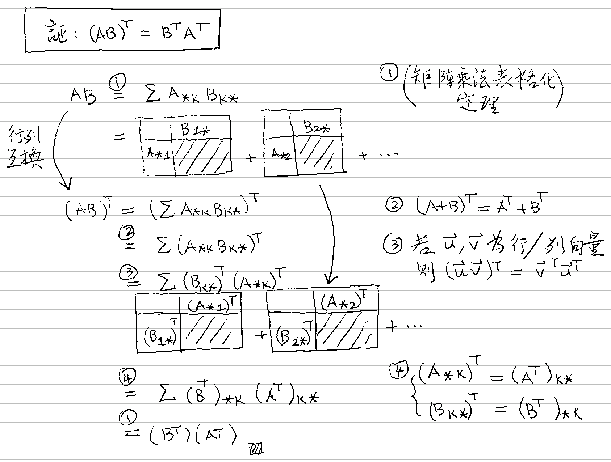

# 🚧 轉置矩陣

[線代](../../) ⟩ [矩陣](../) ⟩ [運算](./) ⟩ 轉置矩陣  ("<mark style="color:purple;">**transpose**</mark>")


將矩陣 $$\mathbf{A}$$ 的<mark style="color:yellow;">**行列互換**</mark>，所得到的矩陣就稱為「<mark style="color:purple;">**轉置矩陣**</mark>」，以 $${\color{orange}\mathbf{A}^T}$$ 表示。

$$(\mathbf{A}^T)_{ij} = \mathbf{A}_{ji}$$





1. (1) $$(\mathbf{A}_{{\color{orange}{i}} *} )^T =\left(\mathbf{A}^T \right)_{*\color{orange}{i}}$$\
   「$$\mathbf{A}$$ 的第 $$i$$ <mark style="color:green;">**列**</mark>」[轉置](transpose.md)後變成「$${\color{orange}\mathbf{A}^T}$$ 的第 $$i$$ <mark style="color:yellow;">**行**</mark>」\
   \
   (2) $$(\mathbf{A}_{* {\color{orange}{j}} } )^T =\left(\mathbf{A}^T \right)_{{\color{orange}{j}} *}$$\
   「$$\mathbf{A}$$ 的第 $$j$$ <mark style="color:yellow;">**行**</mark>」[轉置](transpose.md)後變成「$${\color{orange}\mathbf{A}^T}$$ 的第 $$j$$ <mark style="color:green;">**列**</mark>」



2. $$\mathbf{(AB)}^T = \mathbf{B}^T \mathbf{A}^T$$


* 需要：[矩陣乘法表格化](mult/outer-product/sum-of-outer-products.md#ding-li)、行向量 ⨉ 列向量[引理](mult/outer-product/#yin-li)。
* 證明：👉  


3. $$\mathbf{A} \to  {\color{orange}\mathbf{A}^T}$$ 是一種[**線性變換**](../../space/transform/)：
   * $$(\mathbf{A+B})^{\color{orange}T} = \mathbf{A}^{\color{orange}T} + \mathbf{B}^{\color{orange}T}$$
   * $$({\color{orange}k}\mathbf{A})^{\color{orange}T} = {\color{orange}k} (\mathbf{A}^{\color{orange}T})$$



4. 若 $$\mathbf{M}$$  為<mark style="color:yellow;">**可逆方陣**</mark>，則：$$\left(\mathbf{M}^{-1}\right)^T =  \left(\mathbf{M}^{T}\right)^{-1}$$


* 證明： $$\left(\mathbf{M}^{-1}\right)^T \mathbf{M}^T = \left(\mathbf{M} \mathbf{M}^{-1}\right)^T = \mathbf{I}^T = \mathbf{I}$$ ▨
* 相關： [normal-vec.md](../../space/transform/normal-vec.md "mention")




1. <mark style="color:purple;">**轉置**</mark>後的<mark style="color:yellow;">**行列數**</mark>會跟原來<mark style="color:red;">**不同**</mark> (除非它是個<mark style="color:yellow;">**方陣**</mark>):exclamation:&#x20;



2. $$\left(\mathbf{M}^{-1}\right)^T$$ 稱為 $$\mathbf{M}$$ 的 "<mark style="color:yellow;">**inverse transpose**</mark>"。 :point\_right: [normal-vec.md](../../space/transform/normal-vec.md "mention")




* [inverse.md](mult/inverse.md "mention")
* [matrix.md](../../space/basis/ortho/matrix.md "mention")
* [normal-vec.md](../../space/transform/normal-vec.md "mention")



* [ ] Mathematics for 3D Game Programming & Computer Graphics (2nd Edition, 2004) &#x20;


