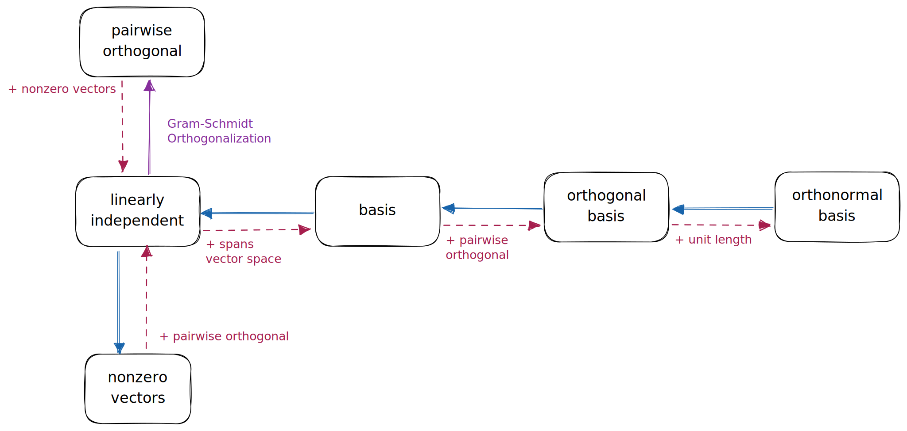

# 🔸 基底

[線性代數](../../) ⟩ [向量空間](../) ⟩ 基底 ("<mark style="color:purple;">**basis**</mark>")


如果一組向量 $$\{ \mathbf{v_1}, \mathbf{v_2}, \cdots, \mathbf{v_n} \}$$：

* [**線性獨立**](../../indep.md)
* 可以**拓展**<mark style="color:yellow;">**整個**</mark>[**向量空間**](../) ( :point\_right: 重點 1 )

我們就說這組向量是[**向量空間**](../)的一組「<mark style="color:purple;">**基底**</mark>」(basis)。




* [coord.md](coord.md "mention")
* [正交基底](ortho/)




1. 若[**向量空間**](../)中的<mark style="color:yellow;">**每個向量**</mark>都能表示成一組向量的[線性組合](../../combination.md)，我們就說這組向量「<mark style="color:orange;">**拓展**</mark>」 (span) 整個向量空間。








* [線性獨立](../../indep.md)
* [線性組合](../../combination.md)


