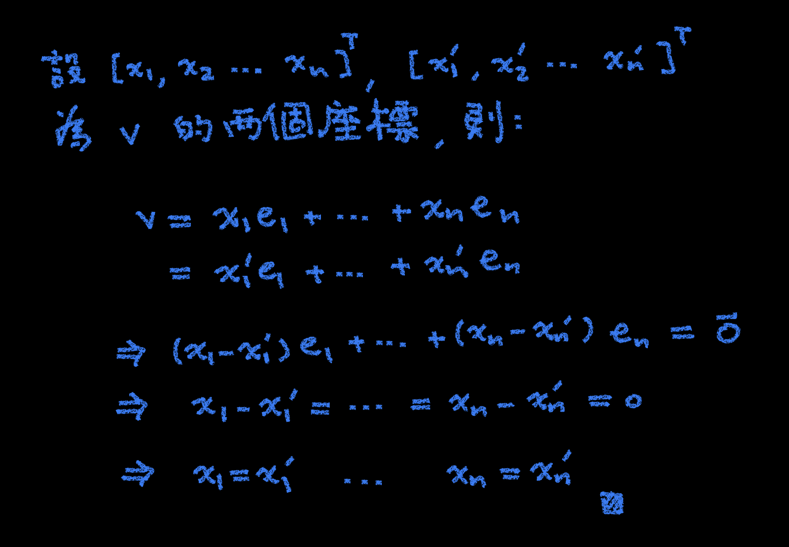
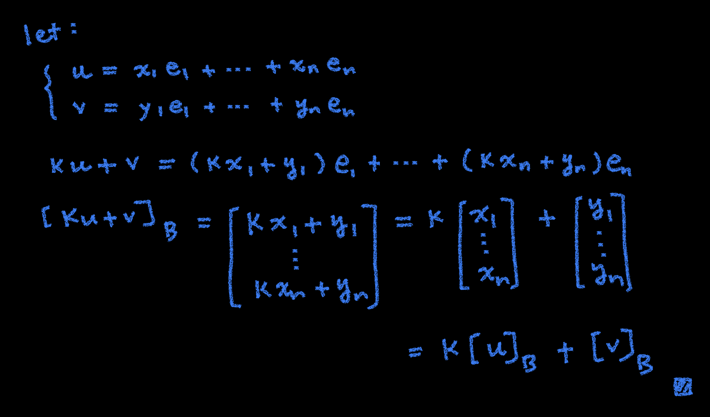

# 🔸 座標

[線性代數](../../) ⟩ [向量空間](../) ⟩ [基底](./) ⟩ 座標 ("<mark style="color:purple;">**coordinate**</mark>")


若：

* $$\mathbf{B} = \{ \mathbf{e_1}, \mathbf{e_2}, \cdots, \mathbf{e_n}\}$$ 為[向量空間](../) $$(\mathbb{V, F,+,\cdot)}$$ 的一組[基底](./)
* $$\mathbf{v} = {\color{orange}x_1}\mathbf{e_1}+ {\color{orange}x_2}\mathbf{e_2}+ \cdots {\color{orange}x_n}\mathbf{e_n}$$

則我們說<mark style="color:yellow;">**行向量**</mark> $$[\ {\color{orange}x_1}, \ {\color{orange}x_2}, \ \cdots, {\color{orange}x_n} \ ]^T$$ 是「 $$\mathbf{v}$$ 以 $$\mathbf{B}$$ 為基底時的<mark style="color:purple;">**座標**</mark> 」，並用 $$[\mathbf{v}]_{\mathbf{B}}$$ 表示。





1. 座標是<mark style="color:yellow;">**唯一的**</mark>。


* 證明：👉 


2. $$[\mathbf{v}]_{\mathbf{B}}: \mathbb{V} \to \mathbb{F}^n$$ 是一個[線性變換](../transform/)。\
   (1) $$[\mathbf{u+v}]_{\mathbf{B}} = [\mathbf{u}]_{\mathbf{B}}+[\mathbf{v}]_{\mathbf{B}}$$\
   (2) $$[{\color{orange}k}\mathbf{v}]_{\mathbf{B}} = {\color{orange}k}[\mathbf{v}]_{\mathbf{B}}$$    ( $${\color{orange}k} \in \mathbb{F}$$ )


* 證明：👉 


3.  已知 $${\color{orange}{T}}: \mathbb{V} \to \mathbb{W}$$ 是一個[線性變換](../transform/)，若：

    * $$\mathbf{B} = \{ \mathbf{e_1}, \mathbf{e_2}, \cdots, \mathbf{e_n}\}$$ 為 $$\mathbb{V}$$ 的一組[基底](./)
    * $$\mathbf{B'} = \{ \mathbf{e'_1}, \mathbf{e'_2}, \cdots, \mathbf{e'_n}\}$$ 為 $$\mathbb{W}$$ 的一組[基底](./)

    則：

    * &#x20;$$[T(\mathbf{v})]_{\mathbf{B'}} = {\color{orange}[T]^{\mathbf{B'}}_{\mathbf{B}} } \ [\mathbf{v}]_{\mathbf{B}}$$

    其中：&#x20;

    * $${\color{orange}[T]^{\mathbf{B'}}_{\mathbf{B}} }$$ 定義為 $$\left[ \ [T(\mathbf{{\color{orange}e_1}})]_{\mathbf{B'}} \ \cdots \ [T(\mathbf{{\color{orange}e_n}})]_{\mathbf{B'}} \ \right]$$


* 證明：👉 [線性變換性質](../transform/#xing-zhi) ２



* [線性變換性質](../transform/#xing-zhi) ２


