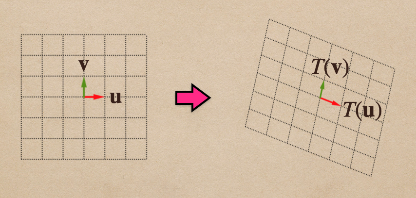
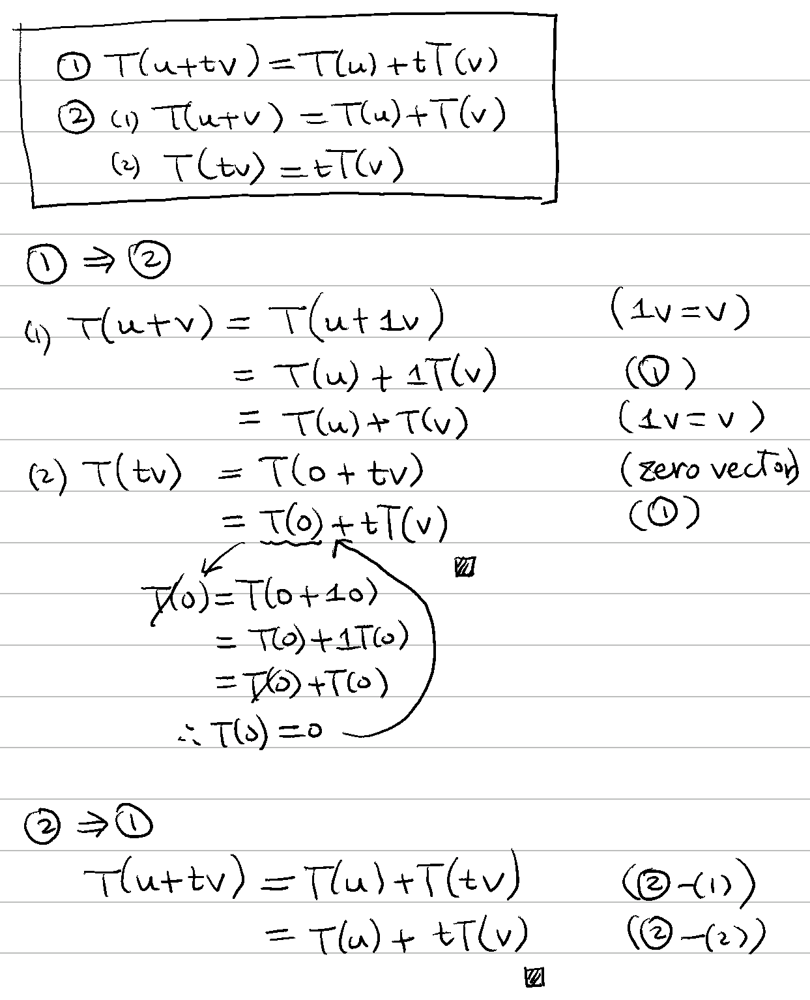
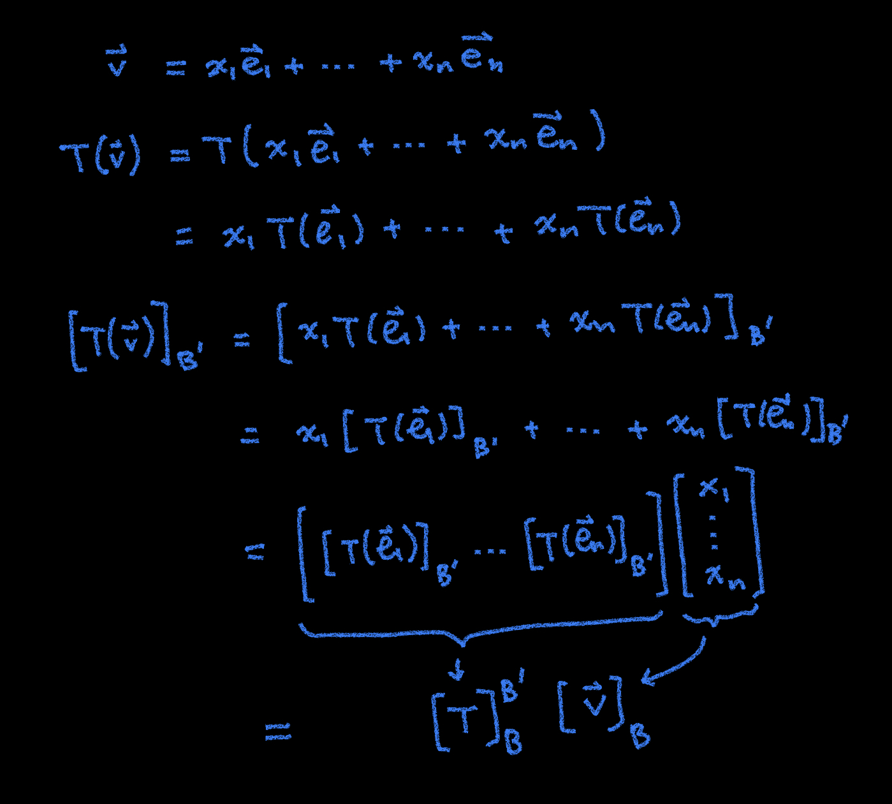

# 🔰 線性變換

[線性代數](../../) ⟩ [向量空間](../) ⟩ 線性變換 (linear transformation)

<figure><figcaption>
能夠「<mark style="color:yellow;"><strong>保持</strong></mark><a href="../">向量空間</a><mark style="color:yellow;"><strong>線性結構</strong></mark>」的變換，稱為「<mark style="color:purple;"><strong>線性變換</strong></mark>」
</figcaption></figure>


假設 $$\mathbb{V}, \mathbb{W}$$ 為在<mark style="color:red;">**同一個**</mark><mark style="color:yellow;">**係數**</mark>[**體**](../../../algebra/field/) $$\mathbb{F}$$ 上的[向量空間](../)，若 $${\color{orange}{T}}: \mathbb{V} \to \mathbb{W}$$ 符合下列條件

* $$T( \mathbf{u} + {\color{orange}{t}} \mathbf{v})=   T(\mathbf{u}) +  {\color{orange}{t}} \ T(\mathbf{v})$$   ( $$t \in \mathbb{F}$$ )

則稱 $${\color{orange}{T}}$$ 為「<mark style="color:purple;">**線性變換**</mark>」。





1. 下列兩者等價：
   * $$T( \mathbf{u} + {\color{orange}{t}} \mathbf{v})=   T(\mathbf{u}) +  {\color{orange}{t}} \ T(\mathbf{v})$$   ( $$t \in \mathbb{F}$$ )&#x20;
   * (1) $$T( \mathbf{u} +  \mathbf{v})=   T(\mathbf{u}) + T(\mathbf{v})$$  \
     (2) $$T( {\color{orange}{t}} \mathbf{v} )=  {\color{orange}{t}} \ T(\mathbf{v})$$


* 證明： :point\_right: &#x20;


2.  已知 $${\color{orange}{T}}: \mathbb{V} \to \mathbb{W}$$ 是一個<mark style="color:purple;">**線性變換**</mark>，若：

    * $$\mathbf{B} = \{ \mathbf{e_1}, \mathbf{e_2}, \cdots, \mathbf{e_n}\}$$ 為 $$\mathbb{V}$$ 的一組[基底](../basis/)
    * $$\mathbf{B'} = \{ \mathbf{e'_1}, \mathbf{e'_2}, \cdots, \mathbf{e'_n}\}$$ 為 $$\mathbb{W}$$ 的一組[基底](../basis/)

    則：

    * &#x20;$$[T(\mathbf{v})]_{\mathbf{B'}} = {\color{orange}[T]^{\mathbf{B'}}_{\mathbf{B}} } \ [\mathbf{v}]_{\mathbf{B}}$$

    其中：&#x20;

    * $${\color{orange}[T]^{\mathbf{B'}}_{\mathbf{B}} }$$ 定義為 $$\left[ \ [T(\mathbf{{\color{orange}e_1}})]_{\mathbf{B'}} \ \cdots \ [T(\mathbf{{\color{orange}e_n}})]_{\mathbf{B'}} \ \right]$$


* 先備： [coord.md](../basis/coord.md "mention")、
* 證明：👉 



* [線性獨立](../../indep.md)
* [基底](../basis/)
* 「[四元數旋轉](../../../num/quaternion/op/rotate.md)」是一種<mark style="color:purple;">**線性變換**</mark>。



* [射影向量](../../vec/proj/)
* [旋轉矩陣](../../matrix/rotation/)
* [transpose.md](../../matrix/op/transpose.md "mention")
* [coord.md](../basis/coord.md "mention")： $$[\mathbf{v}]_{\mathbf{B}}$$



* [ ] Brilliant ⟩ [Linear Transformation](https://brilliant.org/wiki/linear-transformations/)&#x20;


