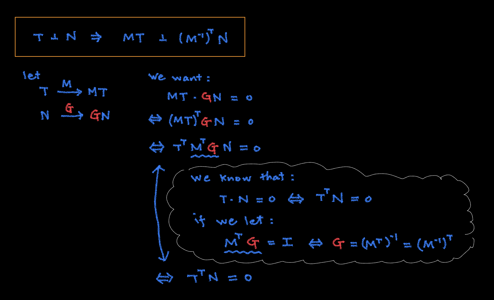

# 🔰 變換法向量

[線性代數](../../) ⟩ [向量空間](../) ⟩ [線性變換](./) ⟩ 變換法向量


一組[切向量](../../vec/parallel/tangent.md) $$\mathbf{T}$$ 與[法向量](../../vec/perp/normal.md) $$\mathbf{N}$$ 會保持[垂直](../../vec/perp/)，但經過[線性變換](./) $$\mathbf{M}$$ 變換成 $$\mathbf{M}\mathbf{T}$$ 與 $$\mathbf{M}\mathbf{N}$$ 後，之間的<mark style="color:yellow;">**垂直關係**</mark><mark style="color:red;">**可能會被打破**</mark>，這時只要利用 $$\left(\mathbf{M}^{-1}\right)^T$$ 將 $$\mathbf{N}$$ 轉換成 $$\left(\mathbf{M}^{-1}\right)^T \mathbf{N}$$，就可以讓 $$\mathbf{M}\mathbf{T}$$ 與 $$\left(\mathbf{M}^{-1}\right)^T \mathbf{N}$$ 再度<mark style="color:yellow;">**保持垂直**</mark>的關係。


* $$\left(\mathbf{M}^{-1}\right)^T$$ 稱為 $$\mathbf{M}$$ 的 "<mark style="color:yellow;">**inverse transpose**</mark>"。
* 若 $$\mathbf{M}$$ 為[正交矩陣](../basis/ortho/matrix.md)（如：[旋轉](../../matrix/rotation/)或鏡射），則 $$\left(\mathbf{M}^{-1}\right)^T= \left(\mathbf{M}^{T}\right)^T = \mathbf{M}$$。
* 證明：👉 



- [normal.md](../../vec/perp/normal.md "mention")
- [transpose.md](../../matrix/op/transpose.md "mention")




1. $$\left(\mathbf{M}^{-1}\right)^T =  \left(\mathbf{M}^{T}\right)^{-1}$$  :point\_right: [轉置矩陣性質](../../matrix/op/transpose.md#xing-zhi) 4




* [ ] Math for 3D Game ⟩ 3.5 Transforming Normal Vectors ⭐️&#x20;



事實上，如果從平面[法向量](../../vec/perp/normal.md)的變化來觀察，也許更自然些。

假設一<mark style="color:yellow;">**平面方程式**</mark>為： $$ax+by+cz+d=0$$，其[法向量](../../vec/perp/normal.md)為 $$\mathbf{N}=[a, b, c]^T$$。若設 $$\mathbf{P}=[x, y, x]^T$$，則原方程式可寫為： $$\mathbf{N}^T \mathbf{P} + d = 0$$。

如果 $$\mathbf{P}$$ 點經過[線性變換](./)變成另一點 $$\mathbf{P}'=\mathbf{M}\mathbf{P}$$，則 $$\mathbf{P}=\mathbf{M}^{-1}\mathbf{P}'$$ 代回原平面方程式可得： $$\mathbf{N}^T \mathbf{M}^{-1}\mathbf{P}' + d = 0$$，由此可看出<mark style="color:yellow;">**新的平面**</mark>[法向量](../../vec/perp/normal.md)為 $$\mathbf{N}'=\left(\mathbf{N}^T \mathbf{M}^{-1}\right)^T$$ ，而這正是本文的主要結果：


$$\mathbf{N}'=\left( \mathbf{M}^{-1}\right)^T \mathbf{N}$$

