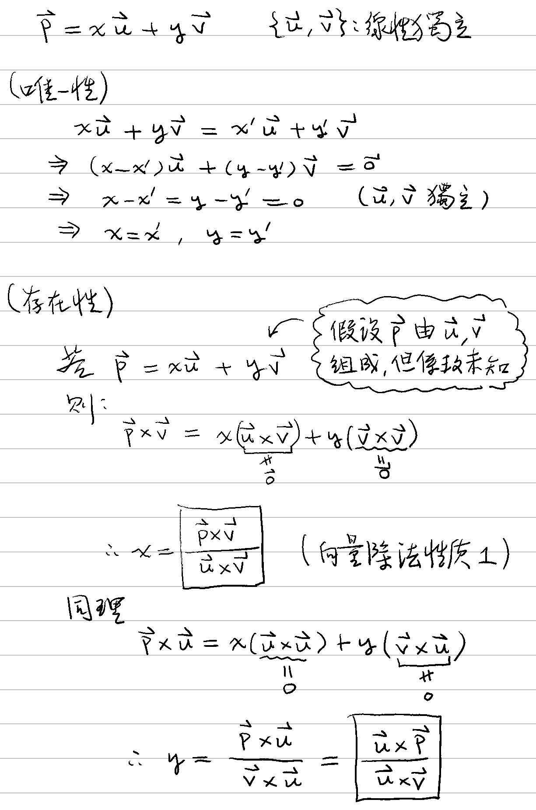

# 🔰 向量分解

[線性代數](../../) ⟩ [向量](../) ⟩ 分解


若 $$\mathbf{p} = {\color{orange}x} \mathbf{u} + {\color{orange}y} \mathbf{v}$$ ($$\mathbf{u}, \mathbf{v}$$ [線性獨立](../../indep.md))，則：

$${\color{orange}x} = \dfrac{\mathbf{\color{red}p}\times\mathbf{v}}{\mathbf{u}\times\mathbf{v}} , \ {\color{orange}y} = \dfrac{\mathbf{u}\times\mathbf{\color{red}p}}{\mathbf{u}\times\mathbf{v}}$$


* 先備：[平行向量性質](../parallel/#xing-zhi) 1、[外積性質](../op/cross/#xing-zhi)、[向量除法性質](../op/div/#xing-zhi) 1、[線性獨立定義](../../indep.md)、
* 證明：👉 



- [perp](perp/ "mention")
- [spherical.md](spherical.md "mention")




1. 此公式若應用在<mark style="color:yellow;">**座標平面**</mark>上，就是著名的[克拉瑪公式](https://zh.wikipedia.org/zh-tw/%E5%85%8B%E8%90%8A%E5%A7%86%E6%B3%95%E5%89%87) (Cramer's Rule)。




* [2d.md](../op/cross/2d.md "mention")
* [3d](../op/cross/3d/ "mention")
* [cross.md](../../../num/quaternion/op/cross.md "mention")


