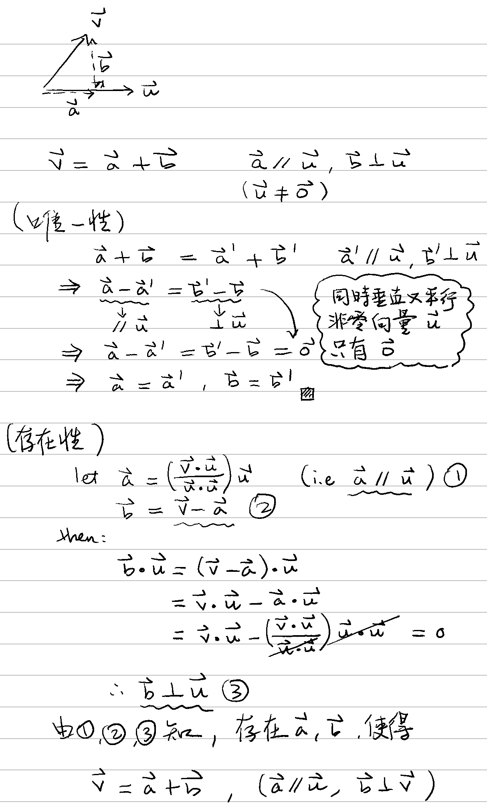
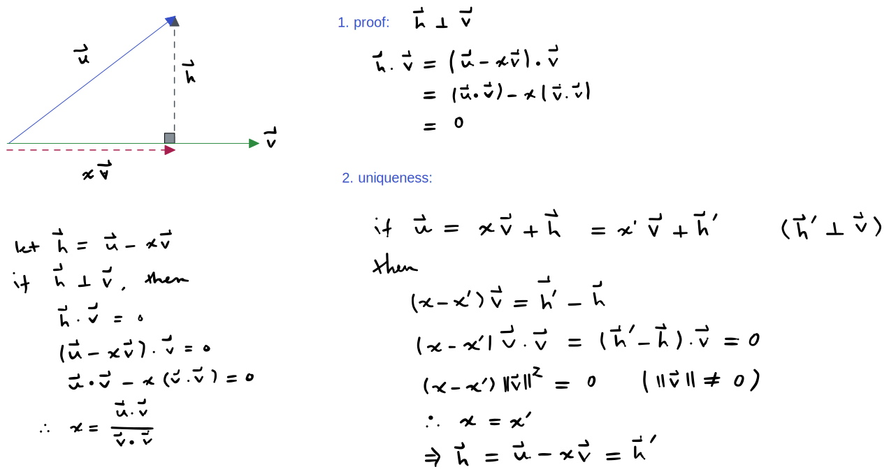

# 🔰 向量垂直分解

[線性代數](../../../) ⟩ [向量](../../) ⟩ [分解](/broken/pages/wdfhCUS4GKvI3n99Fr0Z) ⟩ 垂直分解&#x20;


* 向量 $$\mathbf{u}$$ 可<mark style="color:yellow;">**分解**</mark>成：\
  $$\mathbf{u} = \mathbf{a} + \mathbf{b}$$，其中 $$\mathbf{a} \parallel \mathbf{v}, \ \mathbf{b} \perp \mathbf{v} \ \ (\mathbf{v} \neq \mathbf{0})$$ 
* 這種分解是<mark style="color:yellow;">**唯一**</mark>的，而且：\
  \
  $$\mathbf{a} = \text{proj}_{\mathbf{v}}(\mathbf{u}) = \left(\dfrac{\mathbf{u}\cdot\mathbf{v}}{\mathbf{v}\cdot\mathbf{v}}\right)\mathbf{v}$$ \
  $$\mathbf{b} = \text{perp}_{\mathbf{v}}(\mathbf{u}) = \mathbf{u} - \mathbf{a}$$


* 先備：[垂直向量性質](../../perp/#xing-zhi)2、
* 證明： :point\_right: 




- 這<mark style="color:yellow;">**兩個分量**</mark>都可以看做是 $$\mathbf{u}$$ 的[線性變換](../../../space/transform/)。(可由「[內積性質](/broken/pages/n9XpdwQQ2jzLzE6uaSDz)」證明)
- 這種<mark style="color:purple;">**垂直分解**</mark>不只二維或三維空間可以用，只要有[內積](../../op/dot/)運算的[向量空間](../../../space/)都可以用。




* [perp](../../perp/ "mention")
* [parallel](../../parallel/ "mention")



* [about-axis.md](../../../matrix/rotation/about-axis.md "mention")



* [矩陣乘法](../../../matrix/op/mult/)
* [perp](../../perp/ "mention")



* Mathematics for 3D Game Programming & Computer Graphics (2nd Edition, 2004)




$$\text{proj}_{\mathbf{v}}(\mathbf{u}) = \left(\dfrac{\mathbf{u}\cdot\mathbf{v}}{\mathbf{v}\cdot\mathbf{v}}\right)\mathbf{v}$$&#x20;

$$\text{perp}_{\mathbf{v}}(\mathbf{u}) = \mathbf{u} - \left(\dfrac{\mathbf{u}\cdot\mathbf{v}}{\mathbf{v}\cdot\mathbf{v}}\right)\mathbf{v}$$


🎖 證明：


$$\mathbf{B}  = \dfrac{1}{\|\mathbf{v}\|²}   \begin{bmatrix}       v_2^2 + v_3^2 & -v_1 v_2       & -v_1 v_3 \\       -v_2 v_1      & v_1^2 + v_3^2 & -v_2 v_3 \\      -v_3 v_1      & -v_3 v_2       & v_1^2 + v_2^2   \end{bmatrix}$$


🎖 證明：

$$\text{perp}_{\mathbf{v}}(\mathbf{u})  = \mathbf{u} - \mathbf{Au} = \mathbf{Bu}$$

$$\mathbf{B} = \mathbf{I-A} = \begin{bmatrix}       1 & 0       & 0 \\       0      & 1 & 0 \\      0      & 0       & 1   \end{bmatrix}    - \dfrac{1}{\|\mathbf{v}\|²}  \begin{bmatrix}    v_1^2 & v_1 v_2 & v_1 v_3 \\      v_2 v_1 & v_2^2 & v_2 v_3 \\     v_3 v_1 & v_3 v_2 & v_3^2   \end{bmatrix}$$，其中 $$\|\mathbf{v}\|^2 = v_1^2 + v_2^2 + v_3^2$$

通分後，即可得結果。



