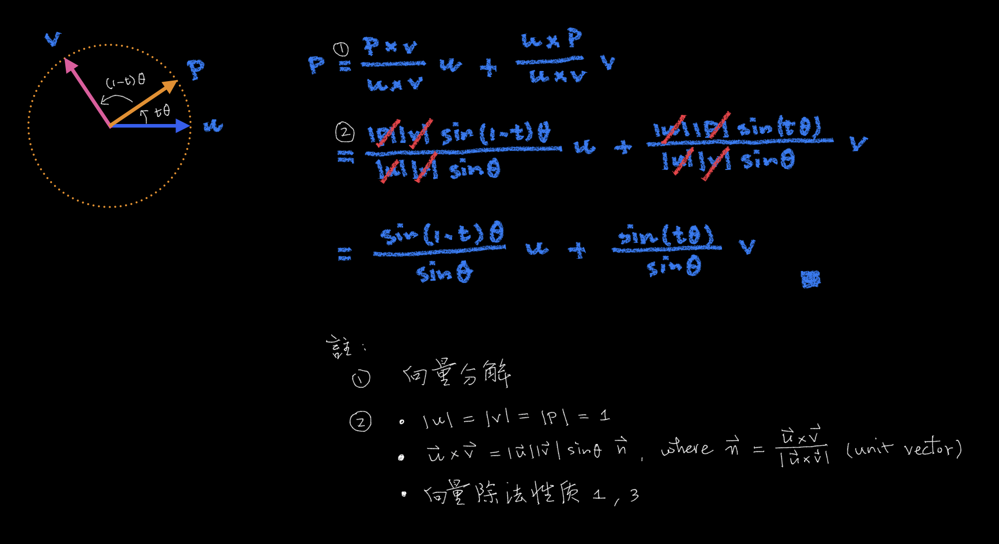

# 🔰 圓弧插值法

[線性代數](../../) ⟩ [向量](../) ⟩ [分解](/broken/pages/wdfhCUS4GKvI3n99Fr0Z) ⟩ 圓弧插值法 (spherical linear interpolation)

若：&#x20;

* $$\mathbf{u} \nparallel \mathbf{v}$$， $$\|\mathbf{u}\| =  \| \mathbf{v} \| = 1$$，&#x20;
* $$\mathbf{p}$$ 為從 $$\mathbf{u}$$ 到 $$\mathbf{v}$$ 的<mark style="color:yellow;">**圓弧**</mark>上的[**單位向量**](../unit.md)，

則：


$$\mathbf{p} = \dfrac{1}{\sin\theta}\left[ \ \sin({\color{orange}(1-t)}\theta) \ \mathbf{u} \ + \ \sin({\color{orange}t}\theta) \ \mathbf{v} \ \right]$$

($$\theta = \cos^{-1}(\mathbf{u} \cdot \mathbf{v})$$ 為 $$\mathbf{u}$$ 到 $$\mathbf{v}$$ 的夾角， $$0 \le t \le 1$$)


* 此式稱為「<mark style="color:purple;">**圓弧插值法**</mark>」(<mark style="color:yellow;">spherical linear interpolation</mark>)。
* 先備：[向量分解](./)、[向量除法](../op/div/#xing-zhi)、[外積性質](../op/cross/#xing-zhi)6、[平行向量性質](../parallel/#xing-zhi)1、
* 證明：👉 



- GGB ⟩ [spherical linear interpolation](https://www.geogebra.org/m/wcsvrc83)&#x20;


圓弧插值法 (spherical linear interpolation)




* [ ] Math for 3D Game ⟩ 3.6.3 Spherical Linear Interpolation ⭐️ &#x20;


