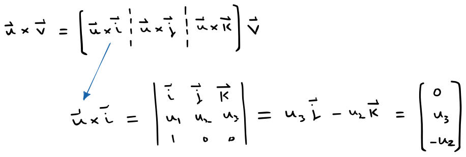

# 🔰 空間外積矩陣

[線性代數](../../../../) ⟩ [向量](../../../) ⟩ [運算](../../) ⟩ [外積](../) ⟩ [空間外積](./) ⟩ 矩陣表示法


[空間外積](./) $$\mathbf{u}\times\mathbf{v}$$ 可視為作用於 $$\mathbf{v}$$ 的<mark style="color:yellow;">**線性變換**</mark>：

$$\mathbf{u} \times \mathbf{v} = \underbrace{ \begin{bmatrix}       0 & -u_3 & u_2 \\   u_3 & 0 & -u_1 \\   -u_2 & u_1 & 0  \end{bmatrix}  \begin{bmatrix}       v_1 \\ v_2 \\ v_3 \end{bmatrix}  }_{\text{matrix multiplication}}$$

(註：當然也可視為作用於 $$\mathbf{u}$$ 的<mark style="color:yellow;">**線性變換**</mark>)




* [對特定軸的旋轉矩陣](../../../../matrix/rotation/about-axis.md)




$$\mathbf{u} \times \mathbf{v} = \underbrace{ \begin{bmatrix}       0 & -u_3 & u_2 \\   u_3 & 0 & -u_1 \\   -u_2 & u_1 & 0  \end{bmatrix}  \begin{bmatrix}       v_1 \\ v_2 \\ v_3 \end{bmatrix}  }_{\text{matrix multiplication}}$$


🎖 證明：

* 由[外積性質](/broken/pages/FMN1x2euxLBhZdA0lLW9)，我們知道外積是個<mark style="color:yellow;">**線性變換**</mark>，所以我們只要算出<mark style="color:yellow;">**三個基底向量**</mark> $$\mathbf{i}, \mathbf{j}, \mathbf{k}$$ 在此變換下，換成哪些行向量即可：

* 上面我們算出<mark style="color:yellow;">**第一個基底向量**</mark> $$\mathbf{i}$$ 會換成：$$\begin{bmatrix}       0  \\   u_3  \\   -u_2   \end{bmatrix}$$，其他向量可依此類推。



* [矩陣乘法](../../../../matrix/op/mult/)
* Desmos ⟩ [matrix](../../../../../tool/desmos/expr/matrix/ "mention")
* GGB ⟩ [matrix](../../../../../tool/ggb/matrix/ "mention") &#x20;
* LaTeX ⟩ [deco.md](../../../../../tool/tex/deco.md "mention")



* [ ] Mathematics for 3D Game Programming & Computer Graphics (2nd Edition, 2004) &#x20;


