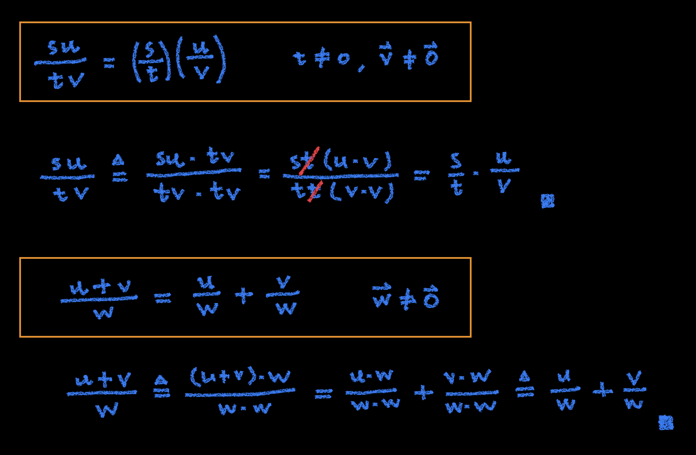
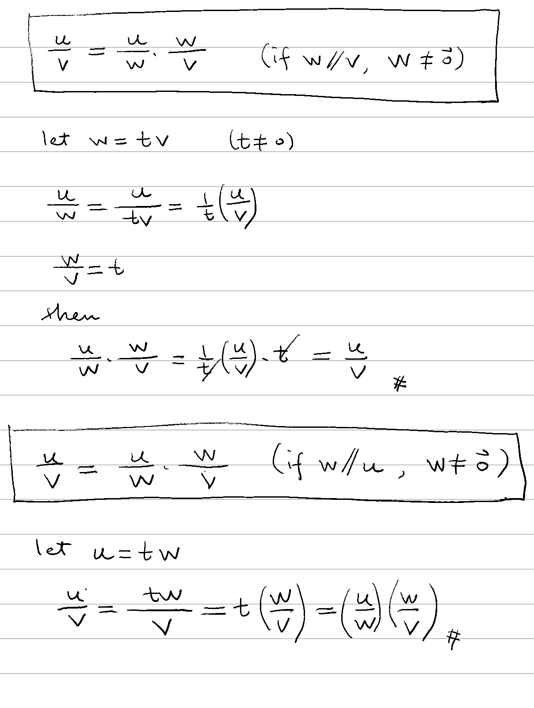

# ➗ 向量除法

[線性代數](../../../) ⟩ [向量](../../) ⟩ [運算](../) ⟩ 向量除法


若 $$\mathbf{v} \neq \mathbf{0}$$，則定義：$$\dfrac{\mathbf{\color{orange}u}}{\mathbf{v}} =  \dfrac{\mathbf{\color{orange}u} \cdot \mathbf{v}}{\mathbf{v} \cdot \mathbf{v}}$$


* ⭐️ 注意： $$\mathbf{u}, \mathbf{v}$$ 兩者<mark style="color:red;">**不需**</mark>[**平行**](../../parallel/):exclamation:&#x20;




1. 若 $$\mathbf{u} = {\color{orange}t} \mathbf{v} \ \ (\mathbf{v} \neq \mathbf{0})$$，則 $$\dfrac{\mathbf{u}}{\mathbf{v}} = \color{orange}t$$


* 證明：👉  


2. 若 $$\mathbf{u}, \mathbf{v} \neq \mathbf{0}$$，則：\
   \
   &#x20;$$\left(\dfrac{\mathbf{\color{orange}u}}{\mathbf{v}}\right)^{-1} = \dfrac{\mathbf{v}}{\mathbf{\color{orange}u}} \iff \mathbf{u} \parallel \mathbf{v}$$


* 先備：[向量長度性質 3](../../norm.md#xing-zhi)、[平行向量性質 1](../../parallel/#xing-zhi)
* 證明：👉 


3. $$\dfrac{   {\color{orange}s} \mathbf{u} }{   {\color{orange}t} \mathbf{v} } = \left( \dfrac{   {\color{orange}s}  }{   {\color{orange}t}  } \right) \left( \dfrac{   \mathbf{u} }{   \mathbf{v} } \right)$$  ( $${\color{orange}t} \neq 0, \mathbf{v} \neq \mathbf{0}$$ )
4. $$\dfrac{   \mathbf{u+v} }{   \mathbf{w} } = \dfrac{   \mathbf{u} }{   \mathbf{w} } + \dfrac{   \mathbf{v} }{   \mathbf{w} }$$   ( $$\mathbf{w} \neq \mathbf{0}$$ )


* 證明：👉 
* 應用：[射影座標性質](div.md#xing-zhi)１、


5. 若 $$\mathbf{{\color{orange}w}} \neq \mathbf{0}, \ \mathbf{{\color{orange}w}} \parallel \mathbf{u} \ \lor \ \mathbf{{\color{orange}w}} \parallel \mathbf{v}$$，則：$$\dfrac{   \mathbf{u} }{   \mathbf{v} } = \dfrac{   \mathbf{u} }{   \mathbf{{\color{orange}w}} } \cdot \dfrac{   \mathbf{{\color{orange}w}} }{   \mathbf{v} }$$


* 證明：👉 
* 應用：[射影座標性質](div.md#xing-zhi)１、



* [decomp](../../decomp/ "mention")
* [spherical.md](../../decomp/spherical.md "mention")



* [proj](../../proj/ "mention")


