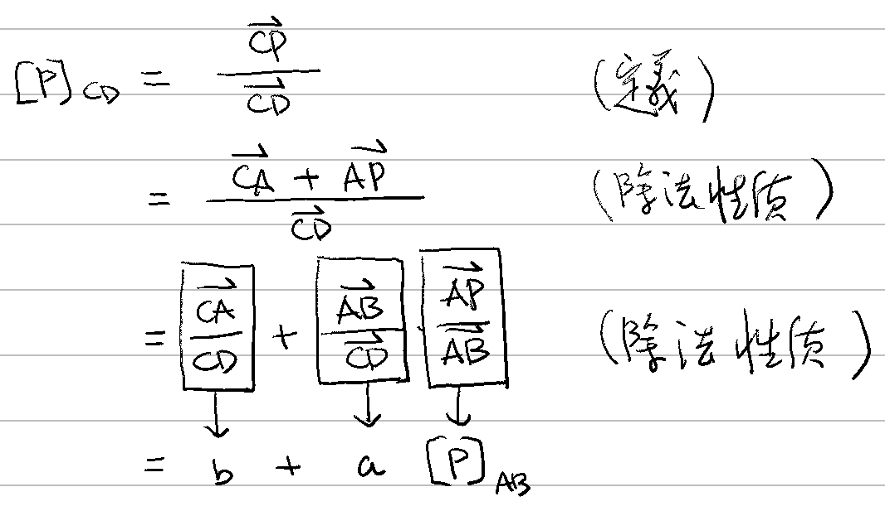

# 🔰 射影座標

[線性代數](../../../) ⟩ [向量](../../) ⟩ [運算](../) ⟩ [除法](./) ⟩ 射影座標&#x20;


若 A, B, P 為[向量空間](../../../space/)中三點，A ≠ B，則定義： $$[{\color{orange}P}]_{AB}=\dfrac{\overrightarrow{A{\color{orange}P}}}{\overrightarrow{AB}}$$，並稱之為「<mark style="color:yellow;">**P 在 AB 線上的射影座標**</mark>」，Ａ點稱為「<mark style="color:yellow;">**座標原點**</mark>」，Ｂ點稱為「<mark style="color:yellow;">**座標單位點**</mark>」。





同一條線上，可以設定不同的「座標原點」與「座標單位點」，但這些不同設定的「射影座標」之間有「線性關係」。 :point\_right: 性質 1





1. 若ＣＤ在ＡＢ直線上，Ｃ≠ Ｄ，則存在 $$a,b \in \mathbb{R}$$，使得： \
   \
   $$[{\color{orange}P}]_{CD}= a \ [{\color{orange}P}]_{AB} + b$$\
   \
   其中： $$a=\dfrac{\overrightarrow{AB}}{\overrightarrow{CD}}, \ b = \dfrac{\overrightarrow{CA}}{\overrightarrow{CD}}$$。


* 先備：[向量除法性質](./#xing-zhi)、
* 證明：👉 



* [proj](../../proj/ "mention")


