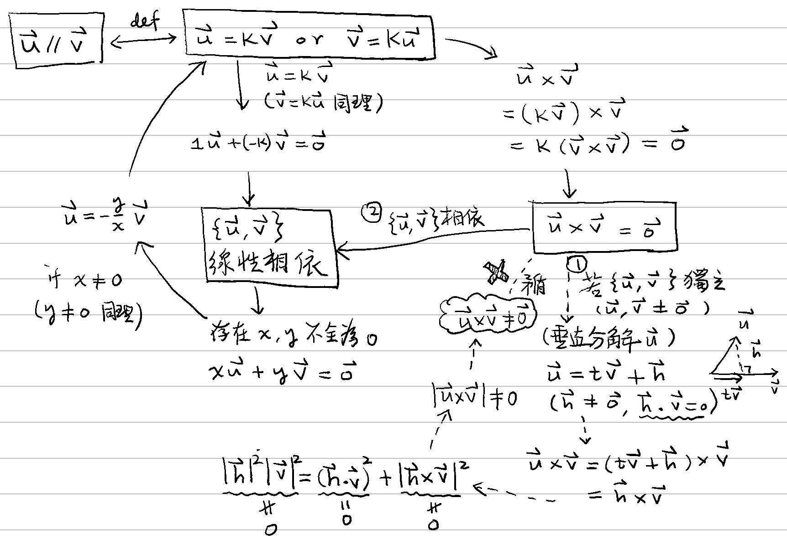

# 🔸 平行向量

[線性代數](../../) ⟩ [向量](../) ⟩ 平行向量


若兩向量有<mark style="color:yellow;">**倍數關係**</mark>，我們就說此兩向量「<mark style="color:purple;">**平行**</mark>」：

$$\mathbf{u} = {\color{orange}k} \mathbf{v}  \text{ or }  \mathbf{v} = {\color{orange}k} \mathbf{u} \ ({\color{orange}k} \in \mathbb{R})  \iff \mathbf{u} \parallel \mathbf{v}$$

:star: 注意：此兩向量<mark style="color:green;">**可以**</mark>是<mark style="color:yellow;">**零向量**</mark>:exclamation:





1. 下列各點是等價的：
   * $$\mathbf{u} \parallel \mathbf{v}$$
   * $$\mathbf{u} = {\color{orange}k} \mathbf{v}  \text{ or }  \mathbf{v} = {\color{orange}k} \mathbf{u} \ ({\color{orange}k} \in \mathbb{R})$$
   * $$\{ \mathbf{u}, \mathbf{v} \}$$ [線性相依](../../indep.md) (linearly dependent)
   * $$\mathbf{u}\times\mathbf{v} = \mathbf{0}$$  (適用於： $$\mathbb{R}^2$$, $$\mathbb{R}^3$$, $$\mathbb{C}$$)


🎖 證明： :point\_right:  


2. <mark style="color:yellow;">**零向量**</mark><mark style="color:purple;">**平行於**</mark>任何向量:exclamation:



3. $$\mathbf{u} \perp \mathbf{v} \ , \ \mathbf{u} \parallel \mathbf{v} \iff \mathbf{u} = \mathbf{0} \text{ or } \mathbf{v} = \mathbf{0}$$


🎖 證明： (由[向量長度性質 1, 3](../norm.md#xing-zhi) 可得)



* [perp](../decomp/perp/ "mention")
* 向量長度 ⟩ [性質 1, 3](../norm.md#xing-zhi)
* [向量外積性質](../op/cross/#xing-zhi)



* [decomp](../decomp/ "mention")
  * [perp](../decomp/perp/ "mention")
  * [spherical.md](../decomp/spherical.md "mention")
* 「<mark style="color:yellow;">**向量除法**</mark>」[性質 2](../op/div/#xing-zhi)： $$\left(\dfrac{\mathbf{\color{orange}u}}{\mathbf{v}}\right)^{-1} = \dfrac{\mathbf{v}}{\mathbf{\color{orange}u}} \iff \mathbf{u} \parallel \mathbf{v}$$  ( $$\mathbf{u}, \mathbf{v} \neq \mathbf{0}$$ )
* 平行向量性質可用於證明：
  * [四元數乘法](../../../num/quaternion/op/x.md)<mark style="color:yellow;">**可交換之條件**</mark>（[性質 5](../../../num/quaternion/op/x.md#xing-zhi)）
  * [四元數除法性質](../../../num/quaternion/op/div.md#xing-zhi)



* [perp](../perp/ "mention")


