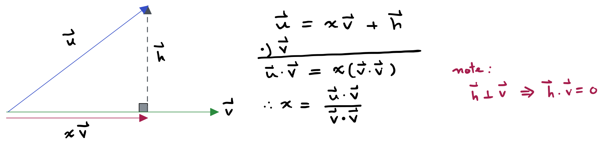

# 🔰 射影向量

[線代](../../) ⟩ [向量](../) ⟩ 射影向量&#x20;


向量 $$\mathbf{u}$$ 投射在向量 $$\mathbf{v}$$ 身上的向量，稱為「<mark style="color:purple;">**射影向量**</mark>」：

$$\text{proj}_{\mathbf{v}}(\mathbf{u})=\left(\dfrac{\mathbf{u}\cdot\mathbf{v}}{\mathbf{v}\cdot\mathbf{v}}\right)\mathbf{v}$$

( 其中 $$\mathbf{v} \ne \mathbf{0}$$ )

:u6307: 同義詞：<mark style="color:purple;">投影向量</mark>, "<mark style="color:purple;">**projection of u onto v**</mark>"





透過<mark style="color:purple;">**射影向量**</mark>，可以將[**向量分解**](../decomp/perp/)成兩個<mark style="color:yellow;">**互相垂直**</mark>的向量。




* [射影向量的矩陣表示法](matrix.md)
* [向量的垂直分解](../decomp/perp/)







* [矩陣乘法](../../matrix/op/mult/)
* [div](../op/div/ "mention")
* <mark style="color:purple;">**射影向量**</mark>是一種[線性變換](../../space/transform/)。



* Mathematics for 3D Game Programming & Computer Graphics (2nd Edition, 2004)
* wiki ⟩ [The Gram–Schmidt process](https://en.wikipedia.org/wiki/Gram%E2%80%93Schmidt_process)&#x20;


