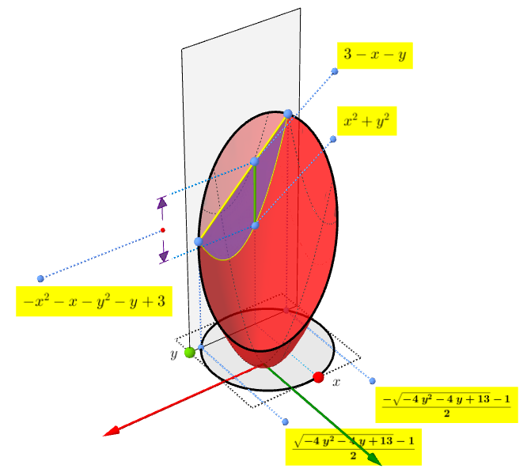
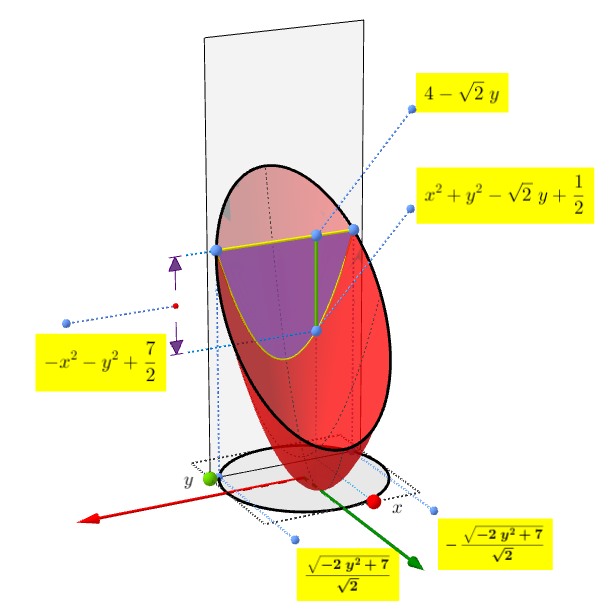
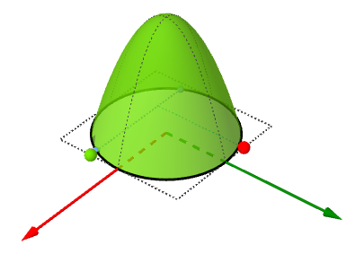
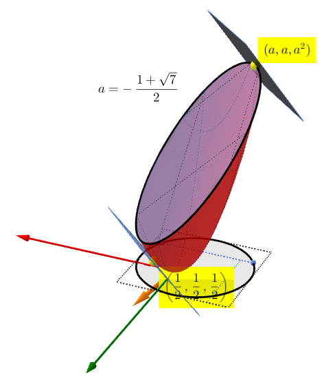

# x²+y²−z<0 且 x+y+z<3 體積

在三維空間中，回答以下小題：

1. 求 $$x^2+y^2-z < 0$$ 與 $$x+y+z < 3$$ 的交集區域的體積
2. 求上題中 $$x+y-z$$ 的極大、極小值

解答：

原來的問題為 $$x^2+y^2<z<3-x-y$$ 的體積：

\[圖例：[雙重積分](https://www.geogebra.org/m/yEyv3rRh)]

經過平移與旋轉後，可視為介於 $$f(x,y)=x^2+y^2-\sqrt{2}y +\frac{1}{2}$$ 與 $$g(x,y)=4-\sqrt{2}y$$ 的體積：

這時做雙重積分 (double integral) 可得：

$$
\int_{-r}^{r}\int_{-\sqrt{r^2-y^2}}^{\sqrt{r^2-y^2}} (r^2-x^2-y^2) dxdy
$$

其中：$$r=\sqrt{\frac{7}{2}}$$，這個積分可以看成旋轉體體積：

這個旋轉體可視為 $$y=\sqrt{x}$$ 從 $$x=0$$ 到 $$x=r^2$$ 的旋轉體體積：

$$
\int_0^{r^2} \pi y^2 dx = \int_0^{r^2} \pi x dx = \frac{\pi r^4}{2} = \frac{49}{8} \pi
$$

至於要尋找在這個體積內 $$x+y-z$$ 極值的點座標，只要找 (1, 1, -1) 方向的終端點代入即可：

\[[GGB 原始檔](https://github.com/pegasusroe/math-notes/tree/92ed4ec9253dccd51e8c566e5f4e5cd749ea51e2/assets/ggb/yuchengda.ggb)]

將 $$\left( \frac{1}{2}, \frac{1}{2}, \frac{1}{2} \right)$$ 、$$(a, a, a^2)$$ 代入可得（其中：$$a=-\frac{1+\sqrt{7}}{2}$$）：

$$
-5-2\sqrt{7} \le x + y -z \le \frac{1}{2}
$$

參考：

* [Wallis’s Theorem](https://www.desmos.com/calculator/fbwtn9pvkf)&#x20;
