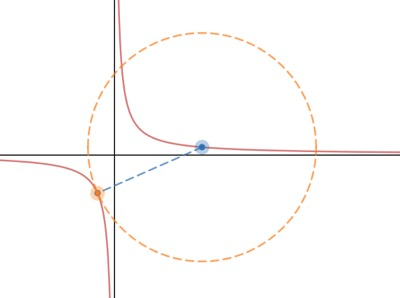

# 雙曲線上兩點的最短距離

題目：

A(a, 1/a) , B(27, 1/27) 為曲線 xy = 1 上兩點 (a < 0)，求 a = ? 時 $$\overline{AB}$$ 有最小值。

解答：

\[[Desmos](https://www.desmos.com/calculator/vtonwxxtvf)]

設 c = 27，則：

$$
\overline{AB}=\sqrt{(a-c)^2 + (\frac{1}{a} - \frac{1}{c})^2 }
$$

設：

$$
\begin{aligned}
f(a)&=(a-c)^2 + (\frac{1}{a} - \frac{1}{c})^2 
\end{aligned}
$$

接下來，利用 $$f'(a)$$ 來計算最小值的地方：

$$
\begin{aligned}f'(a)&=2(a-c) + 2\left(\frac{1}{a} - \frac{1}{c}\right)\left(-\frac{1}{a^2}\right) \\& =2(a-c) + 2\left(\frac{a-c}{ac}\right)\left(\frac{1}{a^2}\right) \\&= 2(a-c)\left( 1 + \frac{1}{ca^3}\right)\\&=  2(a-c)\left( \frac{ca^3+1}{ca^3}\right)\\&= \frac{2}{a^3}(a-c)\left( a^3+\frac{1}{c}\right)\end{aligned}
$$

當 $$f'(a) = 0$$ 時，$$a=-\frac{1}{\sqrt[3]{c}}=-\frac{1}{3}$$

$$
a=-\frac{1}{\sqrt[3]{c}}=-\frac{1}{3}
$$

(注意：a < 0, 所以 a = c 不合)

這時，$$a<-\frac{1}{3}$$ 時，$$f'(a) < 0$$ ，$$a > -\frac{1}{3}$$ 時，$$f'(a) > 0$$ ，所以知道 $$a = -\frac{1}{3}$$ 時有最小值。
