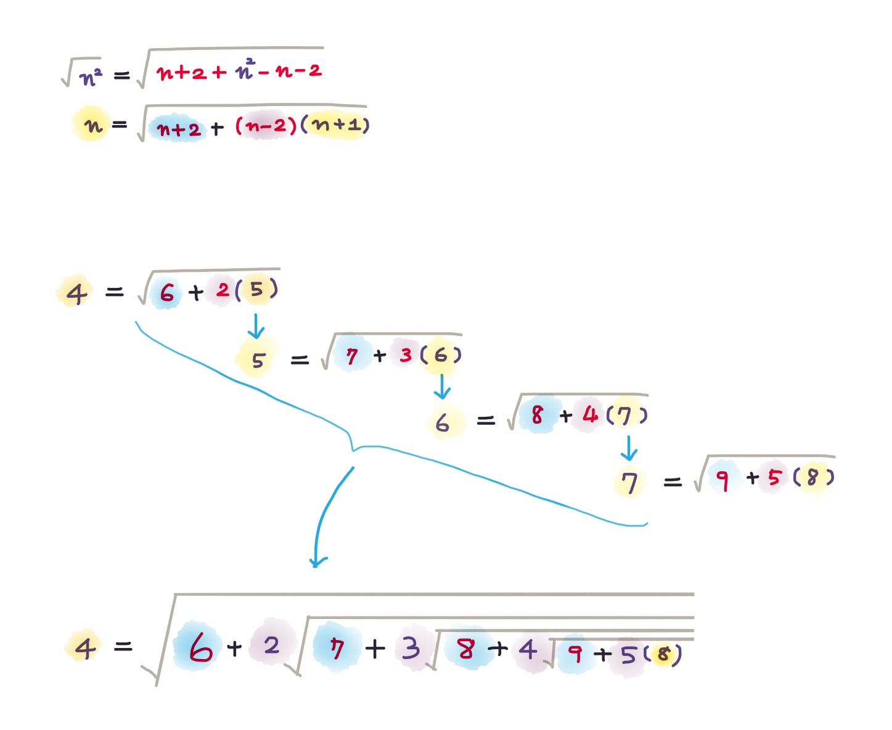

# √(6+2√(7+3√(8+...))) = 4

參考：

* [What is the value of √(6+2√(7+3√(8+...))) ?](https://socratic.org/questions/what-is-the-value-of-s-sqrt-6-2sqrt-7-3sqrt-8-4sqrt-9-cdots)
* Math Stack Exchange: [Prove: = √(6+2√(7+3√(8+...))) = 4](https://math.stackexchange.com/questions/2715473/prove-that-sqrt6-2-sqrt7-3-sqrt8-4-sqrt9-ldots-4)&#x20;
* Math Stack Exchange: [What is the value of √(1+2√(2+3√(3+...)))?](https://math.stackexchange.com/questions/435778/finding-the-value-of-sqrt12-sqrt23-sqrt34-sqrt45-sqrt5-dots)
* Desmos: [√(6+2√(7+3√(8+...))) = 4](https://www.desmos.com/calculator/6l1uvkovw1)
* Quora: [What is the value of √(1+2√(2+3√(3+...)))?](https://www.quora.com/What-is-the-value-of-scriptstyle-sqrt-1+2-sqrt-2+3-sqrt-3+4-sqrt-4+5-sqrt-5+-ldots)
* Wikipedia: \[Ramanujan's Infinite Radicals]\(\[\[[https://en.wikipedia.org/wiki/Nested\_radical#Ramanujan's\_infinite\_radicals\](https://en.wikipedia.org/wiki/Nested\_radical#Ramanujan's\_infinite\_radicals)\](https://en.wikipedia.org/wiki/Nested\_radical#Ramanujan's\_infinite\_radicals\]%28https://en.wikipedia.org/wiki/Nested\_radical#Ramanujan's\_infinite\_radicals%29)\\](https://en.wikipedia.org/wiki/Nested_radical#Ramanujan's_infinite_radicals]\(https://en.wikipedia.org/wiki/Nested_radical#Ramanujan's_infinite_radicals\)]\(https://en.wikipedia.org/wiki/Nested_radical#Ramanujan's_infinite_radicals]%28https://en.wikipedia.org/wiki/Nested_radical#Ramanujan's_infinite_radicals%29\)\\))
