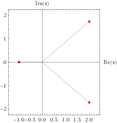

# x³ - 3x² + 3x + 7 = 0

已知：$$x^3 - 3x^2 + 3x + 7 = 0$$

試求：

* $$|x+1|$$ 與 $$\ln x$$
* $$\cos x$$

方程式可分解為：

$$(x + 1) (x^2 - 4 x + 7) = 0$$

解得：

$$x=-1, 2\pm\sqrt{3}i$$

因此：

| $$x$$           | $$\|x+1\|$$   | $$\ln x$$                                                | $$\cos x$$                                          |
| --------------- | ------------- | -------------------------------------------------------- | --------------------------------------------------- |
| -1              | 0             | $$i\pi$$                                                 | $$\cos(1)$$                                         |
| $$2+\sqrt{3}i$$ | $$2\sqrt{3}$$ | $$\ln\sqrt{7}+\tan^{-1}\left(\frac{\sqrt{3}}{2}\right)$$ | $$\cos(2)\cosh(\sqrt{3})-i \sin(2)\sinh(\sqrt{3})$$ |
| $$2-\sqrt{3}i$$ | $$2\sqrt{3}$$ | $$\ln\sqrt{7}-\tan^{-1}\left(\frac{\sqrt{3}}{2}\right)$$ | $$\cos(2)\cosh(\sqrt{3})+i \sin(2)\sinh(\sqrt{3})$$ |

參考：

* [Wolfram Alpha](https://www.wolframalpha.com/input/?i=x^3-3x^2%2B3x%2B7%3D0)：解方程式 $$x^3 - 3x^2 + 3x + 7 = 0$$
* [Wolfram Alpha](https://www.wolframalpha.com/input/?i=ln%28-1%29)：計算 $$\ln(-1)$$
* [Wolfram Alpha](https://www.wolframalpha.com/input/?i=ln%282%2Bsqrt%283%29i%29)：計算 $$\ln (2+\sqrt{3}i)$$
* [Wolfram Alpha](https://www.wolframalpha.com/input/?i=cos%282%2Bsqrt%283%29i%29)：計算 $$\cos(2+\sqrt{3}i)$$
