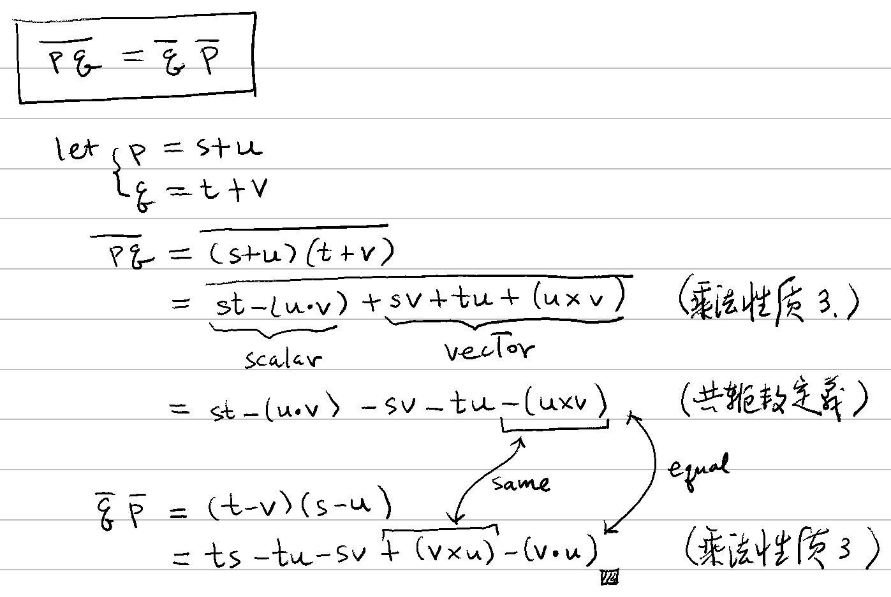

# 🚧 共軛四元數

[數系](../) ⟩ [四元數](./) ⟩ 共軛數 (conjugate)


若 $$\mathbf{q} = w+x\mathbb{i} +y\mathbb{j} +z\mathbb{k}$$，則定義它的<mark style="color:purple;">**共軛數**</mark>為：

$$\mathbf{\overline{q}} = w -x\mathbb{i} -y\mathbb{j} -z\mathbb{k}$$




若：$$\mathbf{p} = {\color{orange}s} + \mathbf{u}$$, $$\mathbf{q} = {\color{orange}t} + \mathbf{v}$$, $$\mathbf{\overline{q}} = {\color{orange}t} - \mathbf{v}$$ 則：


1. $$\mathbf{\overline{pq}} = \mathbf{\overline{q}} \ \mathbf{\overline{p}}$$   (⭐️ 注意順序❗️)
2. $$\overline{{\color{orange}s}} = {\color{orange}s}$$  (<mark style="color:yellow;">**純量**</mark>的共軛數)
3. $$\mathbf{\overline{u}} = -\mathbf{u}$$  (<mark style="color:yellow;">**向量**</mark>的共軛數)


* 🎖 證明： :point\_right:   


4. $$\|\mathbf{q}\|^2 = \mathbf{\overline{q}} \mathbf{q} = \mathbf{q} \mathbf{\overline{q}}$$  ( :point\_right: [四元數長度](length.md) )



5. (1) $$\mathbf{\overline{p \cdot q}} = \mathbf{\overline{p}} \cdot \mathbf{\overline{q}}  = \mathbf{\overline{q}} \cdot \mathbf{\overline{p}} = \mathbf{p} \cdot \mathbf{q}$$\
   (2) $$\mathbf{\overline{p \times q}} = \mathbf{\overline{q}} \times \mathbf{\overline{p}}$$\
   (3) $$\mathbf{\overline{p \pm q}} = \mathbf{\overline{p}} \pm \mathbf{\overline{q}}$$




* [conjugate.md](../complex/conjugate.md "mention")
* [四元數](./) ⟩ [內積](op/dot.md)、[外積](op/cross.md)


