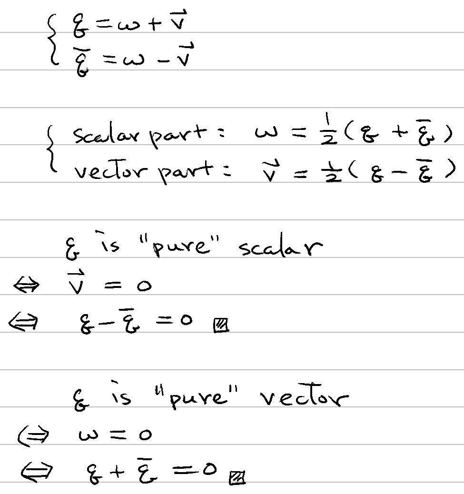

# 🔰 四元數表示法

[數系](../) ⟩ [複數](../complex/) ⟩ 表示法


* 四元數 (quaternion) 通常以：\
  &#x20;\
  $$\begin{align} \mathbf{q}  &= (w,x,y,z) \\ &= w+x\mathbb{i} +y\mathbb{j} +z\mathbb{k} \ \ \ \ \ \\ &= w + \mathbf{v} \end{align}$$ \
  \
  表示， $$w,x,y,z\in \mathbb{R}$$。
* 其中： \
  $$w$$ 稱為<mark style="color:yellow;">**純量部分**</mark> (scalar part)， \
  $$\mathbf{v} = x\mathbb{i} +y\mathbb{j} +z\mathbb{k}$$ 稱為[向量](../../linear/vec/)<mark style="color:yellow;">**部分**</mark> (vector part)。





1. $$\mathbf{q}$$ 的<mark style="color:yellow;">**純量**</mark>部分 (scalar part) 為 $$\frac{1}{2} ( \mathbf{q} + \mathbf{\overline{q}})$$
2. $$\mathbf{q}$$ 的<mark style="color:yellow;">**向量**</mark>部分 (vecotr part) 為 $$\frac{1}{2} ( \mathbf{q} - \mathbf{\overline{q}})$$



3. $$\mathbf{q}$$ 只有<mark style="color:yellow;">**純量**</mark>部分$$\iff \mathbf{q} - \mathbf{\overline{q}} = 0$$
4. $$\mathbf{q}$$ 只有<mark style="color:yellow;">**向量**</mark>部分$$\iff \mathbf{q} + \mathbf{\overline{q}} = 0$$


* 🎖 證明： 



* [共軛四元數](conjugate.md)


