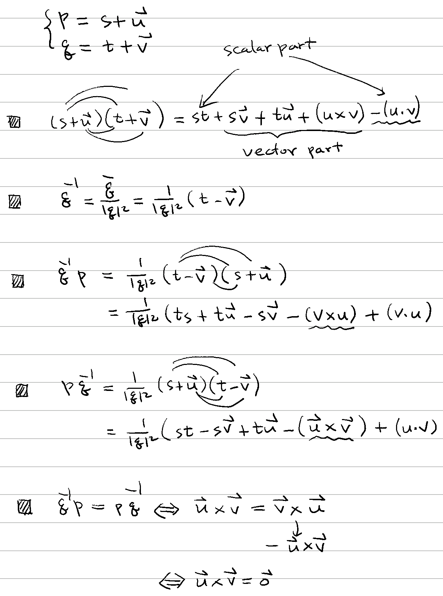

# ❗ 四元數除法

[數系](../../) ⟩ [四元數](../) ⟩ [運算](./) ⟩ 除法


因為「[四元數乘法](x.md)<mark style="color:red;">**沒有**</mark><mark style="color:yellow;">**交換律**</mark>」，所以通常 $$\mathbf{q}^{-1} \mathbf{p} \neq  \mathbf{p} \mathbf{q}^{-1}$$，

因此：$$\dfrac{\mathbf{p}}{\mathbf{q}}$$ 這個符號有「<mark style="color:yellow;">**意義不明**</mark>」的問題，應該<mark style="color:red;">**避免使用**</mark>:exclamation:





若： $$\mathbf{p} = s + \mathbf{u}, \ \mathbf{q} = t + \mathbf{v}$$

則： $$\mathbf{q}^{-1} \mathbf{p} =  \mathbf{p} \mathbf{q}^{-1} \iff  \mathbf{u} \parallel \mathbf{v}$$


* 🎖 證明： :point\_right: 
* ⬆️ 需要： [平行向量性質](../../../linear/vec/parallel/#xing-zhi)



* [平行向量性質](../../../linear/vec/parallel/#xing-zhi)



* [ ] wiki ⟩ [Quaternions](https://www.wikiwand.com/en/Quaternion) ⭐️&#x20;
* [ ] MathWorks ⟩ [Quaternion Division](https://www.mathworks.com/help/aeroblks/quaterniondivision.html)


