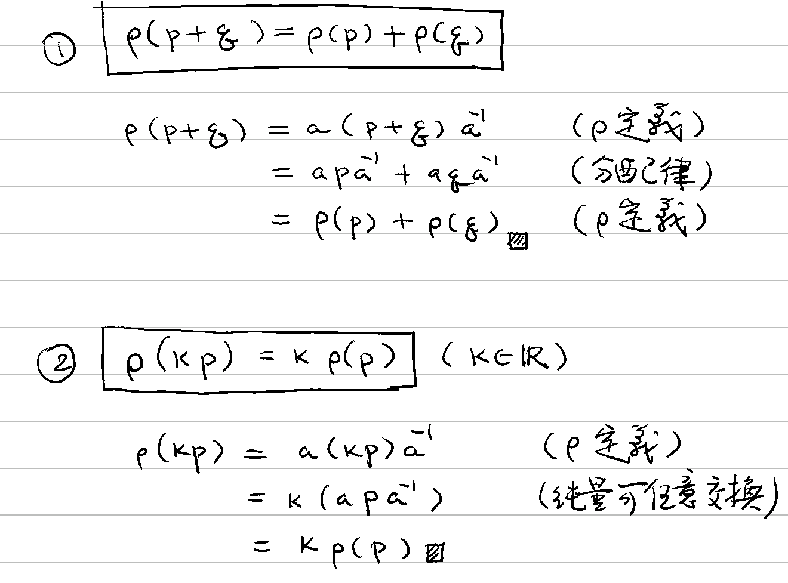
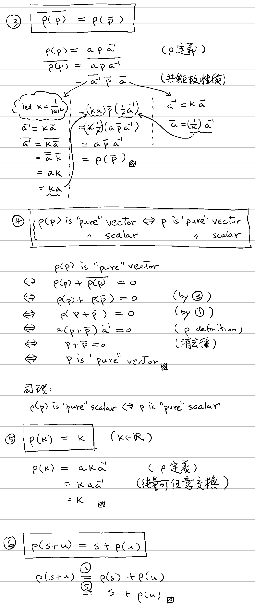
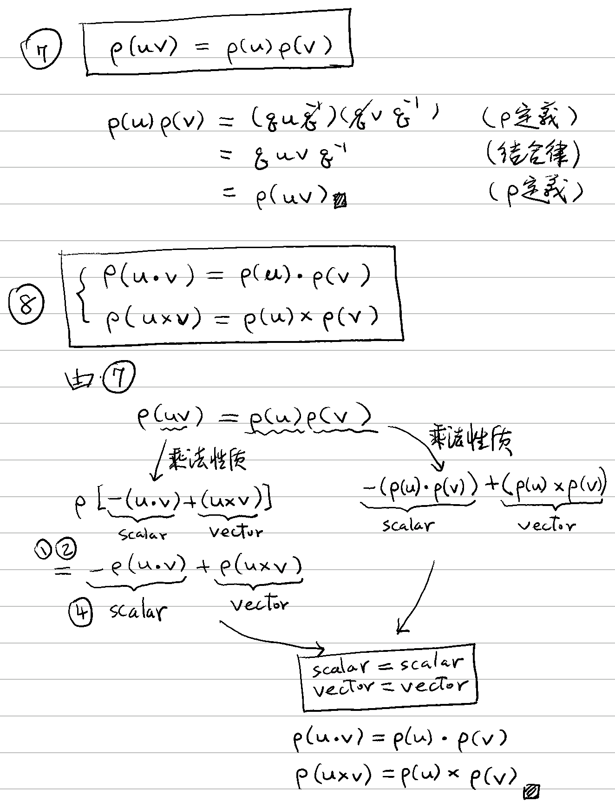
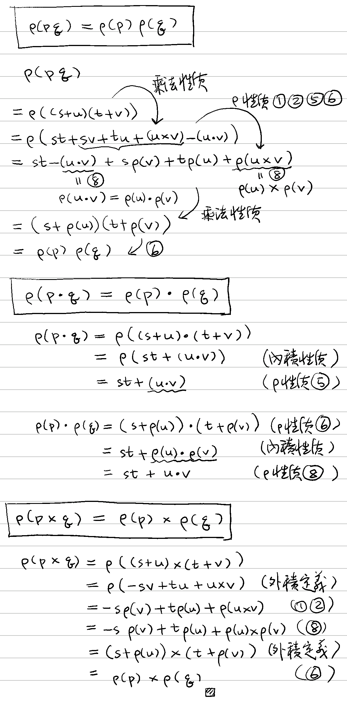
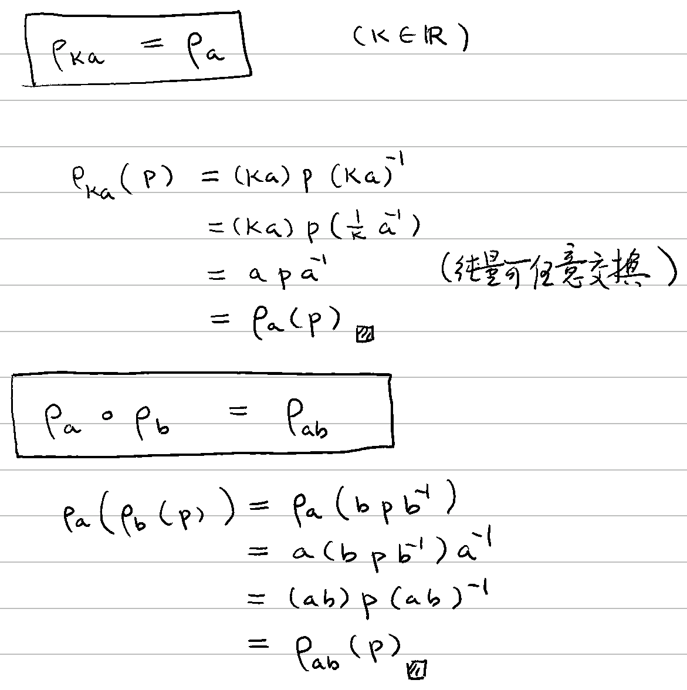
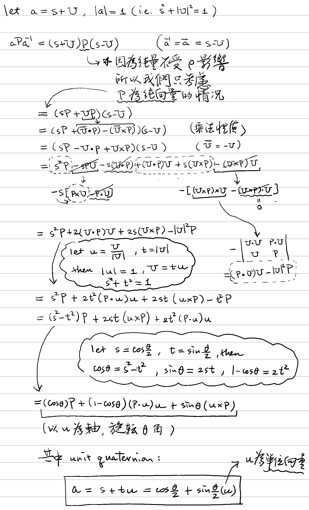

# 🔰 四元數旋轉

[數系](../../) ⟩ [四元數](../) ⟩ [運算](./) ⟩ 旋轉


若定義 $$\rho: \mathbb{H} \to \mathbb{H}$$ 為&#x20;

* $$\rho_{{\color{red}a}}( \mathbf{p} ) = \mathbf{{\color{red}a}} \mathbf{p} \mathbf{{\color{red}a}}^{-1}$$&#x20;

其中 $$\mathbf{a} \neq 0 , \mathbf{a} \in \mathbb{H}$$，則 $$\rho$$ 可視為「[**R³ 中的旋轉**](../../../linear/space/transform/rotate3d.md)」。





1. $$\rho(\mathbf{p+q}) = \rho(\mathbf{p}) + \rho(\mathbf{q})$$
2. $$\rho({\color{orange}k} \mathbf{p}) = {\color{orange}k} \ \rho(\mathbf{p})$$  ( $${\color{orange}k} \in \mathbb{R}$$ )


* 🎖 證明： :point\_right: 
* 由以上兩點可知： $$\rho$$ 是一個「[線性變換](../../../linear/space/transform/)」。 


3. $$\overline{\rho(\mathbf{p})} = \rho(\mathbf{\overline{p}})$$  ⭐️
4. $$\rho(\mathbf{p})$$ is "pure" scalar/vector $$\iff$$$$\mathbf{p}$$ is "pure" scalar/vector
5. $$\rho({\color{orange}{k}}) = {\color{orange}{k}}$$   ( $${\color{orange}k} \in \mathbb{R}$$ )
6. $$\rho({\color{orange}s}+\mathbf{u}) = {\color{orange}s} + \rho(\mathbf{u})$$，其中 $$\rho(\mathbf{u})$$ 為<mark style="color:yellow;">**純向量**</mark>。


* 🎖 證明： :point\_right: &#x20;
* 從 (4)(5)(6) 知： $$\rho$$ <mark style="color:red;">**不會改變**</mark><mark style="color:yellow;">**純量的部分**</mark>，只有對<mark style="color:yellow;">**向量部分**</mark>造成影響。 


7. $$\rho(\mathbf{uv}) = \rho(\mathbf{u}) \rho(\mathbf{v})$$
8. (1) $$\rho(\mathbf{u  \cdot v}) = \mathbf{u  \cdot v}= \rho(\mathbf{u}) \cdot \rho(\mathbf{v})$$\
   (2) $$\rho(\mathbf{u  \times v}) = \rho(\mathbf{u}) \times \rho(\mathbf{v})$$\
   (3) $$\rho( \mathbf{a} ) = \mathbf{{\color{red}a}} \mathbf{a} \mathbf{{\color{red}a}}^{-1} = \mathbf{{\color{red}a}}$$


* 🎖 證明： :point\_right: 
* 從 8. (1) 知： $$\rho$$ <mark style="color:green;">**可以**</mark><mark style="color:yellow;">**保**</mark>[**內積**](../../../linear/vec/op/dot/)，因此可以<mark style="color:yellow;">**保長度**</mark>與向量<mark style="color:yellow;">**夾角**</mark>。
* 從 8. (2) 知： $$\rho$$ <mark style="color:green;">**可以**</mark><mark style="color:yellow;">**保**</mark>[**外積**](../../../linear/vec/op/cross/3d/)，因此可以<mark style="color:yellow;">**保方向性**</mark> (handedness)。
* 從 8. (3) 知： $$\rho$$ <mark style="color:red;">**不會改變**</mark> $$\mathbf{a}$$ 的方向。
* ️️⭐️ 所以從以上三點，我們可以將 $$\rho$$ 看成「[以 $$\mathbf{a}$$ 為軸的旋轉](../../../linear/matrix/rotation/about-axis.md)」。

事實上，上面三式中的<mark style="color:yellow;">**純向量**</mark>改為一般的<mark style="color:orange;">**四元數**</mark>還是<mark style="color:yellow;">**成立**</mark>的：


9. (1) $$\rho(\mathbf{p  q}) = \rho(\mathbf{p}) \rho(\mathbf{q})$$\
   (2) $$\rho(\mathbf{p  \cdot q}) = \rho(\mathbf{p}) \cdot \rho(\mathbf{q})$$\
   (3) $$\rho(\mathbf{p  \times q}) = \rho(\mathbf{p}) \times \rho(\mathbf{q})$$


* 🎖 證明： :point\_right:  


10. $$\rho_{{\color{orange}k}a} = \rho_{a}$$
11. $$\rho_{a} \circ \rho_{b} = \rho_{ab}$$


* 🎖 證明： :point\_right: 
* ⭐️ 由 10. 知：改變 $$\mathbf{a}$$ 的<mark style="color:yellow;">**倍數**</mark>，並<mark style="color:red;">**不會改變**</mark>旋轉的結果。
* ️️⭐️ 由 11. 知：<mark style="color:yellow;">**兩個旋轉的**</mark><mark style="color:orange;">**合成**</mark>，<mark style="color:yellow;">**依然是一個**</mark><mark style="color:orange;">**旋轉**</mark>，只是<mark style="color:yellow;">**軸的方向改變**</mark>而已。 


12. 若 $$\mathbf{a} = {\color{orange} \cos\frac{\theta}{2}} + {\color{orange} \sin\frac{\theta}{2}} \mathbf{u}$$ ，其中 $$\mathbf{u}$$ 為<mark style="color:yellow;">**單位向量**</mark>，則：\
    &#x20;$$\rho_{{\color{red}a}}( \mathbf{p} ) = \mathbf{{\color{red}a}} \mathbf{p} \mathbf{{\color{red}a}}^{-1}$$ \
    為繞 $$\mathbf{u}$$ 旋轉 $$\theta$$ 角的[旋轉變換](../../../linear/matrix/rotation/about-axis.md)。


* 🎖 證明： :point\_right:     （先備： [about-axis.md](../../../linear/matrix/rotation/about-axis.md "mention")）




[四元數乘法](x.md)可以同時處理<mark style="color:yellow;">**兩空間向量**</mark>的[內積](../../../linear/vec/op/dot/)與[外積](../../../linear/vec/op/cross/3d/)。




* [四元數](../) ⟩ [乘法](x.md)、[內積](dot.md)、[外積](cross.md)
* [rotate3d.md](../../../linear/space/transform/rotate3d.md "mention")
* [繞軸旋轉](../../../linear/matrix/rotation/about-axis.md)



* [ ] Math for 3D Game ⟩ 3.6.2 Rotations with Quaternions ⭐️ &#x20;



* replit ⟩ [rotations with Quaternions](https://replit.com/@pegasusroe/rotations-with-Quaternions#index.js) (with unit tests)



如果我們將「[rotate3d.md](../../../linear/space/transform/rotate3d.md "mention")」擴充至四元數 $$\rho: \mathbb{H} \to \mathbb{H}$$，並定義：


* $$\rho({\color{orange}s}+\mathbf{u}) = {\color{orange}s} + \rho(\mathbf{u})$$


則原來「旋轉變換的條件」可改寫為：


* $$\rho(\mathbf{u} \cdot \mathbf{v}) = \rho(\mathbf{u}) \cdot \rho(\mathbf{v})$$ &#x20;
* $$\rho(\mathbf{u} \times \mathbf{v}) = \rho(\mathbf{u}) \times \rho(\mathbf{v})$$


(註： $$\mathbf{u} \cdot \mathbf{v}$$ 為純量，所以根據擴充定義 $$\rho(\mathbf{u} \cdot \mathbf{v}) = \mathbf{u} \cdot \mathbf{v}$$)

但從「四元數[乘法性質](x.md#xing-zhi)」知：


* $$\mathbf{u} \mathbf{v} = (\mathbf{u} \times \mathbf{v}) -(\mathbf{u} \cdot \mathbf{v})$$


據此可推得：\
$$\begin{align*}   \rho(\mathbf{uv})   &= \rho(-(\mathbf{u}\cdot \mathbf{v}) + (\mathbf{u} \times \mathbf{v})) \\   &= -(\mathbf{u}\cdot \mathbf{v}) + \rho(\mathbf{u} \times \mathbf{v}) \\   &= -\rho(\mathbf{u}\cdot \mathbf{v}) + \rho(\mathbf{u} \times \mathbf{v}) \\   &= -\rho(\mathbf{u}) \cdot \rho(\mathbf{v}) + \rho(\mathbf{u}) \times \rho(\mathbf{v}) \\   &= \rho(\mathbf{u}) \rho(\mathbf{v}) \end{align*}$$

因此我們可以將「旋轉變換的兩條件」可改為<mark style="color:yellow;">**一個條件**</mark>：


$$\rho(\mathbf{uv}) = \rho(\mathbf{u}) \rho(\mathbf{v})$$

