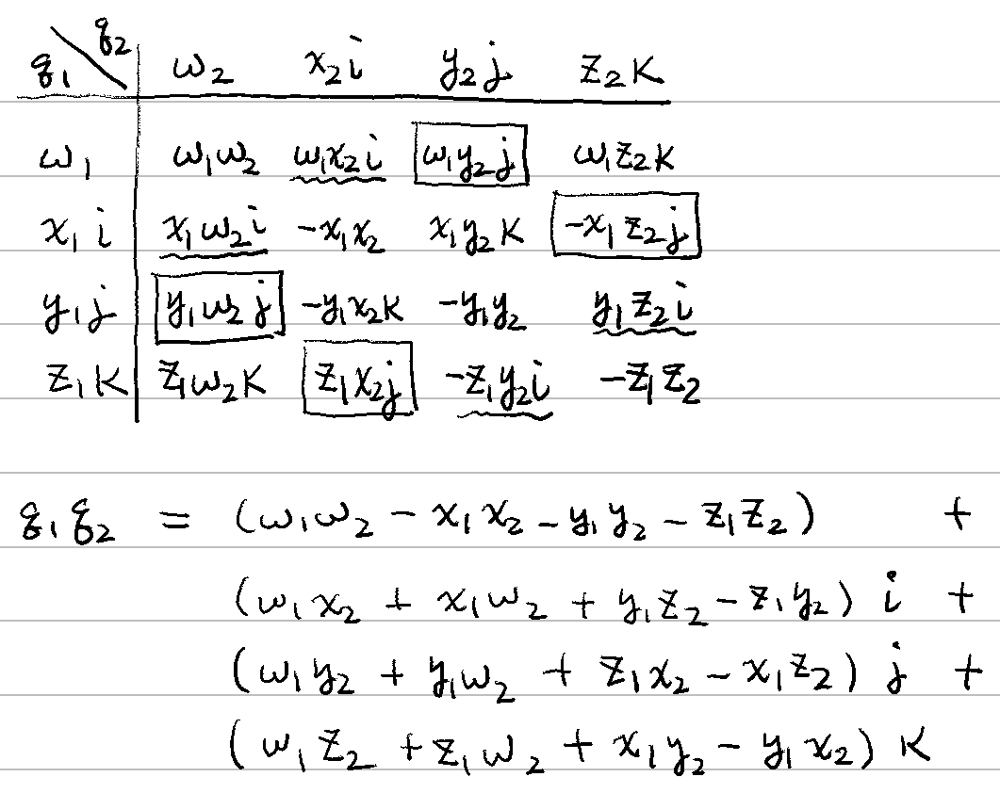
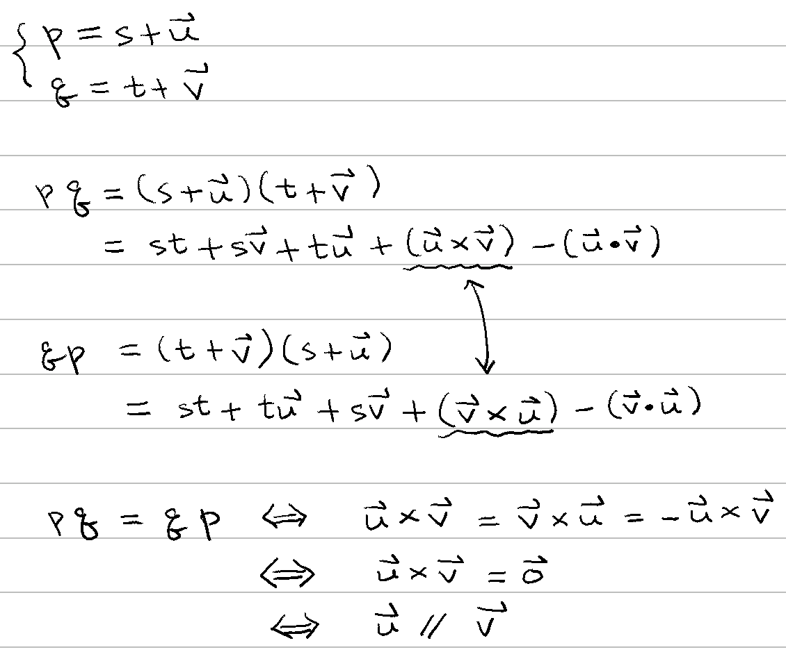

# 🚧 四元數乘法

[數系](../../) ⟩ [四元數](../) ⟩ [運算](./) ⟩ 乘法

* 設： \
  \
  $$\mathbf{p} = w_1+x_1\mathbb{i} +y_1\mathbb{j} +z_1\mathbb{k}$$, \
  $$\mathbf{q} = w_2+x_2\mathbb{i} +y_2\mathbb{j} +z_2\mathbb{k}$$


定義 $$\mathbf{pq}$$ 為：&#x20;

$$\begin{matrix}       \phantom{+}  & \phantom{\mathbf{i}} (w_1 w_2 - x_1 x_2 - y_1 y_2 -z_1 z_2) \\    + & \mathbf{i} \ (w_1 x_2 + x_1 w_2 + y_1 z_2 - z_1 y_2) \\   + & \mathbf{j} \  (w_1 y_2 + y_1 w_2 + z_1 x_2 - x_1 z_2)\\     + & \mathbf{k} \ (w_1 z_2 + z_1 w_2 + x_1 y_2 - y_1 x_2)   \end{matrix}$$


* 註：可先借用四元數的<mark style="color:yellow;">**分配律**</mark>推導 :point\_right: &#x20;


- 若用[矩陣乘法](../../../linear/matrix/op/mult/)則可寫成： \
  $$\begin{bmatrix} w_{1} & -x_{1} & -y_{1} & -z_{1}\\ x_{1} & w_{1} & -z_{1} & y_{1}\\ y_{1} & z_{1} & w_{1} & -x_{1}\\ z_{1} & -y_{1} & x_{1} & w_{1} \end{bmatrix}\begin{bmatrix} w_{2}\\ x_{2}\\ y_{2}\\ z_{2} \end{bmatrix}$$


* ⭐️ 注意：前面這個矩陣<mark style="color:yellow;">**類似**</mark>「**反對稱矩陣**」 




1. (<mark style="color:yellow;">**結合律**</mark>)：$$(\mathbf{p}\mathbf{q})\mathbf{r} =  \mathbf{p}(\mathbf{q}\mathbf{r})$$
2. (**左**<mark style="color:yellow;">**分配律**</mark>)：$$\mathbf{p} (\mathbf{q} + \mathbf{r}) = \mathbf{p}\mathbf{q} + \mathbf{p}\mathbf{r}$$ (**右**<mark style="color:yellow;">**分配律**</mark>也成立)&#x20;


若：$$\mathbf{p} = s + \mathbf{u}$$, $$\mathbf{q} = t + \mathbf{v}$$，則：


3. $$\mathbf{p} \mathbf{q}  =  ( {\color{orange}{s}} + \mathbf{u})( {\color{orange}{t}} + \mathbf{v})  =  \underbrace{ {\color{orange}{st}} - (\mathbf{u} \cdot \mathbf{v}) }_{\text{scalar part}} +  \underbrace{ {\color{orange}{s}} \mathbf{v} + {\color{orange}{t}} \mathbf{u} + (\mathbf{u} \times \mathbf{v})} _{\text{vector part}}$$
4. $$\mathbf{\overline{p}} \mathbf{q}  =  ( {\color{orange}{s}} - \mathbf{u})( {\color{orange}{t}} + \mathbf{v})  =  \underbrace{ {\color{orange}{st}} + (\mathbf{u} \cdot \mathbf{v}) }_{\text{scalar part}} +  \underbrace{ {\color{orange}{s}} \mathbf{v} - {\color{orange}{t}} \mathbf{u} - (\mathbf{u} \times \mathbf{v})} _{\text{vector part}}$$



5. (<mark style="color:red;">**可交換**</mark><mark style="color:yellow;">**條件**</mark>)： $$\mathbf{q} \mathbf{p} =  \mathbf{p} \mathbf{q} \iff  \mathbf{u} \parallel \mathbf{v}$$  &#x20;
6. $${\color{orange}k}\mathbf{q} = \mathbf{q}{\color{orange}k}$$ (<mark style="color:yellow;">**純數**</mark><mark style="color:green;">**一定可交換**</mark>)


* ⬆️ 需要： [平行向量性質](../../../linear/vec/parallel/#xing-zhi)
* 🎖 證明： (5)  


7. $$\mathbf{u} \mathbf{v} = (\mathbf{u} \times \mathbf{v})-(\mathbf{u} \cdot \mathbf{v})$$


* :point\_right: 比較：[複數乘法性質](../../complex/mult.md#xing-zhi) 、 [四元數外積](cross.md) 、[四元數旋轉](rotate.md) 


8. &#x20;$$(1) \ \mathbf{\overline{p}} \mathbf{q} =   \underbrace{ (\mathbf{p} \cdot \mathbf{q}) }_{\text{scalar part}} \underbrace{  - (\mathbf{p} \times \mathbf{q}) }_{\text{vector part}}$$\
   &#x20;$$(2) \ \mathbf{p} \mathbf{q} =   \underbrace{ (\mathbf{\overline{p}} \cdot \mathbf{q}) }_{\text{scalar part}} \underbrace{  - (\mathbf{\overline{p}} \times \mathbf{q}) }_{\text{vector part}}$$


* 🎖 證明： 可由 <mark style="color:yellow;">**(4)**</mark> 式與四元數[內積](dot.md)、[外積](cross.md)定義而來。
* <mark style="color:yellow;">**(8)**</mark> 式可視為是 <mark style="color:yellow;">**(7)**</mark> 式的擴充。




注意：四元數乘法<mark style="color:red;">**沒有**</mark>「<mark style="color:yellow;">**交換律**</mark>」:exclamation:

* $$\mathbf{q}_1 \mathbf{q}_2 \neq  \mathbf{q}_2 \mathbf{q}_1$$





通常<mark style="color:red;"><mark style="color:yellow;">**省略**<mark style="color:yellow;"></mark>四元數的<mark style="color:yellow;">**乘法符號**</mark>，以避免與向量空間的[內積](../../../linear/vec/op/dot/)符號混淆。



[向量係數積](../../../linear/vec/op/scalar-mult.md) $${\color{orange}s} \mathbf{q}$$ 與<mark style="color:purple;">**四元數乘法**</mark> $$({\color{orange}s},0,0,0) \mathbf{q}$$ 兩者<mark style="color:yellow;">**結果一樣**</mark>，因此運算時，我們通常<mark style="color:yellow;">**不區分彼此**</mark>。



[四元數乘法](x.md)可以同時處理<mark style="color:yellow;">**兩空間向量**</mark>的[內積](../../../linear/vec/op/dot/)與[外積](../../../linear/vec/op/cross/3d/)。

:point\_right: [四元數旋轉](rotate.md)




* :point\_right: [四元數旋轉](rotate.md)



* [ ] Math for 3D Games, 3.6 Quaternions



* [Is there a relationship between the cross product and quaternion multiplication?](https://math.stackexchange.com/questions/984438/is-there-a-relationship-between-the-cross-product-and-quaternion-multiplication)


