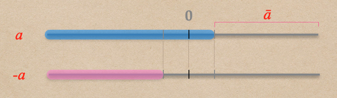
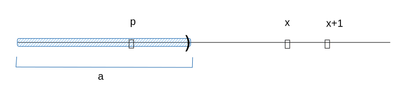
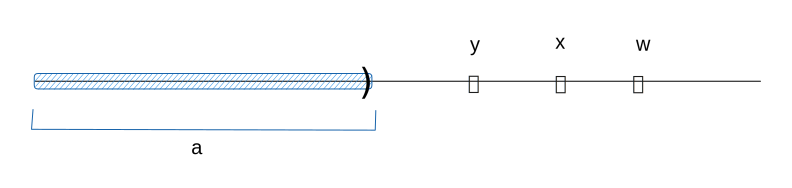
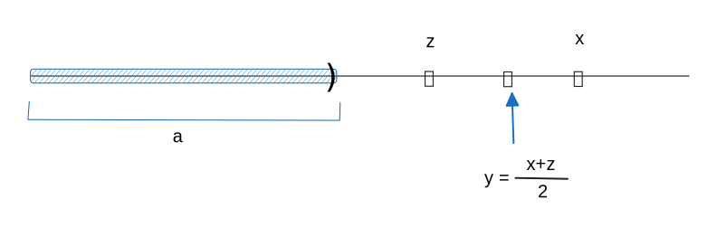

# 🔰 加法反元素 -a

[數學](../../../../) ⟩ [數系](../../../) ⟩ [實數](../../) ⟩ [建造](../) ⟩ [加法](./) ⟩ 反元素

若要定義 $${\color{orange}a} \in {\color{orange}\mathbb{R}}$$ 的<mark style="color:purple;">加法反元素</mark> $${\color{orange}-a}$$，「取 $${\color{orange}a}$$ [補集](../../../../set/complement.md)再<mark style="color:yellow;">變號</mark>」看來是個不錯的選擇：

<figure><figcaption></figcaption></figure>

但如果只是單純這樣做，則會衍生一個問題，也就是「這種有理數子集<mark style="color:red;">不一定</mark>是[戴德金分割](../reals/dedekind-cut.md)」，例如：若 $${\color{orange}a} = (-\infty, 1)$$，則「取 $${\color{orange}a}$$ [補集](../../../../set/complement.md)再<mark style="color:yellow;">變號</mark>」 $$=(-\infty, -1]$$，這時這個子集<mark style="color:red;">不具備</mark>「<mark style="color:yellow;">開放性</mark>」的性質。不過這個問題不大，我們只要做個小修正就可以，也就是「⑴ 取 $${\color{orange}a}$$ [補集](../../../../set/complement.md) ⑵ 去除<mark style="color:yellow;">可能的</mark><mark style="color:orange;">最小值</mark> ⑶ 再<mark style="color:yellow;">變號</mark>」。


 若 $${\color{orange}a} \in {\color{orange}\mathbb{R}}$$，則定義：

* &#x20;$$\bar{\color{orange}a} =  \{ \ x \in {\color{orange}\mathbb{Q}} \ | \ x \notin {\color{orange}a} \ \}$$：⑴ 取 $${\color{orange}a}$$ [補集](../../../../set/complement.md)
* &#x20;$$\hat{\color{orange}a} =  \{ \ x \in \bar{\color{orange}a} \ | \ \exists y \in \bar{\color{orange}a}  \ni y<x \ \}$$：⑵ 去除<mark style="color:yellow;">可能的</mark><mark style="color:orange;">最小值</mark>
* &#x20;$${\color{orange}-a} =  \{ \ -x \in {\color{orange}\mathbb{Q}} \ | \ x \in \hat{\color{orange}a} \ \}$$：⑶ 再<mark style="color:yellow;">變號</mark>


在上面的定義中，我們將 $$\bar{\color{orange}a}$$ <mark style="color:yellow;">可能的</mark><mark style="color:orange;">最小值</mark>去除後，變成 $$\hat{\color{orange}a}$$，這樣可以<mark style="color:yellow;">保持開放性</mark>，然後再<mark style="color:yellow;">變號</mark>，就可以形成一個「[戴德金分割](../reals/dedekind-cut.md)」。



* [加法性質](prop.md)：[A2](prop.md#a2)╱<mark style="color:yellow;">**加法**</mark><mark style="color:orange;">**零元素**</mark>： $$a + {\color{orange}\mathbf{𝟘}} = a$$
* [加法性質](prop.md)：[A3](prop.md#a3)╱<mark style="color:yellow;">**加法**</mark><mark style="color:orange;">**反元素**</mark>： $${\color{orange}a}+ ({\color{orange}-a}) = {\color{orange}\mathbf{𝟘}}$$



## 加法反元素性質 


1. 若 $$-x \in {\color{orange}-a}$$ 則  $$x \notin {\color{orange}a}$$&#x20;
2. $${\color{orange}-a}$$ 是一個「[戴德金分割](../reals/dedekind-cut.md)」
3. $${\color{orange}-\mathbb{0}} = {\color{orange}\mathbb{0}}$$&#x20;
4. 若 $${\color{orange}a} \le {\color{orange}\mathbb{0}}$$，則 $${\color{orange}-a} \ge {\color{orange}\mathbb{0}}$$


## 性質證明 




若 $$-x \in {\color{orange}-a}$$ 則  $$x \notin {\color{orange}a}$$&#x20;


根據$${\color{orange}-a}$$ 定義： $$x \in \bar{\color{orange}a}$$ ，也就是  $$x \notin {\color{orange}a}$$  ▨




若 $${\color{orange}a} \in {\color{orange}\mathbb{R}}$$，則$${\color{orange}-a}$$ 是一個「[戴德金分割](../reals/#dedekind-cut)」

* <mark style="color:yellow;">**DC1**</mark>：$$\exists -x \in {\color{orange}-a}, \exists -p \notin {\color{orange}-a}$$
* <mark style="color:yellow;">**DC2**</mark>：$$-w < -x \in {\color{orange}-a} \implies -w \in {\color{orange}-a}$$&#x20;
* <mark style="color:yellow;">**DC3**</mark>：$$-x \in {\color{orange}-a} \implies \exists -y \in {\color{orange}-a} \ ( -x < -y)$$&#x20;


\[<mark style="color:yellow;">**DC1**</mark>]：$$\exists -x \in {\color{orange}-a}, \exists -p \notin {\color{orange}-a}$$

1. 根據 「[戴德金分割](../reals/#dedekind-cut)定義<mark style="color:yellow;">**DC1**</mark>」： $$\exists p \in {\color{orange}a}, \exists x \notin {\color{orange}a}$$
2. 根據 「$${\color{orange}-a}$$ 的<mark style="color:yellow;">**性質 1.**</mark>」：因爲 $$p \in {\color{orange}a}$$，所以 $$-p \notin {\color{orange}-a}$$（若 $$-p \in {\color{orange}-a}$$ 則  $$p \notin {\color{orange}a}$$，矛盾）
3. 根據 「[戴德金分割性質 2.](../reals/#properties)」：因為 $$x \notin {\color{orange}a}$$ 且 $$x<x+1$$ 所以 $$x+1 \notin {\color{orange}a}$$
4. 因此根據 「$${\color{orange}-a}$$ 的定義」： $$-(x+1) \in {\color{orange}-a}$$
5. 由 2. 與 4. 知： $${\color{orange}-a} \neq {\color{orange}\phi}, \ {\color{orange}\mathbb{Q}}$$ ▨

\[<mark style="color:yellow;">**DC2**</mark>]：$$-w < -x \in {\color{orange}-a} \implies -w \in {\color{orange}-a}$$&#x20;

1. 若 $$-w < -x \in {\color{orange}-a}$$，則 $$w>x$$ 且 $$x \notin {\color{orange}a}, \ \exists y \notin {\color{orange}a} (y<x)$$
2. 根據 「[戴德金分割性質 2.](../reals/#properties)」：因為 $$x<w$$ 且 $$x \notin {\color{orange}a}$$，所以 $$w \notin {\color{orange}a}$$
3. 又因為 $$y \notin {\color{orange}a}, \ y<x<w$$，根據 「$${\color{orange}-a}$$ 的定義」： $$-w \in {\color{orange}-a}$$ ▨

\[<mark style="color:yellow;">**DC3**</mark>]：$$-x \in {\color{orange}-a} \implies \exists -y \in {\color{orange}-a} \ ( -x < -y)$$&#x20;

1. 根據 「$${\color{orange}-a}$$ 的定義」： $$-x \in {\color{orange}-a}$$ 表示 $$x \notin {\color{orange}a}, \ \exists z \notin {\color{orange}a} (z<x)$$
2. 設 $$y=\dfrac{x+z}{2}$$，則 $$z<y<x$$
3. 根據  「[戴德金分割性質 2.](../reals/#properties)」：因為 $$z<y$$ 且 $$w \notin {\color{orange}a}$$，所以 $$y \notin {\color{orange}a}$$
4. 根據 「$${\color{orange}-a}$$ 的定義」：因為  $$y \notin {\color{orange}a}$$ 且 $$z \notin {\color{orange}a}, z<y$$，所以 $$-y \in {\color{orange}-a}$$
5. 根據 2. 與 4. 得知： $$-y$$ 就是我們要找的元素 ▨



🚧 under construction



🚧 under construction


