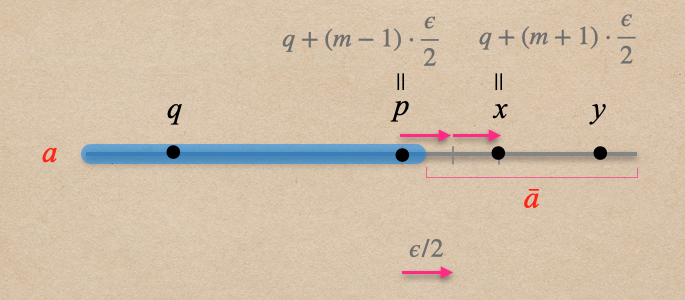

# 🔰 加法性質

[數學](../../../../) ⟩ [數系](../../../) ⟩ [實數](../../) ⟩ [建造](../) ⟩ [加法](./) ⟩ 性質


[實數加法](./)符合代數系統「[體](../../../../algebra/field/)」(<mark style="color:yellow;">field</mark>)的加法規範：

* <mark style="color:yellow;">**A0**</mark>╱<mark style="color:yellow;">**加法**</mark><mark style="color:orange;">**封閉性**</mark>： $$a+b \in {\color{orange}\mathbb{R}}$$  ( :point\_right: [證明](add.md#properties) )
* <mark style="color:yellow;">**A1**</mark>╱<mark style="color:yellow;">**加法**</mark><mark style="color:orange;">**結合律**</mark>： $$(a+b)+c=a+(b+c)$$
* <mark style="color:yellow;">**A2**</mark>╱<mark style="color:yellow;">**加法**</mark><mark style="color:orange;">**零元素**</mark>： $$a + {\color{orange}\mathbf{0}} = a$$
* <mark style="color:yellow;">**A3**</mark>╱<mark style="color:yellow;">**加法**</mark><mark style="color:orange;">**反元素**</mark>： $${\color{orange}a}+ ({\color{orange}-a}) = {\color{orange}\mathbf{𝟘}}$$
* <mark style="color:yellow;">**A4**</mark>╱<mark style="color:yellow;">**加法**</mark><mark style="color:orange;">**交換律**</mark>： $$a+b=b+a$$




* [dedekind-cut.md](../reals/dedekind-cut.md "mention")
* [zero.md](zero.md "mention")&#x20;
* [negative.md](negative.md "mention")



* Understanding Analysis ⟩ 8.6 A Construction of R From Q



## 加法性質證明 




<mark style="color:yellow;">**A1**</mark>╱<mark style="color:yellow;">**加法**</mark><mark style="color:orange;">**結合律**</mark>： $$(a+b)+c=a+(b+c)$$


因為 $$a , b, c \in {\color{orange}\mathbb{R}}$$， $$a, b, c$$ 都是「[戴德金分割](../reals/#dedekind-cut)」：

1. 我們先證明： $$(a+b)+c= \{ \ p+q+r \ | \ p \in {\color{orange}a}, \ q \in {\color{orange}b}, \ r \in {\color{orange}c} \ \}$$
   1. $$(a+b)+c$$ 中的元素必定為 $$(p+q)+r$$ 的形式(其中 $$p \in {\color{orange}a}, \ q \in {\color{orange}b}, \ r \in {\color{orange}c}$$)，因此 $$(a+b)+c \ \subseteq \{ \ p+q+r \ | \ p \in {\color{orange}a}, \ q \in {\color{orange}b}, \ r \in {\color{orange}c} \ \}$$。
   2. 反過來說， $$p+q+r$$ (其中 $$p \in {\color{orange}a}, \ q \in {\color{orange}b}, \ r \in {\color{orange}c}$$) 可以寫成 $$(p+q)+r$$，因此 $$\{ \ p+q+r \ | \ p \in {\color{orange}a}, \ q \in {\color{orange}b}, \ r \in {\color{orange}c} \ \}  \ \subseteq  (a+b)+c$$。
   3. 所以綜合以上兩點： $$(a+b)+c= \{ \ p+q+r \ | \ p \in {\color{orange}a}, \ q \in {\color{orange}b}, \ r \in {\color{orange}c} \ \}$$
2. 同理，我們也可以證明： $$a+(b+c) = \{ \ p+q+r \ | \ p \in {\color{orange}a}, \ q \in {\color{orange}b}, \ r \in {\color{orange}c} \ \}$$

因此，根據以上兩點： $$(a+b)+c=a+(b+c)$$ <mark style="color:blue;">▨</mark>




<mark style="color:yellow;">**A2**</mark>╱<mark style="color:yellow;">**加法**</mark><mark style="color:orange;">**零元素**</mark>： $$a + {\color{orange}\mathbf{𝟘}} = a$$


  根據「[零元素定義](zero.md)」： $${\color{orange}\mathbf{𝟘}} =  \{ \ p \in {\color{orange}\mathbb{Q}} \ | \ p < 0 \ \}$$

1.  先證明： $$a + {\color{orange}\mathbf{0}} \subseteq a$$

    假設 $$p + q \in {\color{orange}a+\mathbf{0}}$$（其中 $$p \in {\color{orange}a}, q \in {\color{orange}\mathbf{0}}$$），因為 $$q \in {\color{orange}\mathbf{0}}$$ 所以 $$q<0$$，因此 $$p+q<p$$，根據「[戴德金分割](../reals/#dedekind-cut)定義 <mark style="color:yellow;">**DC2**</mark>」： $$p + q \in {\color{orange}a}$$，所以 $$a + {\color{orange}\mathbf{0}} \subseteq a$$。
2.  再證明： $$a + {\color{orange}\mathbf{0}} \supseteq a$$

    假設 $$p  \in {\color{orange}a}$$，根據「[戴德金分割](../reals/#dedekind-cut)定義 <mark style="color:yellow;">**DC3**</mark>」： $$\exists q \in {\color{orange}a} \ ( p < q )$$，令 $$\delta = p-q < 0$$，則 $$q+\delta = q + (p-q) = p \in {\color{orange}a}$$，但另一方面 $$q+\delta \in a + {\color{orange}\mathbf{0}}$$，因此可推得 $$p  \in a + {\color{orange}\mathbf{0}}$$，所以 $$a + {\color{orange}\mathbf{0}} \supseteq a$$。

根據以上兩點可知： $$a + {\color{orange}\mathbf{0}} = a$$ <mark style="color:blue;">▨</mark>




<mark style="color:yellow;">**A3**</mark>╱<mark style="color:yellow;">**加法**</mark><mark style="color:orange;">**反元素**</mark>： $${\color{orange}a}+ ({\color{orange}-a}) = {\color{orange}\mathbf{𝟘}}$$


  要證明 $${\color{orange}a}+ ({\color{orange}-a}) = {\color{orange}\mathbf{𝟘}}$$，必須證明 $$a+ ({\color{orange}-a}) \subseteq {\color{orange}\mathbf{0}}$$ 而且 $${\color{orange}\mathbf{𝟘}} \subseteq {\color{orange}a} + ({\color{orange}-a})$$。

先證明： $$a+ ({\color{orange}-a}) \subseteq {\color{orange}\mathbf{0}}$$

<figure><figcaption></figcaption></figure>

1. 設 $$p \in {\color{orange}a}$$ 且 $$-x \in {\color{orange}-a}$$ （也就是 $$x \in {\color{orange}\bar{a}}$$ 且 $$x$$ 不是 $${\color{orange}\bar{a}}$$ 的<mark style="color:orange;">最小值</mark>）
2. 根據 「戴德金分割[補集性質](../reals/dedekind-cut.md#properties)」，$$x$$ 是 $${\color{orange}a}$$ 的<mark style="color:orange;">上界</mark>，因此 $$p<x$$，所以：$$p+(-x)=p-x<0$$&#x20;
3. 因此  $$p+(-x) \in {\color{orange}\mathbf{0}}$$ ，故可得 $$a+ ({\color{orange}-a}) \subseteq {\color{orange}\mathbf{0}}$$

***

再證明： $$a+ ({\color{orange}-a}) \supseteq {\color{orange}\mathbf{0}}$$

* 若要證明 $${\color{orange}\mathbf{𝟘}} \subseteq {\color{orange}a} + ({\color{orange}-a})$$，我們必須證明對每一個 $$-\epsilon < 0 \ \ (\epsilon \in {\color{orange}\mathbf{Q}}^+)$$，不管這個 $$\epsilon$$ 多小(或多大)，都可以找到 $$p \in {\color{orange}a}$$ 且 $$-x \in {\color{orange}-a}$$ ( $$x \in \hat{\color{orange}a}$$， $$\hat{\color{orange}a}$$ 的定義請參考[加法反元素](negative.md))，使得 $$-\epsilon = p-x=p+(-x) \in  {\color{orange}a} + ({\color{orange}-a})$$。

<figure><figcaption></figcaption></figure>

1. 因為 $${\color{orange}a}$$ 是「[戴德金分割](../reals/dedekind-cut.md)」，所以由 <mark style="color:yellow;">**DC1**</mark> (非特化)性質知道： $$\exists q \in {\color{orange}a}, \exists y \notin {\color{orange}a}$$  \
    
2. &#x20;$$\because y \notin {\color{orange}a} \ \therefore y > q$$ （戴德金分割[補集性質](../reals/dedekind-cut.md#undefined-4)⑶）
3. &#x20;$$\because y-q > 0, \ \frac{\epsilon}{2} > 0 \ \ \therefore \exists n \in {\color{orange}\mathbb{N}} \ \ni n \cdot \frac{\epsilon}{2} > y-q$$（有理數的[阿基米德性質](../../../rational/archimedean.md)）\
   換句話說，存在 $$n \in {\color{orange}\mathbb{N}}$$ 使得 $$y < q + n \cdot \frac{\epsilon}{2}$$，因此：\
   $$q + n \cdot \frac{\epsilon}{2} \notin {\color{orange}a}$$（戴德金分割[補集右半線性質](../reals/dedekind-cut.md#undefined-3)）
4. 由上個步驟知道： $$\{ \ k \in {\color{orange}\mathbb{N}} \ | \ q + k \cdot \frac{\epsilon}{2} \notin {\color{orange}a} \ \}$$ 是自然數的非空集合，因此我們知道這個集合有<mark style="color:orange;">最小值</mark>（[自然數的良序性](../../../natural/natural.md)）
5. 令：\
   &#x20;$$m=\text{min}\{ \ k \in {\color{orange}\mathbb{N}} \ | \ q + k \cdot \frac{\epsilon}{2} \notin {\color{orange}a} \ \}$$\
   （ :star: 注意： $$m$$ 必大於零，因為當 $$k=0$$ 時， $$q + k \cdot \frac{\epsilon}{2}=q \in {\color{orange}a}$$ ）\
   &#x20;$$p = q + (m-1) \cdot \frac{\epsilon}{2}$$\
   &#x20;$$x = q + (m+1) \cdot \frac{\epsilon}{2}$$\
   &#x20; 
6. 因為 $$m-1 < m$$，所以 $$p \in {\color{orange}a}$$。\
   再來因為 $$q + m \cdot \frac{\epsilon}{2} \notin {\color{orange}a}$$ 且 $$q + m \cdot \frac{\epsilon}{2} < x$$，因此 $$x \in \hat{\color{orange}a}$$（ $$x \in \bar{\color{orange}a}$$， $$x$$ 也不是 $$\bar{\color{orange}a}$$ 的最小值），所以 $$-x \in {\color{orange}-a}$$。（參考[加法反元素](negative.md)定義）
7. 由上個步驟知道： $$-\epsilon = p-x=p+(-x) \in  {\color{orange}a} + ({\color{orange}-a})$$\
   故證得： $${\color{orange}\mathbf{𝟘}} \subseteq {\color{orange}a} + ({\color{orange}-a})$$  ▨




<mark style="color:yellow;">**加法**</mark><mark style="color:orange;">**交換律**</mark>： $$a+b=b+a$$


 由[有理數](../../../rational/)的「<mark style="color:yellow;">**加法交換律**</mark>」與 $${\color{orange}a+b}$$ 的[定義](add.md)可明顯推得 ▨


