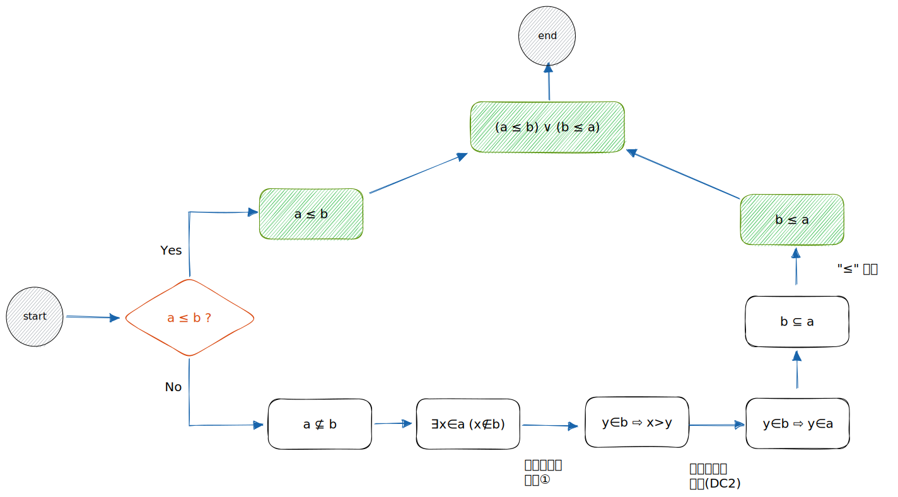

# 🔰 實數順序：a ≤ b

[數學](../../../) ⟩ [數系](../../) ⟩ [實數](../) ⟩ [建造](./) ⟩ 順序


 若 $$a, b \in \mathbb{R}$$，定義： $${\color{orange}a \le b}$$ 代表 $$a \subseteq b$$




* [subset.md](../../../set/relations/subset.md "mention")



* [nonneg\_props.md](mult/nonneg_props.md "mention")



* Understanding Analysis ⟩ 8.6 A Construction of R From Q



## 性質 


在[實數系](reals/) $${\color{orange}\mathbb{R}}$$ 中， $${\color{orange} \le }$$ 是一個 [quan-xu-total-ordering.md](../../../set/binary/quan-xu-total-ordering.md "mention")，具有：

1. (<mark style="color:yellow;">**TO1**</mark>) <mark style="color:orange;">**全序性**</mark>╱[totality](../../../set/binary/prop/totality.md)： $$a \ {\color{orange}\le} \ b \ \lor \ b \ {\color{orange}\le} \ a$$
2. (<mark style="color:yellow;">**TO2**</mark>) <mark style="color:orange;">**反對稱**</mark>╱[antisymmetry](../../../set/binary/prop/antisymmetric.md)： $$a \ {\color{orange}\le} \ b \ \land \ b \ {\color{orange}\le} \ a \implies a = b$$&#x20;
3. (<mark style="color:yellow;">**TO3**</mark>) <mark style="color:orange;">**遞移性**</mark>╱[transitivity](../../../set/binary/prop/transitive.md)： $$a \ {\color{orange}\le} \ b \ \land \ b \ {\color{orange}\le} \ c \implies a \ {\color{orange}\le} \ c$$&#x20;


## 證明 

因為「[⊆](../../../set/relations/subset.md)」本身就有「[反對稱](../../../set/binary/prop/antisymmetric.md)」與「[遞移性](../../../set/binary/prop/transitive.md)」，所有我們只要證明「 $${\color{orange} \le }$$ 」具有「[全序性](../../../set/binary/prop/totality.md)」即可：

