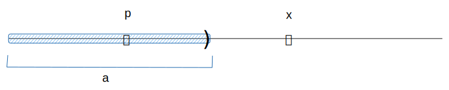
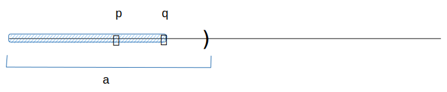
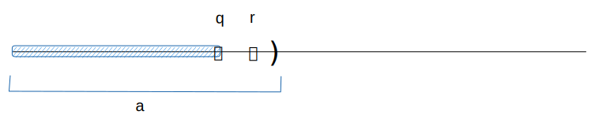

# 🔰 戴德金分割

[數學](../../../../) ⟩ [數系](../../../) ⟩ [實數](../../) ⟩ [建造](../) ⟩ [定義實數](./) ⟩ 戴德金分割

下圖是一個[有理數](../../../rational/)數線上的<mark style="color:orange;">子集</mark> (subset)，具備三特性： ⑴ <mark style="color:yellow;">非特化</mark> ⑵ <mark style="color:yellow;">左封閉</mark> ⑶ <mark style="color:yellow;">右開放</mark>，這樣的<mark style="color:orange;">子集</mark>稱為「<mark style="color:purple;">戴德金分割</mark>」：


 若 $${\color{orange}a} \subseteq \mathbb{Q}$$，並擁有以下性質(設 $$p, q, r, x \in \mathbb{Q}$$)：

* ⑴ <mark style="color:yellow;">**DC1**</mark>：$${\color{orange}a} \neq {\color{orange}\phi}, \ {\color{orange}\mathbb{Q}}$$    ( $$\exists p \in {\color{orange}a}, \exists x \notin {\color{orange}a}$$ )  (非特化：非空真子集)
* ⑵ <mark style="color:yellow;">**DC2**</mark>：$$p < q  \in {\color{orange}a} \implies p \in {\color{orange}a}$$   (左封閉)
* ⑶ <mark style="color:yellow;">**DC3**</mark>：$$p \in {\color{orange}a} \implies \exists q \in {\color{orange}a}, \ \ni p < q$$     (右開放： $${\color{orange}a}$$ <mark style="color:red;">**沒有**</mark><mark style="color:orange;">最大值</mark>)

則稱 $${\color{orange}a}$$ 為一個「<mark style="color:purple;">戴德金分割</mark>╱<mark style="color:yellow;">Dedekind cut</mark>」。


後面我們將這樣的[有理數](../../../rational/)<mark style="color:orange;">子集</mark> $${\color{orange}a}$$ 當作一種[新的數](system.md)(number)，我們稱之為「[實數](system.md)」(real number)。



* [rational.md](rational.md "mention")
* 🚧 存在不是 (-∞, r) 形的戴德金分割



* [order.md](../order.md "mention")
* [add.md](../add/add.md "mention")
* [prop.md](../add/prop.md "mention")：[A3](../add/prop.md#a3)╱<mark style="color:yellow;">**加法**</mark><mark style="color:orange;">**反元素**</mark>： $${\color{orange}a}+ ({\color{orange}-a}) = {\color{orange}\mathbf{𝟘}}$$
* [negative.md](../add/negative.md "mention")：也是一個「<mark style="color:purple;">戴德金分割</mark>」
* [nonnegative.md](../mult/nonnegative.md "mention")
* [nonneg\_props.md](../mult/nonneg_props.md "mention")







* [ ] Understanding Analysis ⟩ 8.6 A Construction of R From Q
* [ ] wiki ⟩ [Dedekind cut](https://en.wikipedia.org/wiki/Dedekind_cut)




問：「 如果放開 <mark style="color:yellow;">**DC1**</mark> 條件，會形成什麼樣的新數系呢？ 」




## 戴德金分割的補集性質 


若 $${\color{orange}a}$$ 是<mark style="color:purple;">戴德金分割</mark>，則 $${\color{orange}\bar{a}}$$ ( $${\color{orange}a}$$ 的[補集](../../../../set/complement.md)) 具有下列性質 (假設 $$p, x, y \in {\color{orange}\mathbb{Q}}$$）：

* ⑴ 非特化： $${\color{orange}\bar{a}} \neq {\color{orange}\phi}, \ {\color{orange}\mathbb{Q}}$$
* ⑵ 右半線：$$x \in {\color{orange}\bar{a}}, \ x < y \implies  \ y \in {\color{orange}\bar{a}}$$
* ⑶ 上下界：$$p \in {\color{orange}a} \ \land \ x \in {\color{orange}\bar{a}} \implies  p < x$$（每個 $$p \in {\color{orange}a}$$ 是 $${\color{orange}\bar{a}}$$ 的<mark style="color:orange;">下界</mark>，每個 $$x \in {\color{orange}\bar{a}}$$ 是 $${\color{orange}a}$$ 的<mark style="color:orange;">上界</mark>）



:warning: 注意：

* 這裡用 $${\color{orange}\bar{a}}$$ 來表示「$${\color{orange}a}$$ 的[補集](../../../../set/complement.md)」，但在[複數系](../../../complex/)中，這種符號是指[共軛複數](../../../complex/conjugate.md)。
* $${\color{orange}\bar{a}}$$ 有可能是「<mark style="color:orange;">封閉性</mark>」的，也就是說，$${\color{orange}\bar{a}}$$ 有可能有<mark style="color:orange;">最小值</mark>，例如：如果 $${\color{orange}a} = (-\infty, 0)$$ ，則 $${\color{orange}\bar{a}} = [0, \infty)$$，這時 $${\color{orange}\bar{a}}$$ 有<mark style="color:orange;">最小值</mark> $$0$$。


## 證明 




⑴ 非特化： $${\color{orange}\bar{a}} \neq {\color{orange}\phi}, \ {\color{orange}\mathbb{Q}}$$


1. 因為 $${\color{orange}a}$$ 是<mark style="color:purple;">戴德金分割</mark>，根據其定義 <mark style="color:yellow;">**DC1**</mark> (非特例)： $$\exists p \in {\color{orange}a}, \exists x \notin {\color{orange}a}$$&#x20;
2. 因此  $$p \notin {\color{orange}\bar{a}} \ \land \ x \in {\color{orange}\bar{a}}$$
3. 因為 $$p \notin {\color{orange}\bar{a}}$$，所以 $${\color{orange}\bar{a}} \neq   {\color{orange}\mathbb{Q}}$$。因為 $$x \in {\color{orange}\bar{a}}$$，所以 $${\color{orange}\bar{a}} \neq {\color{orange}\phi}$$ ▨




⑵ 右半線：$$x \in {\color{orange}\bar{a}}, \ x < y \implies  \ y \in {\color{orange}\bar{a}}$$


1. 若 $$\ y \in {\color{orange}a}$$ ，則根據 $${\color{orange}a}$$ 的「<mark style="color:yellow;">**DC2**</mark> 左半線性質」： $$x < y \ \land \ y \in {\color{orange}a} \implies x \in {\color{orange}a}$$&#x20;
2. 但這結果與 $$x \in {\color{orange}\bar{a}}$$ 矛盾
3. 因此 $$y \in {\color{orange}\bar{a}}$$  ▨




⑶ 上下界：$$p \in {\color{orange}a} \ \land \ x \in {\color{orange}\bar{a}} \implies  p < x$$


因為 $$p, x \in {\color{orange}\mathbb{Q}}$$，根據[有理數](../../../rational/)的「<mark style="color:orange;">三一律</mark>」，下列三個必有一個是正確的：

* ⑴ $$p=x$$ ⑵ $$p>x$$ ⑶ $$p<x$$

***

1. 假設 $$p=x$$，則 $$p=x \in {\color{orange}\bar{a}}$$，這跟已知 $$p \in {\color{orange}a}$$ 矛盾，故不合。
2. 假設 $$p>x$$，則根據 $${\color{orange}\bar{a}}$$ 的「右半線」性質： $$x \in {\color{orange}\bar{a}}, \ x < p \implies  \ p \in {\color{orange}\bar{a}}$$，這跟已知 $$p \in {\color{orange}a}$$ 矛盾，故不合。
3. 根據以上兩點，只剩下唯一個可能，就是 $$p<x$$  ▨


