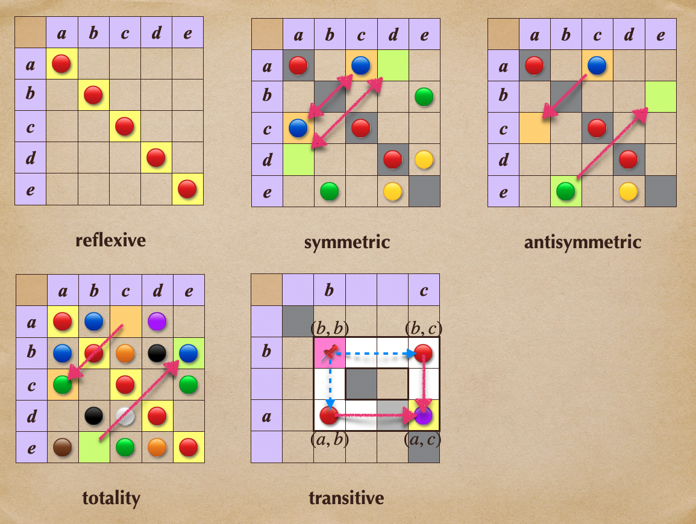

# 🔰 二元關係屬性

[集合](../../) ⟩ [關係](../../relation.md) ⟩ [二元](../) ⟩ 性質


常見的性質有：

* [反身性](reflexive.md) (reflexivity)：$$a \ {\color{orange}\mapsto} \ a, \ \forall a \in A$$  （<mark style="color:yellow;">**對角線上的點**</mark>都有）
* [對稱性](symmetric.md) (symmetry)：$$a \ {\color{orange}\mapsto} \ b \implies b \ {\color{orange}\mapsto} \ a$$     (<mark style="color:yellow;">**對稱位置**</mark><mark style="color:red;">**必須一致**</mark>)
* [反對稱](antisymmetric.md) (antisymmetry)：$$a \ {\color{orange}\mapsto} \ b, \ b \ {\color{orange}\mapsto} \ a \implies a = b$$  （<mark style="color:yellow;">**對稱位置**</mark><mark style="color:red;">**不能**</mark><mark style="color:yellow;">**同時**</mark><mark style="color:green;">**有**</mark><mark style="color:yellow;">**關係**</mark>）
* [遞移性](transitive.md) (transitivity)： $$a \ {\color{orange}\mapsto} \ b, \ b \ {\color{orange}\mapsto} \ c \implies a \ {\color{orange}\mapsto} \ c$$
* [全序性](totality.md) (totality)：$$a \ {\color{orange}\mapsto} \ b \ \text{ or } \ b \ {\color{orange}\mapsto} \ a  \ ( \ \forall a, b \in A \ )$$（<mark style="color:yellow;">**任兩個元素間一定有關係**</mark>)(<mark style="color:yellow;">**對稱位置**</mark><mark style="color:red;">**不能**</mark><mark style="color:yellow;">**同時**</mark><mark style="color:red;">**沒**</mark><mark style="color:yellow;">**關係**</mark>╱<mark style="color:yellow;">**對角線上的點**</mark>都有)

:star: 註：「[全序性](totality.md)」一定有「[反身性](reflexive.md)」


<figure><figcaption>
二元關係性質
</figcaption></figure>




:star:注意：以下性質只適用於「<mark style="color:yellow;">**同一個集合內**</mark>」元素之間的「[二元關係](../)」:exclamation:


* [reflexive.md](reflexive.md "mention")： $$a \ {\color{orange}\mapsto} \ a, \ \forall a \in A$$
* [symmetric.md](symmetric.md "mention")： $$a \ {\color{orange}\mapsto} \ b \implies b \ {\color{orange}\mapsto} \ a$$
* [antisymmetric.md](antisymmetric.md "mention")： $$a \ {\color{orange}\mapsto} \ b, \ b \ {\color{orange}\mapsto} \ a \implies a = b$$
* [transitive.md](transitive.md "mention")： $$a \ {\color{orange}\mapsto} \ b, \ b \ {\color{orange}\mapsto} \ c \implies a \ {\color{orange}\mapsto} \ c$$
* [totality.md](totality.md "mention")： $$a \ {\color{orange}\mapsto} \ b \ \text{ or } \ b \ {\color{orange}\mapsto} \ a  \ ( \ \forall a, b \in A \ )$$



* Abstract and Linear Algebra (Burton) ⟩ 1.2 Functions and relations (p. 19)


