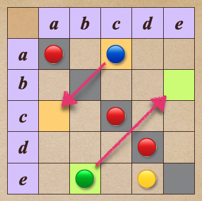

# 🔸 反對稱╱antisymmetry

[集合](../../) ⟩ [關係](../../relation.md) ⟩ [二元](../) ⟩ [性質](./) ⟩ 反對稱


若「[二元關係](../)」，擁有以下性質：

* $$a \ {\color{orange}\mapsto} \ b, \ b \ {\color{orange}\mapsto} \ a \implies a = b$$  （<mark style="color:yellow;">**對稱位置**</mark><mark style="color:red;">**不能**</mark><mark style="color:yellow;">**同時**</mark><mark style="color:green;">**有**</mark><mark style="color:yellow;">**關係**</mark>）

此時我們說此「[二元關係](../)」具有具有「<mark style="color:orange;">**反對稱性**</mark>」(<mark style="color:yellow;">**antisymmetry**</mark>)。


<figure><figcaption>
antisymmetric relation
</figcaption></figure>


利用表格，可以看出「[二元關係](../)」是不是具有「<mark style="color:orange;">**反對稱性**</mark>」：

* 對稱「<mark style="color:yellow;">**對角線**</mark>」的「<mark style="color:yellow;">**每對位置**</mark>」：
  * 如果其中一個位置<mark style="color:green;">**有**</mark>關係，則代表另一個位置**一定**<mark style="color:red;">**沒有**</mark>此關係。
  * 如果其中一個位置<mark style="color:red;">**沒有**</mark>關係，則另一個位置<mark style="color:yellow;">**可以有**</mark>、也<mark style="color:yellow;">**可以沒有**</mark>此關係。
  * 換句話說，「<mark style="color:yellow;">**對稱位置**</mark>」<mark style="color:red;">**不能同時**</mark><mark style="color:yellow;">**有關係**</mark>。
  * :bulb: 因此：
    * 一看到有「<mark style="color:yellow;">**對稱位置**</mark>」<mark style="color:red;">**同時**</mark><mark style="color:yellow;">**有關係**</mark>，就代表此關係<mark style="color:red;">**不具備**</mark>「<mark style="color:orange;">**反對稱性**</mark>」。
    * 反過來說，如果找不到這種例子，那就代表<mark style="color:green;">**有**</mark>「<mark style="color:orange;">**反對稱性**</mark>」。
* 「<mark style="color:yellow;">**對角線上的位置**</mark>」不管是否有關係，都對「<mark style="color:orange;">**反對稱性**</mark>」<mark style="color:yellow;">**沒有任何影響**</mark>。



除了對角線外，完全沒有任何像 $$a \ {\color{orange}\mapsto} \ b, \ b \ {\color{orange}\mapsto} \ a$$ 這樣的「對稱關係」同時存在:exclamation:




具有「<mark style="color:orange;">**反對稱性**</mark>」(<mark style="color:yellow;">**antisymmetry**</mark>) 的[關係](../../relation.md)：

* [quan-xu-total-ordering.md](../quan-xu-total-ordering.md "mention")：例如 $$x\le y$$



* 比較：
  * 「<mark style="color:orange;">**反對稱**</mark>」：「<mark style="color:yellow;">**對稱位置**</mark>」<mark style="color:red;">**不能**</mark><mark style="color:yellow;">**同時**</mark><mark style="color:green;">**有**</mark><mark style="color:yellow;">**關係**</mark>。
  * 「[全序性](totality.md)」：「<mark style="color:yellow;">**對稱位置**</mark>」<mark style="color:red;">**不能**</mark><mark style="color:yellow;">**同時**</mark><mark style="color:red;">**沒**</mark><mark style="color:yellow;">**關係**</mark>。



* Abstract and Linear Algebra (Burton) ⟩ 1.2 Functions and relations (p. 19)&#x20;


