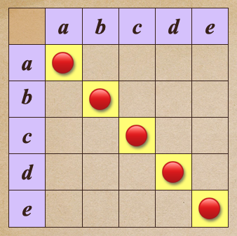

# 🔸 反身性╱reflexivity

[集合](../../) ⟩ [關係](../../relation.md) ⟩ [二元](../) ⟩ [性質](./) ⟩ 反身性


若「[二元關係](../)」，擁有以下性質：

* $$a \ {\color{orange}\mapsto} \ a, \ \forall a \in A$$  （<mark style="color:yellow;">**對角線上的點**</mark>都有）

此時我們說此「[二元關係](../)」具有「<mark style="color:orange;">**反身性**</mark>」(<mark style="color:yellow;">**reflexivity**</mark>)。


<figure><figcaption>
reflexive relation
</figcaption></figure>


利用表格，可以很容易看出「[二元關係](../)」是不是具有「<mark style="color:orange;">**反身性**</mark>」：

* 只要看看「<mark style="color:yellow;">**對角線上的所有位置**</mark>」是否都有此關係就好。
* 不是對角線上的位置，對「<mark style="color:orange;">**反身性**</mark>」沒有任何影響。





「<mark style="color:orange;">**全序性**</mark>」([totality](totality.md))： $$a \ {\color{orange}\mapsto} \ b \ \text{ or } \ b \ {\color{orange}\mapsto} \ a  \ ( \ \forall a, b \in A \ )$$ 必定具有「<mark style="color:orange;">**反身性**</mark>」(<mark style="color:yellow;">**reflexivity**</mark>)




* Abstract and Linear Algebra (Burton) ⟩ 1.2 Functions and relations (p. 19)&#x20;


