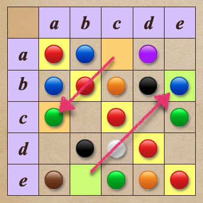

# 🔸 全序性╱totality

[集合](../../) ⟩ [關係](../../relation.md) ⟩ [二元](../) ⟩ [性質](./) ⟩ 全序性


若「[二元關係](../)」，擁有以下性質：

* $$a \ {\color{orange}\mapsto} \ b \ \text{ or } \ b \ {\color{orange}\mapsto} \ a  \ ( \ \forall a, b \in A \ )$$（<mark style="color:yellow;">**任兩個元素間一定有關係**</mark>)(<mark style="color:yellow;">**對稱位置**</mark><mark style="color:red;">**不能**</mark><mark style="color:yellow;">**同時**</mark><mark style="color:red;">**沒**</mark><mark style="color:yellow;">**關係**</mark>)

此時我們說此「[二元關係](../)」具有具有「<mark style="color:orange;">**全序性**</mark>」(<mark style="color:yellow;">**totality**</mark>)。


<figure><figcaption>
totality (relation)
</figcaption></figure>


「<mark style="color:orange;">**全序性**</mark>」(<mark style="color:yellow;">**totality**</mark>) 必定具有「<mark style="color:orange;">**反身性**</mark>」([reflexivity](reflexive.md))： $$a \ {\color{orange}\mapsto} \ a, \ \forall a \in A$$



利用表格，可以看出「[二元關係](../)」是不是具有「<mark style="color:orange;">**全序性**</mark>」。

* 「<mark style="color:orange;">**全序性**</mark>」有點類似「[反對稱性](antisymmetric.md)」的反面：
  * 「[反對稱](antisymmetric.md)」：「<mark style="color:yellow;">**對稱位置**</mark>」<mark style="color:red;">**不能**</mark><mark style="color:yellow;">**同時**</mark><mark style="color:green;">**有**</mark><mark style="color:yellow;">**關係**</mark>。
  * 「<mark style="color:orange;">**全序性**</mark>」：「<mark style="color:yellow;">**對稱位置**</mark>」<mark style="color:red;">**不能**</mark><mark style="color:yellow;">**同時**</mark><mark style="color:red;">**沒**</mark><mark style="color:yellow;">**關係**</mark>。
    * 如果一個點是「空格」，那它的「對稱點」必須有設立關係。
    * :bulb:可利用此點<mark style="color:yellow;">**找反例**</mark> (兩個都是空格)，就可說明一個「[二元關係](../)」沒有「<mark style="color:orange;">**全序性**</mark>」
* 「<mark style="color:yellow;">**對角線上的所有位置**</mark>」一定<mark style="color:yellow;">**都有**</mark>設立關係。(因此有<mark style="color:orange;">**全序性**</mark>代表有[反身性](reflexive.md))




* 具有「<mark style="color:orange;">**全序性**</mark>」的「[二元關係](../)」：
  * [quan-xu-total-ordering.md](../quan-xu-total-ordering.md "mention")：例如 $$x\le y$$



* Abstract and Linear Algebra (Burton) ⟩ 1.2 Functions and relations (p. 19)&#x20;


