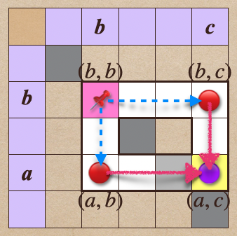
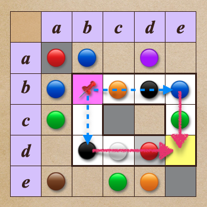

# 🔸 遞移性╱transitivity

[集合](../../) ⟩ [關係](../../relation.md) ⟩ [二元](../) ⟩ [性質](./) ⟩ 遞移性


若「[二元關係](../)」，擁有以下性質：

* $$a \ {\color{orange}\mapsto} \ b, \ b \ {\color{orange}\mapsto} \ c \implies a \ {\color{orange}\mapsto} \ c$$

此時我們說此「[二元關係](../)」具有具有「<mark style="color:orange;">**遞移性**</mark>」(<mark style="color:yellow;">**transitivity**</mark>)。


<figure><figcaption>
transitive relation
</figcaption></figure>


如果想利用表格看出「[二元關係](../)」是不是<mark style="color:yellow;">**具有**</mark>「<mark style="color:orange;">**遞移性**</mark>」恐怕不切實際，如上圖：

1. 首先，挑選「<mark style="color:yellow;">**對角線**</mark>」上的<mark style="color:yellow;">**任一位置**</mark> $$(b,b)$$。(此點有沒有設立關係無所謂)
2. 然後挑選<mark style="color:yellow;">**不同行不同列**</mark>的<mark style="color:yellow;">**另一位置**</mark> $$(a,c)$$ 當它的「<mark style="color:yellow;">**對角點**</mark>」。
3. 利用這兩點<mark style="color:yellow;">**圍成一個矩形**</mark>（白底標出的部分）。
4. 若 $$(b,b)$$ <mark style="color:yellow;">**兩側頂點**</mark>位置（藍色箭頭所指處）<mark style="color:yellow;">**有設立關係**</mark> ($$a \ {\color{orange}\mapsto} \ b, \ b \ {\color{orange}\mapsto} \ c$$)，則代表 $$(a,c)$$ 位置也<mark style="color:red;">**必須**</mark><mark style="color:yellow;">**有設立關係**</mark> ($$a \ {\color{orange}\mapsto} \ c$$)。

從上面的步驟可以看出，如果是一個大表格，用這個方法檢查「[二元關係](../)」有沒有「<mark style="color:orange;">**遞移性**</mark>」，根本不可行，畢竟人腦非電腦。



但如果要利用上述方法看出它<mark style="color:red;">**沒有**</mark>「<mark style="color:orange;">**遞移性**</mark>」，則相對簡單些，我們只要<mark style="color:yellow;">**舉出一個反例**</mark>即可：

* 首先，任挑一個「<mark style="color:yellow;">**空格**</mark>」 $$(a,c)$$ (沒有設立關係的點)。
* 在「<mark style="color:yellow;">**對角線**</mark>」上任挑一個<mark style="color:yellow;">**不同行不同列**</mark>的點 $$(b,b)$$。(此點有沒有設立關係無所謂)
* 利用這兩點<mark style="color:yellow;">**圍成一個矩形**</mark>。
* 若發現 $$(b,b)$$ <mark style="color:yellow;">**兩側頂點**</mark>位置（藍色箭頭所指處）<mark style="color:red;">**都**</mark><mark style="color:yellow;">**有設立關係**</mark>，這時就發現一個反例了。


例如：下圖就代表一個<mark style="color:red;">**沒有**</mark>「<mark style="color:orange;">**遞移性**</mark>」的「[二元關係](../)」。



* 具有「<mark style="color:orange;">**遞移性**</mark>」(<mark style="color:yellow;">**transitivity**</mark>) 的「[二元關係](../)」：
  * [quan-xu-total-ordering.md](../quan-xu-total-ordering.md "mention")：例如 $$x\le y$$




在「<mark style="color:orange;">**遞移性**</mark>」的條件中：&#x20;

* $$a \ {\color{orange}\mapsto} \ b, \ b \ {\color{orange}\mapsto} \ c \implies a \ {\color{orange}\mapsto} \ c$$

只要討論 $$b \neq a, \ b \neq c$$ 的情況就好，因為：

* 當 $$b=a$$，原條件變成 $$a \ {\color{orange}\mapsto} \ a, \ a \ {\color{orange}\mapsto} \ c \implies a \ {\color{orange}\mapsto} \ c$$，顯然成立。
* 當 $$b=c$$，原條件變成 $$a \ {\color{orange}\mapsto} \ c, \ c \ {\color{orange}\mapsto} \ c \implies a \ {\color{orange}\mapsto} \ c$$，也顯然成立。

這也是為什麼我們在上面的討論中，利用表格如何判斷一個「[二元關係](../)」是否具有「<mark style="color:orange;">**遞移性**</mark>」時，只需考慮「一般的矩形」就好，不需考慮「壓扁或退化的矩形範圍」。




* Abstract and Linear Algebra (Burton) ⟩ 1.2 Functions and relations (p. 19)&#x20;


