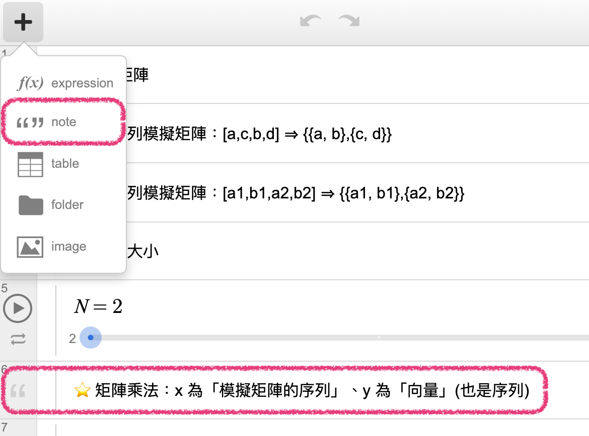

# 📔 筆記 (Note)

[Desmos](../) ⟩ [儲存格](./) ⟩ 筆記 (Note)&#x20;








如果在一個「筆記」儲存格中要手動跳行的話，可以使用下面這個範例：

* [example with newline character](https://www.desmos.com/calculator/qyvsnwaxtb)




<figure><figcaption></figcaption></figure>



* [New Paragraph in Note?](https://cl.desmos.com/t/new-paragraph-in-note/1155) ( :point\_right: see：[this example](https://www.desmos.com/calculator/qyvsnwaxtb))


