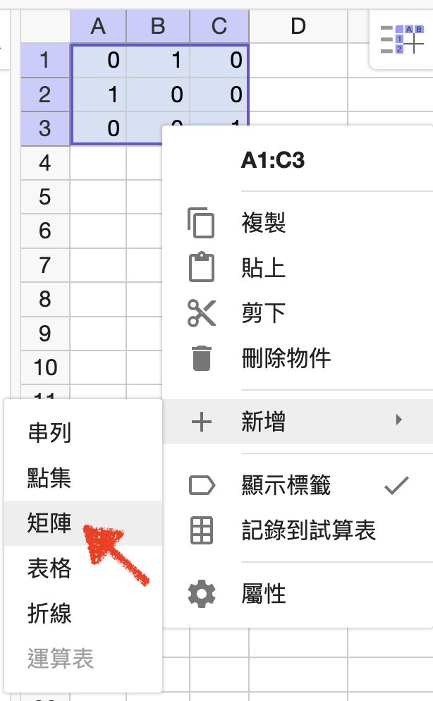

# 🔰 輸入矩陣

[GGB](../) ⟩ [矩陣](./) ⟩ 輸入矩陣&#x20;



* Overleaf ⟩ [Matrices](https://www.overleaf.com/learn/latex/Matrices) (LaTeX)&#x20;



* [https://www.geogebra.org/classic/wyyqh8nr](https://www.geogebra.org/classic/wyyqh8nr)



## 使用指令列


```javascript
// 使用指令列
A = {{1, 2, 3}, {4, 5, 6}, {7, 8, 9}}
```

可得 $$A=\begin{bmatrix} 1 & 2 & 3\\ 4 & 5 & 6\\ 7 & 8 &9\end{bmatrix}$$


## 使用試算表

在試算表中選擇要當作矩陣的儲存格，按滑鼠右鍵，選擇「新增」->「矩陣」。

